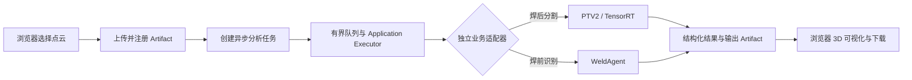
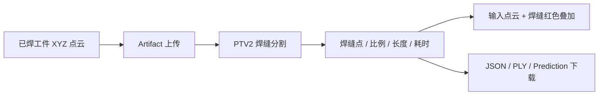
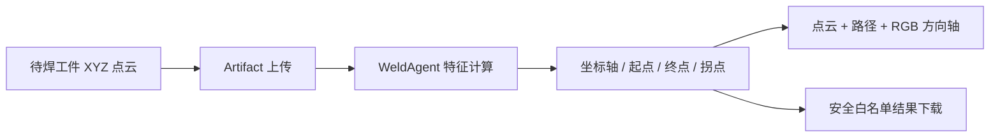
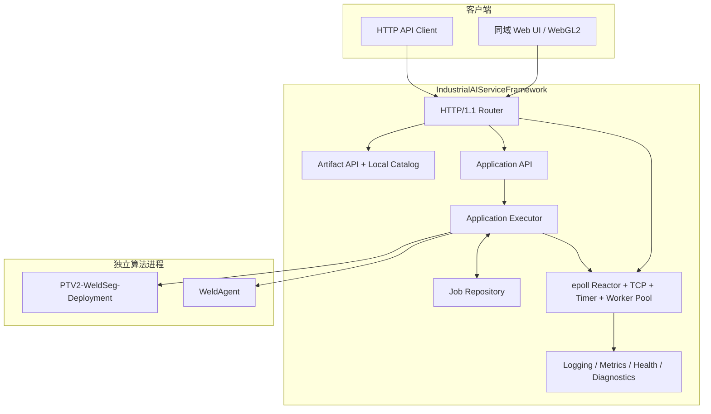

# IndustrialAIServiceFramework

[](https://github.com/realme-max/IndustrialAIServiceFramework/actions/workflows/linux-ci.yml)
[](https://isocpp.org/)
[](#运行环境)
[](LICENSE)

面向工业 AI 应用的 C++ 高性能服务框架。项目把点云算法封装为可通过浏览器和 HTTP 调用的异步任务服务，并提供从网络接入、任务调度、外部进程隔离、Artifact 管理到 3D 结果展示的完整链路。

当前接入两个**相互独立**的工业焊接场景：

| 业务 | 使用阶段 | 输入 | 输出 | 当前状态 |
|---|---|---|---|---|
| 焊后焊缝分割 | 焊接完成后 | 已焊工件点云 | 焊缝点、焊缝比例、长度、推理耗时、结果文件 | 已接入 PTV2，可在浏览器查看分割叠加 |
| 焊前建系与焊接特征 | 机器人焊接前 | 待焊工件点云 | 坐标轴、起点、终点、可选拐点、焊接路径 | 已接入 WeldAgent，支持 straight、corner、L |

> PTV2 与 WeldAgent 不是同一流程的上下游，系统不会自动串联两者。当前不包含焊缝质量评级、关节值下发或机器人控制。

## 项目效果

用户打开同域 Web 页面后，可以直接选择本地点云文件并发起分析。页面会持续查询任务状态，分析完成后展示结构化结果和 WebGL2 三维视图，同时提供经过校验的输出文件下载链接。



### 焊后焊缝分割



### 焊前建系与焊接特征



## 核心能力

### 高性能网络与服务运行时

- Linux `epoll ET` 单 Reactor 事件循环，使用 `eventfd` 完成跨线程唤醒。
- `timerfd` 驱动的有界定时器，支持连接空闲、HTTP Header 和 Body 超时。
- `signalfd` 接入 SIGINT/SIGTERM，完成 HTTP、任务、插件和线程的有序停止。
- 非阻塞 TCP、有限连接表、输入输出硬上限、背压与高水位控制。
- 严格 HTTP/1.1 解析、keep-alive、有限顺序 pipelining 和固定路由表。
- 固定线程池与有界任务队列，避免请求压力转化为无限内存增长。

### 工业 AI 应用运行时

- 独立的焊后分割与焊前识别领域模型、状态机、Repository 和 API 契约。
- CSPRNG Job ID、乐观版本控制和原子状态转换。
- 单 worker Application Executor、适配器异常隔离及受控子进程执行。
- PTV2 与 WeldAgent 使用独立 Adapter，不共享输入语义，不自动互调。
- 外部进程参数独立传递，不经过 Shell；执行超时、输出大小和临时目录均受限。

### Artifact 与数据安全

- 浏览器上传 XYZ 文本后，统一转换为 little-endian `float32`，固定 12 bytes/point。
- 使用 SHA-256 内容标识、严格 manifest、canonical path 和 symlink/root-escape 防护。
- 下载前重新校验文件类型、大小和摘要，不暴露服务器本地路径。
- WeldAgent 公共结果由已验证 Domain Result 白名单生成，不复制外部原始 JSON 的未知字段。
- 上传、任务 JSON、响应、进程输出和可视化点数均设置硬上限并 fail-closed。

### 可观测性与扩展

- 异步有界日志、控制台与滚动文件输出。
- `/health`、`/metrics` 和可选 `/debug/status`。
- 静态插件与稳定 C ABI 动态插件运行时，包含生命周期、容量和诊断边界。
- Windows 构建覆盖可移植核心；完整网络服务与生产运行目标为 Linux。

## 系统架构



## 浏览器使用方式

1. 在 Linux 或 WSL2 中构建并启动服务。
2. 在配置中启用 `applications`，填写本机 PTV2、WeldAgent、模型和工具配置路径。
3. 浏览器访问 `http://<服务器地址>:<端口>/`。
4. 选择“焊后焊缝分割”或“焊前建系与焊接特征”。
5. 从文件资源管理器选择 `.xyz`、`.txt` 或 `.pts` 点云并提交。
6. 等待页面显示完成状态，查看三维结果并下载输出 Artifact。

当前 Web 页面与 API 由同一服务、同一 Origin 提供，不依赖 CDN、npm 或独立前端服务器。

## 快速开始

### 运行环境

- Ubuntu 24.04 或 WSL2 Ubuntu（推荐）
- GCC 13 或兼容的 C++17 编译器
- CMake 3.22+
- Git、CA certificates
- 真实业务运行另需可用的 PTV2/TensorRT 产物和 WeldAgent Python 环境

Windows/MSVC 可构建和测试可移植模块，但 `--serve` 依赖 Linux 的 epoll、timerfd 和 signalfd。

### 构建与测试

```bash
git clone https://github.com/realme-max/IndustrialAIServiceFramework.git
cd IndustrialAIServiceFramework

./scripts/build_linux.sh Release
./scripts/test_linux.sh Release
./scripts/smoke_linux.sh
```

等价的 CMake 命令：

```bash
cmake -S . -B build/linux-release \
  -DCMAKE_BUILD_TYPE=Release \
  -DIAISF_BUILD_TESTS=ON \
  -DIAISF_BUILD_LINUX_NETWORK=ON
cmake --build build/linux-release --parallel
ctest --test-dir build/linux-release --output-on-failure
```

### 配置并启动服务

仓库中的 [`config/iaisf.example.json`](config/iaisf.example.json) 可用于基础配置校验。启用真实工业应用时，需要在本地配置中增加以下内容，并替换为部署机器上的真实路径：

```json
{
  "applications": {
    "enabled": true,
    "artifact_root": "runtime/artifacts",
    "scratch_root": "runtime/scratch",
    "output_root": "runtime/outputs",
    "repository_capacity": 1024,
    "queue_capacity": 128,
    "ptv2": {
      "executable": "<PTV2 executable>",
      "working_directory": "<PTV2 working directory>",
      "engine": "<TensorRT engine>",
      "plugin": "<TensorRT plugin>",
      "timeout_ms": 300000
    },
    "weld_agent": {
      "python_executable": "<Python executable>",
      "project_root": "<WeldAgent project root>",
      "orchestrator": "<WeldAgent orchestrator>",
      "tool_config": "<local tool config>",
      "timeout_ms": 300000
    }
  }
}
```

大点云上传还需要相应调整 `http.limits.max_body_bytes` 和 `max_response_body_bytes`；框架硬上限为 64 MiB。模型、插件、外部仓库、本地运行配置和业务输入不得提交到本仓库。

启动服务：

```bash
build/linux-release/iaisf_server --serve --config <local-config.json>
```

然后访问：

```text
http://127.0.0.1:<port>/
```

## 主要 HTTP 接口

| 方法 | 路径 | 作用 |
|---|---|---|
| `GET` | `/` | 同域工业焊接分析页面 |
| `POST` | `/api/artifacts/v1/pointclouds` | 上传 XYZ 文本点云 |
| `GET` | `/api/artifacts/v1/files/{artifact_id}` | 下载已注册并重新校验的 Artifact |
| `POST` | `/api/weld-inspection/v1/jobs` | 提交焊后分割任务 |
| `GET` | `/api/weld-inspection/v1/jobs/{job_id}` | 查询焊后任务状态 |
| `GET` | `/api/weld-inspection/v1/results/{job_id}` | 获取焊后结果 |
| `POST` | `/api/welding-guidance/v1/jobs` | 提交焊前识别任务 |
| `GET` | `/api/welding-guidance/v1/jobs/{job_id}` | 查询焊前任务状态 |
| `GET` | `/api/welding-guidance/v1/results/{job_id}` | 获取焊前结果 |
| `GET` | `/health` | 健康检查 |
| `GET` | `/metrics` | 运行指标 |

完整字段和错误映射见[协议设计](docs/protocol.md)与[应用层设计](docs/application_layer.md)。

## 当前边界

项目已经具备本地浏览器到真实 PTV2/WeldAgent 的完整分析闭环，但仍是面向本机或受控内网的工程版本：

- 没有 HTTPS、登录认证、租户隔离、配额和公网防滥用能力。
- Job Repository 与 Artifact Catalog 为进程内状态，服务重启后不恢复。
- 上传和下载采用有界整包 I/O，暂不支持 Range、分片上传、流式响应或对象存储。
- Application Executor 当前为单 worker、有界队列，尚未实现远程 Worker Protocol、lease、heartbeat、fencing、自动重试和分布式调度。
- PTV2 当前完成焊缝分割与几何结果输出，不提供焊缝质量合格判定。
- WeldAgent 当前输出几何特征，不公开 joint/tcp 等内部字段，不连接控制器，不执行机器人动作。

## 测试与质量

### 标准测试

当前建立了 Windows/MSVC 与 Linux/GCC 的 Debug、Release 双配置验证，覆盖领域模型、Repository、严格 JSON、HTTP/TCP、任务、插件、Service、Artifact、Adapter 和 Web UI。GitHub Actions 只运行框架构建、测试和 smoke，不运行外部项目、CUDA/GPU 或真实浏览器 E2E。

最新合入基线的 [PR #11 Linux CI](https://github.com/realme-max/IndustrialAIServiceFramework/actions/runs/31302286955)：Linux Debug/Release 各注册 937 项，936 项通过，1 项因 runner 权限能力显式跳过，0 失败；项目源码与测试编译 warning 为 0。

后续标准测试结果将在此补充：

| 测试类型 | 工具/环境 | 范围 | 状态 | 报告 |
|---|---|---|---|---|
| 单元与集成测试 | GoogleTest / CTest | Windows + Linux，Debug + Release | 已建立 | [测试计划](docs/test_plan.md) |
| 编译器告警 | MSVC / GCC | 项目源码与测试 | 已建立，当前 0 warning | GitHub Actions |
| AddressSanitizer | 待确定 | 内存越界、use-after-free、泄漏 | 待执行 | 待补充 |
| UndefinedBehaviorSanitizer | 待确定 | 未定义行为 | 待执行 | 待补充 |
| ThreadSanitizer | 待确定 | 并发数据竞争 | 待执行 | 待补充 |
| Valgrind | 待确定 | Linux 内存与资源泄漏 | 待执行 | 待补充 |
| 长时间稳定性 | 待确定 | 重复运行、资源增长、优雅停止 | 待执行 | 待补充 |

### 压力测试与性能测试

本节预留给后续基准数据。正式报告应记录硬件、操作系统、编译配置、输入规模、并发模型和统计方法，避免只给出脱离环境的单一 QPS。

计划覆盖：

- HTTP 基础接口吞吐、延迟分位数、keep-alive 与连接建立成本。
- 点云上传在不同文件大小和并发数下的吞吐、内存峰值与失败行为。
- Job 提交、状态轮询和 Artifact 下载的混合负载。
- Executor 队列饱和、Repository 容量耗尽和背压策略。
- PTV2 GPU 推理吞吐、端到端延迟与显存占用。
- WeldAgent 子进程启动成本、计算延迟与并发隔离。
- 24 小时以上 soak test 的内存、fd、线程、队列和磁盘增长。

结果表预留：

| 场景 | 工具 | 并发/数据规模 | 吞吐 | P50 | P95 | P99 | CPU | 内存/显存 | 错误率 |
|---|---|---|---:|---:|---:|---:|---:|---:|---:|
| HTTP 健康检查 | 待测试 | 待测试 | — | — | — | — | — | — | — |
| 点云上传 | 待测试 | 待测试 | — | — | — | — | — | — | — |
| Job 提交与轮询 | 待测试 | 待测试 | — | — | — | — | — | — | — |
| Artifact 下载 | 待测试 | 待测试 | — | — | — | — | — | — | — |
| PTV2 端到端 | 待测试 | 待测试 | — | — | — | — | — | — | — |
| WeldAgent 端到端 | 待测试 | 待测试 | — | — | — | — | — | — | — |

## 目录结构

```text
IndustrialAIServiceFramework/
├── include/iaisf/       # 公共 C++ 接口
├── src/                 # Core、网络、HTTP、任务、插件、应用与 Service 实现
├── tests/               # 单元、集成、平台能力与回归测试
├── config/              # 示例配置
├── docs/                # 架构、协议、配置、测试和开发记录
├── scripts/             # Linux 构建、测试与 smoke 脚本
├── tools/               # 点云导入与受控 smoke 工具
└── .github/workflows/   # Linux Debug/Release CI
```

## 文档导航

- [系统架构](docs/architecture.md)
- [应用层设计](docs/application_layer.md)
- [HTTP 与 JSON 协议](docs/protocol.md)
- [配置说明](docs/configuration.md)
- [Linux 构建指南](docs/linux_build.md)
- [插件设计](docs/plugin_design.md)
- [任务 API](docs/task_api.md)
- [测试计划](docs/test_plan.md)
- [开发计划](docs/development_plan.md)
- [详细开发记录](docs/stage_status.md)

## License

本项目采用 [Apache License 2.0](LICENSE)。
