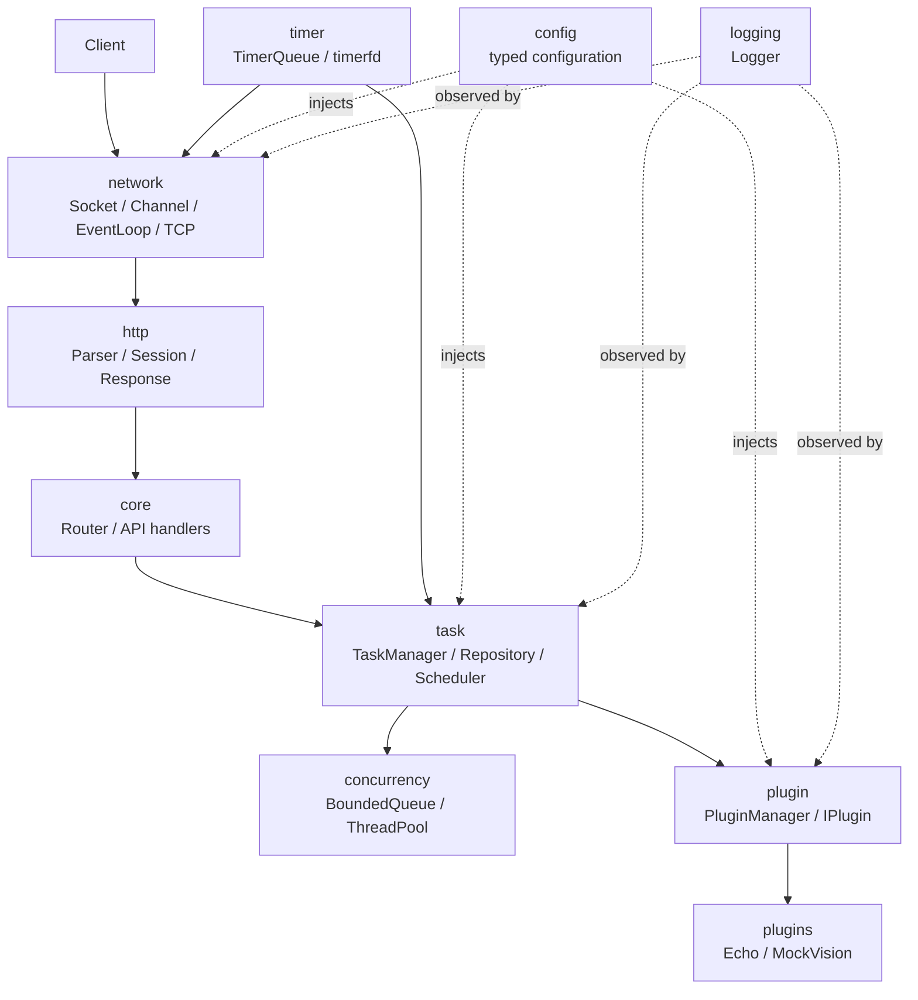
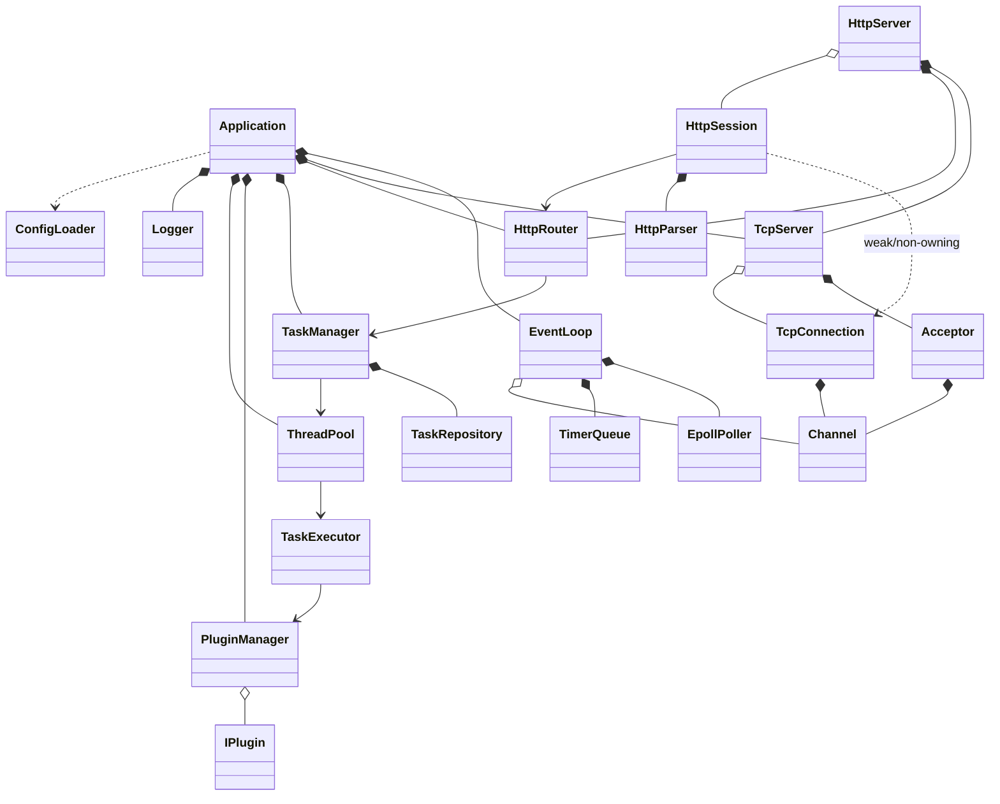
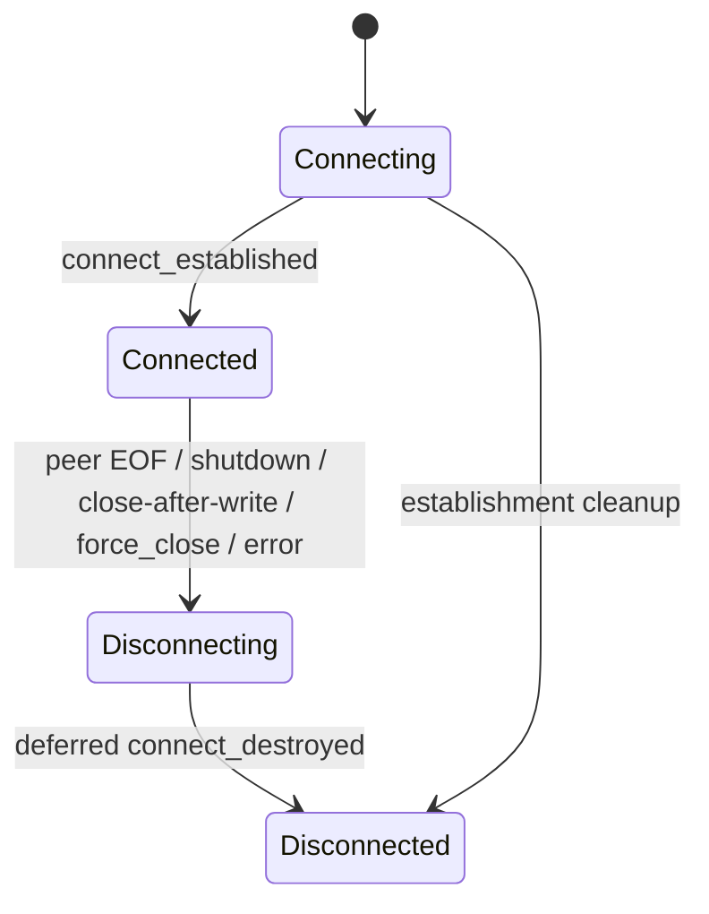
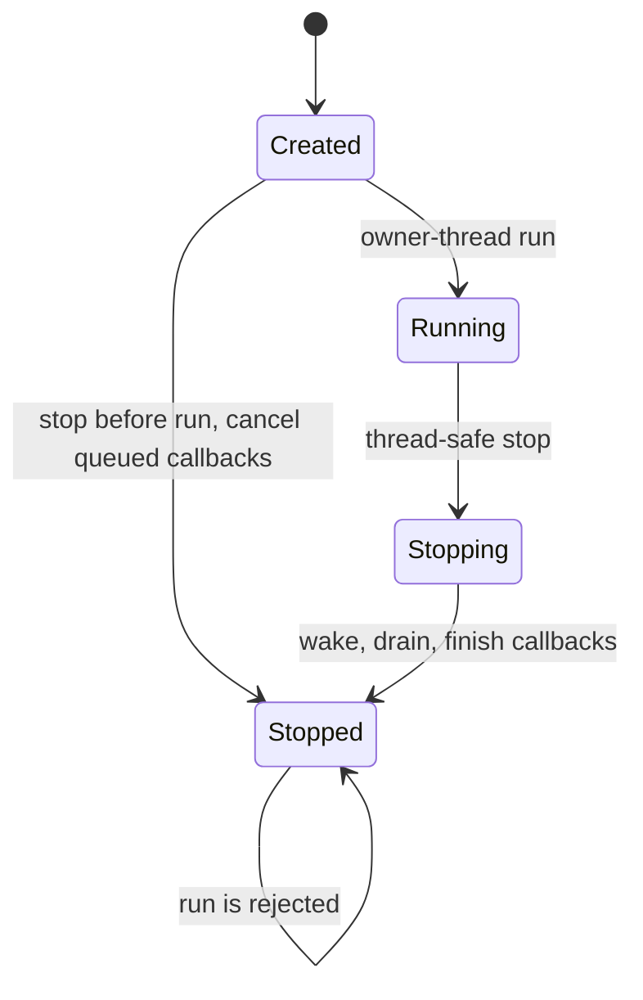
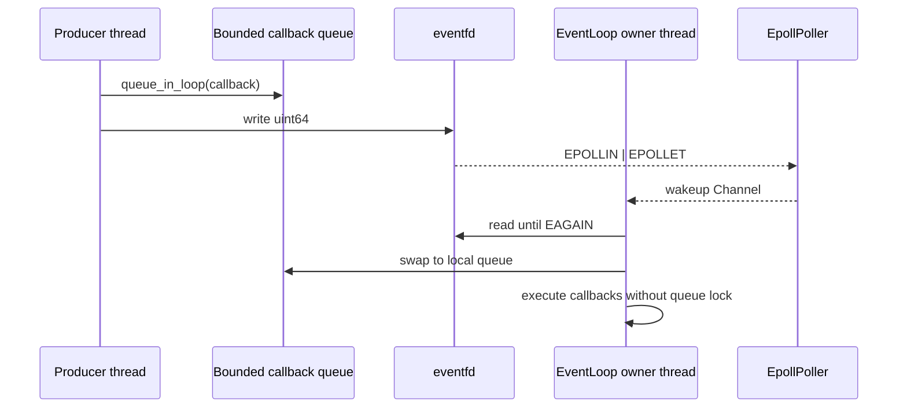
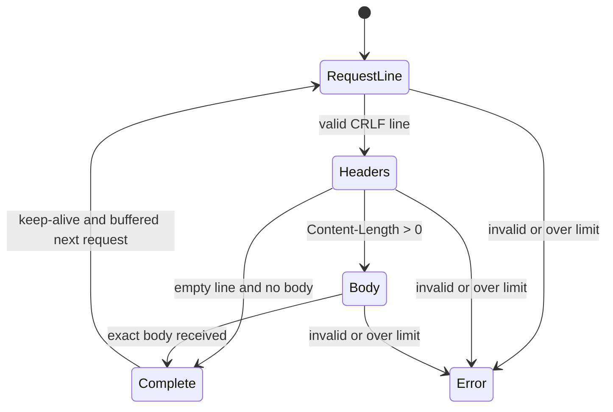
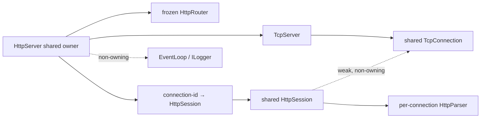
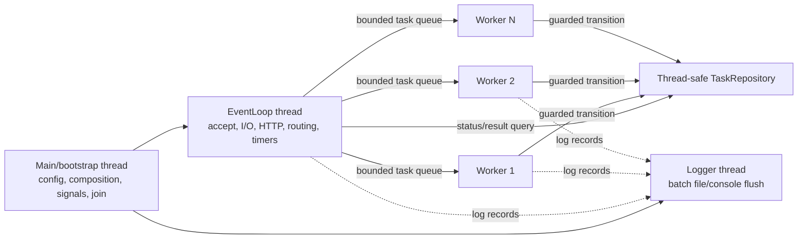
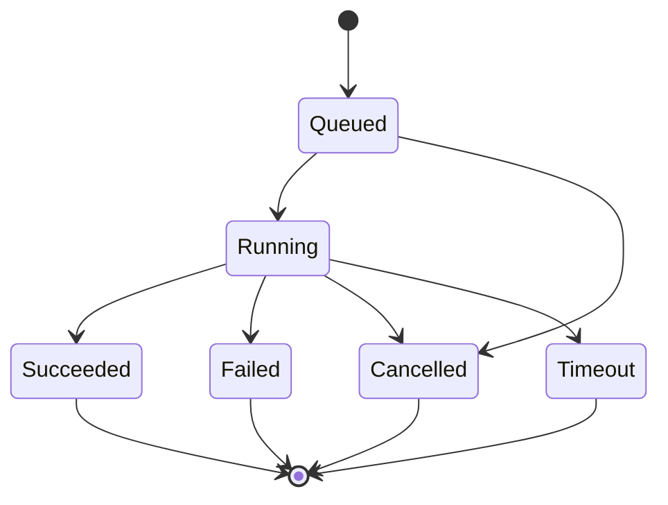

# 架构设计

## 1. 文档状态

- 项目：IndustrialAIServiceFramework
- 阶段：Phase 4 HTTP/1.1 Protocol Layer
- 日期：2026-07-30
- 状态：`PHASE_4_HTTP_PROTOCOL_COMPLETED`；HTTP Core、Linux adapter 与 loopback integration 已完成 Windows/Linux 分层验证
- 目标平台：Linux x86_64，C++17

本文同时记录已实现的 Phase 1 基础设施、Phase 2 Reactor 核心、当前 Phase 3 TCP 传输实现和后续目标边界。只有明确列入已实现边界的类才是当前能力。

### 1.1 Phase 1 已实现边界

已实现：

- `ErrorCode`、`Error`、`Result<T>`、`Result<void>`
- `AppConfig` 的 JSON 加载、默认值和严格校验
- `LogLevel`、`ILogger`、同步 `ConsoleLogger`
- 最小 `Application` 和 CLI
- CMake targets、版本生成和自动化测试

未实现：

- 本文后续描述的 Acceptor、TcpConnection、TcpServer、HTTP、ThreadPool、Task、Plugin 和 Timer 类
- 后台日志线程、异步队列、文件日志或日志轮转

### 1.2 Phase 2 已实现边界

Linux-only `iaisf_net` 当前实现：

- `UniqueFd` 独占 fd；不可复制，可移动，析构不抛异常且不重试 `close(EINTR)`。
- `Socket` 只创建 IPv4 TCP fd、设置 `SO_REUSEADDR` 和执行 write-half shutdown，不 bind/listen/accept/connect。
- `Channel` 不拥有 fd，也不直接调用 `epoll_ctl`；fd 和所属 EventLoop 必须比 Channel 活得更久，注册期地址不可变化，析构前必须移除。
- `EpollPoller` 独占 epoll fd，使用固定上限事件数组，不拥有注册的 Channel。
- `EventLoop` 在构造线程运行；`update_channel/remove_channel/run` 仅允许所属线程调用。
- `queue_in_loop/stop` 可跨线程调用，通过 nonblocking、close-on-exec 的 `eventfd` 唤醒。
- 待执行回调队列按元素数硬限制；空回调返回 `InvalidArgument`，满队列返回 `ResourceExhausted`。
- active Channel 批次分派期间直接 remove 被拒绝；应用回调仍使用有界 `queue_in_loop`，Phase 3 框架生命周期对象则使用独立的 intrusive `DeferredCleanup` 节点在整批处理后清理。
- Channel 回调和待执行回调的异常被记录并隔离。一个 Channel 抛出后停止其本次剩余回调，但后续 active Channel 继续。Logger 不归 EventLoop 所有，必须活得更久。

Phase 2 直接由 EventLoop 持有 `EpollPoller`，没有为了未来替换性创建空壳 `Poller` 基类。

### 1.3 Phase 2 验证与下一阶段边界

Reactor 实现提交 `f76993e09767a2d6b6e1cbd2bcb22cfa1df6f74f` 的首次功能
[GitHub Actions Linux CI run 30514521602](https://github.com/realme-max/IndustrialAIServiceFramework/actions/runs/30514521602)
已通过，但 Release 测试构建记录 2 条 `-Wunused-result` warning。warning 修复提交
`4db8708a5121f8477d835addd0b16170a3e2054f` 的最终
[Linux CI run 30516007475](https://github.com/realme-max/IndustrialAIServiceFramework/actions/runs/30516007475)
在 Ubuntu 24.04.4 LTS、GCC 13.3.0、CMake 3.31.6 上验证。Debug 和 Release
均完成 configure/build，并各有 87/87 CTest 通过；44 个 Reactor 测试在两个配置中
都实际执行。Release smoke 的版本和示例配置检查成功，项目源码和测试 warning 均为
0；没有 failed、cancelled、skipped、neutral 或 `continue-on-error`。

Phase 2 封板时只建议 Phase 3 实现连接层：`Buffer`、`Acceptor`、`TcpConnection`、`TcpServer`，
ET accept/read/write 到 `EAGAIN`、动态启停 `EPOLLOUT`、输出缓冲高水位、
连接建立/半关闭/关闭生命周期和原始字节 Echo 集成测试。Phase 3 不包含 HTTP parser、
HttpRouter、ThreadPool、TaskRepository、TaskManager、PluginManager、timerfd、
signalfd、异步日志、AI 推理或 benchmark。

### 1.4 Phase 3 已实现边界

Phase 3 实现提交新增 Linux-only `iaisf_tcp` / `iaisf::tcp`，PUBLIC 依赖
`iaisf::net`。实现边界为：

- `Ipv4Endpoint` 是 numeric IPv4 + host-order `uint16_t` port 值类型；使用
  `inet_pton/inet_ntop`，不查询 DNS，不支持 IPv6。
- `Buffer` 是 owner-thread-only 有界二进制缓冲；retrieve 只移动 reader index，
  append 需要空间时才 compact/grow，增长前使用 `length > max - readable`。
- `Socket` 增加 bind/listen/local endpoint、`TCP_NODELAY`、`SO_ERROR` 和
  `accept4(SOCK_NONBLOCK | SOCK_CLOEXEC)`。
- `Acceptor` 拥有监听 Socket 和非 owning Channel，以 ET 循环 accept 到
  `EAGAIN`；监听 Channel 的声明/销毁顺序保证先 remove/destroy Channel，再关闭 fd。
- `TcpConnection` 使用 server table 的 `shared_ptr` 作为主要所有者；Channel
  回调捕获 `weak_ptr`，构造期间不调用 `shared_from_this`。
- `TcpServer` 拥有 Acceptor 和有界连接表，不拥有 EventLoop；close callback
  只把强连接引用加入预分配待移除向量，并幂等登记内嵌 cleanup 节点。真正流程是
  remove Channel → 关闭 Socket → erase table → 释放最后一个 `shared_ptr`。
- read/write 都循环到 `EAGAIN`；发送使用 `MSG_NOSIGNAL`。`send()` 先为整包预留
  Buffer 并登记 `EPOLLOUT`，再一次性追加；可写回调排空到 `EAGAIN`，排空后停用。
- input/output hard maximum 独立强制；output high-water 只在 below→at/above
  跨越时通知，降到阈值以下后重武装，不等同于完整应用层限流。
- peer EOF 停止后续读取，但本轮已读取字节仍交给 message callback；有待发送
  数据时先排空，再进入延迟关闭。
- `TcpServerOptions` 的可选 `socket_send_buffer_bytes` 是通用、受硬上限验证的
  `SO_SNDBUF` 调优项；默认不覆盖系统值，测试用它构造确定性 backpressure。

Phase 3 实现提交 `0a45658d0e450dd9dfde052808a27ae92ad08881` 已由
[Linux CI run 30524686201](https://github.com/realme-max/IndustrialAIServiceFramework/actions/runs/30524686201)
验证。Ubuntu 24.04.4 LTS、GCC 13.3.0、CMake 3.31.6 的 Debug/Release 均成功
configure/build，均为 138/138 CTest 通过，其中 Foundation 43、Reactor 45、TCP 50。
两个配置均实际构建 `iaisf_tcp` 和 `iaisf_tcp_tests`；Release 版本/示例配置 smoke
成功，项目源码和测试 warning 均为 0。run、两个 job 和全部步骤均为 success，
没有 failed、cancelled、skipped、neutral 或 `continue-on-error`。

### 1.5 Phase 4 已实现边界

Phase 4 新增两个清晰 target：

- 可移植 `iaisf_http_core` / `iaisf::http_core`，只依赖 `iaisf::core`，包含
  HttpStatus、HttpLimits、HttpRequest/Response、增量 Parser、Router 和 built-ins。
- Linux-only `iaisf_http` / `iaisf::http`，依赖 `iaisf::http_core` 与
  `iaisf::tcp`，包含 HttpSession 和 HttpServer。

Windows Debug/Release 已各实际执行 Foundation 43 + HTTP Core 84，共 127/127
CTest。最终 [Linux CI run 30539245789](https://github.com/realme-max/IndustrialAIServiceFramework/actions/runs/30539245789)
对应修复提交 `0818ebf4f71366cc3cd2fe4e36e95fe667b687a5`；Debug/Release configure/build
和 239/239 CTest 均成功，其中 HTTP Core 84/84、HTTP Integration 16/16。四个 HTTP
target 均实际构建，Release CLI smoke 成功，项目源码和测试 warning 为 0。
`iaisf_server` 仍没有进入常驻模式。

## 2. 调查结果与设计来源

### 2.1 当前工作区

Phase 0 开始时，工作区根目录只有只读参考目录 `TinyWebServer_reference`，没有项目代码、CMake 工程、Git 仓库或用户未提交改动。`PTV2-WeldSeg-Deployment` 和 `weld_agent` 未出现在当前工作区，因此未读取、未修改。

### 2.2 参考工程只读观察

参考目录包含 62 个文件，调查时聚合 SHA-256 为：

```text
83AE7E469DEA30C860DEFD4D26CB313B7B3C87EFCD9387414741E152EE46CF27
```

观察到的主要模块：

- 根级 `WebServer` 负责配置、监听、epoll 循环、连接数组、定时器、日志、线程池和数据库初始化。
- `http_conn` 同时承担 Socket I/O、HTTP 解析、静态文件响应和 MySQL 登录相关逻辑。
- 模板线程池使用 pthread、信号量、裸请求指针和分离线程。
- 定时器采用信号与管道唤醒，容器为有序双向链表。
- 日志采用单例、阻塞队列和后台线程。
- 工程包含 MySQL 连接池、HTML/图片/视频站点资源和 webbench。
- 监听与连接支持 LT/ET 组合，也包含 Reactor/模拟 Proactor 选择。

可借鉴的只是通用思想：非阻塞 Socket、epoll 事件分派、ET 下读到 `EAGAIN`、部分写处理、HTTP 增量状态机、工作队列、空闲连接超时和异步日志。

### 2.3 自主改造原则

不复用参考工程目录、类名、数据结构或实现代码。本项目以工业 AI **任务服务化** 为核心重新划分边界：

- 网络对象不理解 HTTP 路由，更不理解工业业务。
- HTTP 会话不持有数据库、插件或视觉资源。
- 任务调度使用通用闭包和统一 Task 模型，不把连接对象直接扔给工作线程。
- 插件管理器是显式实例，禁止隐式全局注册表。
- 所有 fd 使用 RAII；连接对象按 EventLoop 线程归属管理。
- 使用最小堆与 `timerfd`，不使用 `alarm`/`SIGALRM`。
- 不包含登录、HTML、MySQL、任意文件服务或 CGI。
- 设计从第一天支持自动化单元/集成测试和容量上限。

## 3. 设计目标与非目标

### 3.1 目标

- Linux 上的单 Reactor、epoll ET、非阻塞网络服务。
- HTTP/1.1 JSON API；未来可增加长度前缀 TCP JSON 协议。
- 有界线程池和任务队列，耗时计算与网络 I/O 隔离。
- 统一任务状态、结果、超时和错误模型。
- 静态注册插件，隔离插件异常。
- 可配置、可记录、可测试、可优雅停止。
- 为未来视觉、机器人和编排插件提供边界，而不把它们耦合进核心。

### 3.2 非目标

- HTTPS、HTTP/2、WebSocket、chunked、multipart。
- 多 Reactor、每核 EventLoop、零拷贝。
- 动态 `.so` 加载或稳定二进制 ABI。
- 数据库、用户登录、HTML 静态站点。
- 真实 TensorRT/PCL/PointNet++、机器人控制或 Agent。
- 分布式任务队列、任务持久化、跨进程恢复。

## 4. 分层与依赖规则



依赖规则：

1. `network` 不依赖 `http`、`task` 或 `plugin`。
2. `http` 通过字节流与回调适配 `network`，不执行任务。
3. `core` 负责装配和路由，可以依赖上层服务接口。
4. `task` 依赖抽象插件调用端口和执行器，不依赖具体插件。
5. `plugins/*` 依赖公共插件契约，核心不反向依赖具体插件。
6. `logging`、`config` 提供实例化服务，不使用全局可变单例。
7. 跨层错误使用统一 `Error`，不得静默吞异常。

## 5. 推荐目录

```text
include/iaisf/
  core/          Application, Error, Result, Router, ServiceContext
  net/           UniqueFd, InetAddress, Buffer, Channel, EpollPoller,
                 EventLoop, Acceptor, TcpServer, TcpConnection
  http/          HttpRequest, HttpResponse, HttpParser, HttpSession, HttpRouter
  concurrency/   BoundedQueue, ThreadPool, CancellationToken
  task/          Task, TaskResult, TaskRepository, TaskManager, TaskExecutor
  plugin/        IPlugin, PluginTypes, PluginManager
  timer/         TimerId, TimerQueue
  logging/       LogRecord, ILogger, Logger
  config/        ServerConfig, ConfigLoader
src/             与公共模块对应的实现；main.cpp 只做组合根和进程退出码
plugins/
  echo/          无状态回显插件
  mock_vision/   显式 mock 工业视觉示例
tests/
  unit/          纯模块测试
  integration/   启动真实服务的端到端测试
examples/        示例客户端和请求脚本
scripts/         构建、启动、smoke、sanitizer 辅助脚本
```

## 6. 核心类清单

| 类/概念 | 职责 | 线程安全与生命周期 |
|---|---|---|
| `UniqueFd` | 独占 fd，移动语义，析构关闭 | 不共享；所有权明确 |
| `Ipv4Endpoint` | numeric IPv4、host-order port 和 `sockaddr_in` 转换 | 无资源值对象 |
| `Buffer` | 有界连续字节缓冲、reader/writer 游标与前部复用 | 仅归属 EventLoop |
| `Channel` | fd、关注事件、回调，不拥有 fd | 仅 EventLoop 修改 |
| `EpollPoller` | RAII 管理 epoll fd 和 `epoll_ctl/wait` | 仅 EventLoop 使用 |
| `EventLoop` | epoll 轮询、eventfd 唤醒、跨线程待执行函数、owner-thread internal cleanup lane | 本体单线程；`queue_in_loop()`/`stop()` 可跨线程 |
| `Acceptor` | 创建监听 fd、accept 循环、连接上限前置检查 | EventLoop 线程 |
| `TcpServer` | 持有连接表、创建和移除连接、停止接收 | EventLoop 线程 |
| `TcpConnection` | 连接状态、读写缓冲、半关闭和回压 | EventLoop 线程；外部只持弱引用/投递操作 |
| `HttpParser` | 增量解析 request line/headers/body | 每连接独占，无共享 |
| `HttpSession` | 把 TCP 字节转换为 HTTP 请求/响应 | EventLoop 线程，不执行耗时业务 |
| `HttpRouter` | 方法 + 路径模板匹配 | 启动后只读 |
| `ThreadPool` | 固定工作线程、有界闭包队列、drain/stop | 公共方法线程安全 |
| `Task` | 任务标识、输入、状态、时间、结果和错误 | 状态由仓储锁保护或通过受控方法修改 |
| `TaskRepository` | 有界内存存储、查询、合法状态转换、终态清理 | 内部互斥，公共方法线程安全 |
| `TaskManager` | 校验提交、创建任务、排队、查询、超时协调 | 公共 API 线程安全 |
| `TaskExecutor` | 工作线程中的插件调用边界、异常隔离和结果提交 | 无共享或依赖线程安全服务 |
| `IPlugin` | 插件生命周期和执行契约 | `execute` 在首版要求并发安全 |
| `PluginManager` | 显式注册、冲突检测、初始化、查找、关闭 | 初始化阶段写；运行期只读查找 |
| `TimerQueue` | `timerfd` + 最小堆、取消/更新、执行过期回调 | EventLoop 归属；跨线程操作通过 `queue_in_loop()` |
| `Logger` | 有界日志队列、控制台/文件 sink、刷新停止 | 公共写接口线程安全 |
| `ConfigLoader` | JSON 加载、默认值、类型和范围校验 | 启动期使用，产出不可变配置 |
| `Application` | 组合根、启动顺序、优雅停止，不承担模块细节 | 主线程创建，EventLoop 运行期间协调生命周期 |

## 7. 主要类关系



所有权重点：

- `Application` 控制顶层服务的启动与销毁顺序。
- `TcpServer` 的连接表拥有 `shared_ptr<TcpConnection>`；Channel 回调避免形成强引用环。
- `TcpServer` 本身使用 shared ownership，使延迟回调捕获 server weak pointer 和
  connection strong pointer；server 必须在所有连接之后、EventLoop 之前销毁。
- fd 由 `UniqueFd` 独占，Channel 永不关闭 fd；fd 生命周期必须覆盖 Channel 的完整注册周期。
- Poller 只保存非 owning Channel 指针。Channel 禁止复制/移动；注册期地址稳定，析构断言要求它已从 Poller 移除。
- `epoll_wait` 返回的 active 指针在整个批次结束前都必须有效。任何回调都不能直接销毁本批次内的 Channel；EventLoop 在分派期间拒绝 remove。应用对象通过 `queue_in_loop` 延迟，Acceptor/TcpServer 的框架清理通过内部 `DeferredCleanup` 延迟。
- Router handler 只捕获生命周期稳定的服务引用。
- 工作任务不持有连接强引用；POST 提交立即响应，后续通过任务 ID 查询。

## 8. Reactor 与网络 I/O

### 8.1 模式选择

Phase 2 的 wakeup Channel 和 Phase 3 的监听/连接 Channel 均使用 epoll ET：

- ET 减少事件重复通知，能体现正确的非阻塞 I/O 边界处理。
- 单 Reactor 降低首版生命周期和跨线程连接状态的复杂度。
- 当前 EventLoop 只做 accept/read/write 和原始字节回调；未来业务计算必须交给工作线程。
- 首版不使用 `EPOLLONESHOT`：只有 EventLoop 线程执行连接 I/O，不存在多个 I/O worker 同时处理同一 fd；事件通常关注 `EPOLLET | EPOLLRDHUP` 加实际读写位。

### 8.2 Phase 3 accept/read/write 规则（implemented and validated）

- 使用 `socket(..., SOCK_NONBLOCK | SOCK_CLOEXEC, ...)`，不提供阻塞回退。
- 监听设置 `SO_REUSEADDR`；`SO_REUSEPORT` 首版不启用。
- `accept4(..., SOCK_NONBLOCK | SOCK_CLOEXEC)` 循环直到 `EAGAIN/EWOULDBLOCK`。
- 连接读取循环调用 `recv`，直到返回 `EAGAIN/EWOULDBLOCK`；`EINTR` 重试；`0` 表示 peer EOF。
- 输出使用 `send(..., MSG_NOSIGNAL)`；不依赖全局忽略 SIGPIPE。
- 写缓冲未清空时关注 `EPOLLOUT`；每次可写事件循环发送到 `EAGAIN`，清空后取消 `EPOLLOUT`，避免 busy loop。
- `EPOLLERR` 路径读取 `SO_ERROR` 并决定关闭；`EPOLLRDHUP` 或 `EPOLLHUP` 同时可读时先循环读取剩余数据。只有 HUP 且没有 read-side 事件时才直接进入关闭流程。
- close notification 以布尔门闩保证最多一次；TcpServer 使用与普通
  `queue_in_loop` 分离的 intrusive cleanup lane 延迟执行 Channel remove 和连接表
  erase，普通队列满不影响该路径。
- accepted socket 当前固定启用 `TCP_NODELAY`；配置覆盖尚未接入 AppConfig。

### 8.3 Phase 3 容量与 high-water

- 每连接只限制原始 input/output Buffer；header、body 和请求数属于未来 HTTP。
- high-water 是一次跨阈值通知，不会自动暂停读事件；降到阈值以下后允许再次通知。
- `max_output_buffer_bytes` 是独立硬上限。`send()` 在任何本次 payload 的系统发送
  或 Buffer 追加前验证 `length <= max - current_readable` 并完成整包预留；超限
  返回 `ResourceExhausted`、本次不发生部分接受，并 fail-closed。没有 timerfd，
  故尚无 idle/write deadline。
- `EPOLLOUT` 只在输出缓冲非空时启用，写空后立即停用；一次可写回调循环写到 `EAGAIN`。
- input 超限停止累计并关闭；TCP 字节层不生成协议错误响应。
- 达到最大连接数时完成 accept 后立即关闭新 fd，并记录限流事件；不能让监听 fd 在 ET 下停止 drain。

### 8.4 TcpConnection 状态与关闭



本地主动 `shutdown()` 停止新 send，先排空 output，再执行 write-half shutdown，
并等待 peer EOF；Phase 3 没有超时，非协作 peer 可使 graceful shutdown 长期停留在
Disconnecting。因此服务停止采用明确的 force-close 策略。peer EOF 路径先交付本轮
已读数据；若 message callback 产生输出，则排空后关闭。重复关闭不重复调用 close
callback。TCP 不保留消息边界；message callback 负责 retrieve。EOF 后只交付本轮新增
字节一次，部分或完全未消费的数据不会触发重复回调，并在连接销毁时丢弃。

Phase 4 为 HTTP close 新增 `close_after_write()`：同样停止新 send，但排空 output
后主动进入完整关闭与延迟销毁，不执行 write-half shutdown，也不等待 peer EOF。
该操作 owner-thread-only、幂等，close callback 仍恰好一次。它不改变
`shutdown()` 的半关闭契约。

### 8.5 内部清理、停止和回调边界

`EventLoop::queue_in_loop()` 是有界的应用/跨线程短回调入口，满时必须继续返回
`ResourceExhausted`。`DeferredCleanup` 是 owner-thread-only 的框架内部通道：节点
内嵌于 Acceptor/TcpServer，不在调度时分配内存，一个节点最多 pending 一次，链表
长度受已存在生命周期对象约束。EventLoop 在每个 active batch 后、普通 pending
callback 前后执行该链。节点 pending 时析构对象会 `std::terminate`，以运行时契约
阻止悬空 context；TcpServer 的用户可见延迟 lambda 只捕获 `weak_ptr`。

`TcpServer::stop()` 仅 owner 线程可调用，停止 accept、force-close 当前连接、幂等且
永久禁止 restart。非 active 调用同步完成，成功返回时连接表为空且 `stopped()==true`；
active callback 内调用是异步接受语义，返回时可能仍为 Stopping，批次后的内部清理
完成 Channel remove、Socket close、table erase 和断连通知后才变为 Stopped。started
server 若未完成 stop 就析构是致命契约错误。stop 期间不再调用 message/high-water，
但每个已建立连接仍可收到一次 Disconnected connection callback。

| 回调 | 抛异常后的连接策略 | EventLoop/后续连接 | 是否阻止内部清理 |
|---|---|---|---|
| connection（Connected） | 关闭该连接 | 继续 | 否 |
| connection（Disconnected） | 已处于销毁路径 | 继续 | 否 |
| message | 关闭该连接 | 继续其他连接 | 否 |
| high-water | 仅记录，连接继续 | 继续 | 否 |
| Acceptor new-connection | 本次 accepted Socket 由 RAII 关闭 | accept 循环继续 | 否 |
| close | 框架内部 hook；server 安装 `noexcept` weak 回调 | 非 server 误用异常会请求 loop stop | server 路径不会抛 |
| write-complete | Phase 3 不存在 | 不适用 | 不适用 |

所有记录操作通过 `safe_log` 隔离 Logger 异常。Acceptor 在 read callback 内 stop 时先
进入 Stopping，停止继续 accept，再通过内嵌 cleanup 节点移除监听 Channel，最后关闭
监听 Socket。

### 8.6 EventLoop 唤醒

`EventLoop::queue_in_loop()` 把短小回调放入有界队列，并写 `eventfd` 唤醒 epoll。状态检查、容量检查、入队、非阻塞写入和失败回滚由同一个 mutex 串行化：返回 failure 时本次回调不留在队列，返回 success 表示框架已经接受；显式 stop 仍可按下述状态语义取消或收尾。写入遇到 `EINTR` 重试，遇到 `EAGAIN` 视为已有待处理唤醒；其他错误回滚刚入队的回调。读取使用 `uint64_t` 并循环到 `EAGAIN`，短读、EOF 和其他错误会记录。回调先交换到局部队列，执行时不持有队列 mutex。未来工作线程不得直接调用 `epoll_ctl`、修改 Channel 或写 Socket。

Channel 事件分派语义：

1. `EPOLLHUP` 且没有 `EPOLLIN/EPOLLPRI/EPOLLRDHUP` 时调用 close callback；
2. `EPOLLERR` 调用 error callback；
3. `EPOLLIN/EPOLLPRI/EPOLLRDHUP` 任一存在时调用 read callback；
4. `EPOLLOUT` 调用 write callback。

因此 `EPOLLRDHUP` 不直接关闭，`EPOLLHUP|EPOLLIN` 仍先交给连接层读取剩余数据。
Channel 只进行通知，不读取或写出 fd；Phase 3 ET 连接层负责循环 I/O 到 `EAGAIN`。

Phase 2 状态机为：



状态与提交矩阵：

| 状态 | `run` | `queue_in_loop` | `stop` |
|---|---|---|---|
| Created | owner 可进入 Running | 接受；等待首次 run | 直接进入 Stopped，取消尚未执行回调 |
| Running | 重入拒绝 | 接受 | 原子进入 Stopping 并唤醒 epoll |
| Stopping | 拒绝 | 拒绝 | 幂等 |
| Stopped | 拒绝再次运行 | 拒绝 | 幂等 |

EventLoop 只能在构造线程析构；Running/Stopping 状态析构是违反生命周期契约的致命程序错误。正常 run 返回前一定进入 Stopped。

事件流：



进程在启动时屏蔽 SIGINT/SIGTERM，并计划通过 `signalfd` 把停止通知纳入 EventLoop；SIGPIPE 独立忽略。顺序必须是：主线程先屏蔽目标信号，再创建 `signalfd`，最后才创建 worker 和日志线程，避免目标信号被其他线程异步接收。信号路径只请求停止，不执行非异步信号安全的清理逻辑。

worker 完成任务后不得操作 Socket、Channel 或 epoll，也不得持有能直接操作连接的裸指针。需要通知网络侧时，worker 先写入跨线程完成队列，再写 `eventfd`；EventLoop 醒来后读取完成项，并由 EventLoop 线程更新连接状态或生成网络响应。

## 9. HTTP 解析与会话（Phase 4 implemented）

状态机：



解析器按字节增量工作，不依赖 NUL 结尾，也不在不完整数据上保存悬空指针。每次返回本次消费字节数，HttpSession 立即从 TCP Buffer retrieve；body 分段复制到 Parser 自有有界字符串。限制在解析过程中立即检查：

- 请求行长度、单 header 行、header 总字节数和 header 数量；行限制包含 CRLF，
  header total 包含所有行结尾和终止空行。
- body 最大字节数。
- 所有规范化 header name 必须唯一；`Content-Length` 必须是唯一、十进制、非负、
  无溢出的值。
- 同时出现 `Transfer-Encoding` 和 `Content-Length` 时拒绝。
- chunked、trailers、Upgrade、Expect、multipart 和所有 transfer coding 不支持。
- HTTP/1.1 要求恰好一个非空 Host；method 只做 token 校验，是否允许由精确路由决定。
- 只接受 origin-form；不做 percent decode 或路径规范化，路径只用于精确路由，不提供通用文件读取。

`Connection` 按完整、大小写不敏感 token 解析；相似子串不等于 `close`，空 token
和非法 token 被拒绝。HTTP keep-alive 遵循 HTTP/1.1 默认持久连接和
`Connection: close`。顺序 pipeline
每轮最多处理 `max_requests_per_dispatch`；剩余数据通过普通有界
`queue_in_loop` continuation 继续，入队失败即 fail-closed。请求声明 close 或任一
协议/内部错误后不再处理后续 pipeline。任意组合错误的映射由固定检查顺序决定，
不依赖无序容器迭代。

响应序列化在生成输出前预检 body、header count、单行和整个 head。响应计数包含
自动生成的 `Content-Length` 与 `Connection`；字节限制包含状态行、每行 CRLF 和
终止空行。失败不返回部分响应。HTTP `Connection: close` 调用
`TcpConnection::close_after_write()`：拒绝后续 send，写尽当前输出后主动全关闭，
不等待 peer EOF。原有 `shutdown()` 仍保留为写半关闭并等待 peer EOF 的独立契约。
请求与响应共享 Header 容量限制；若配置的响应单行或总 Header 上限小到无法容纳
框架标准错误响应，序列化预检失败并关闭连接，不降级为无 `Content-Length` 的响应，
也不发送部分 Header。测试 fixture 至少为固定错误 `Content-Type` 行保留 41 字节。

### 9.1 所有权和线程边界



- TcpServer 继续拥有 TcpConnection；HTTP 层不改变 Channel/Socket/连接表销毁顺序。
  `close_after_write()` 最终调用同一 close callback，连接表和 Session 表移除沿用
  active batch 结束后执行的内部 `DeferredCleanup`，不受普通 pending queue 容量影响。
- HttpSession 不拥有连接，也不注册 Channel；其 continuation 同时捕获 session 和
  connection weak pointer，同时至多存在一个；只有二者仍存活、Session 非 terminal
  且连接仍为 Connected 时才使用连接内部稳定 Buffer 地址继续 dispatch。
- HttpServer callback 只捕获 weak server，不捕获裸 `this`；断连回调先标记 Session
  terminal 再从表删除。
- start/stop、解析、路由和 send 都是 owner-thread-only。Router handler 必须快速，
  不得阻塞磁盘、网络或执行 AI；未来 worker 仍不得操作 HTTP/TCP/epoll 对象。
- HttpServer stop 镜像 TcpServer：禁止 restart，active batch 内可能异步完成，
  `stopped()` 同时要求底层 stopped 且 Session 表为空；未完成 stop 前析构是契约错误。

## 10. 请求数据流

### 10.1 提交任务


### 10.2 查询状态/结果

查询只读取 `TaskRepository` 快照，不等待插件完成：

- 状态接口返回当前状态、进度和时间元数据。
- 结果接口对非终态返回 409；成功返回结果；失败/超时返回结构化错误。
- 返回对象是拷贝/不可变快照，序列化期间不持有仓储锁。

### 10.3 健康检查

`GET /health` 只做常数时间状态读取，不进入线程池。后续可区分 liveness 与 readiness，但首版只提供简单健康状态。

## 11. 线程模型



首版可以让主线程直接运行 EventLoop；逻辑上仍区分 bootstrap 阶段和事件循环阶段。并发规则：

- 连接、Channel、Buffer 和 HTTP 会话只在 EventLoop 线程访问。
- Phase 3 只有 `EventLoop::queue_in_loop()` 与 `EventLoop::stop()` 是跨线程入口；
  Acceptor start/stop、TcpServer start/stop、TcpConnection send/shutdown/close-after-write/
  force-close、
  callback setter 和连接表操作均不保证线程安全，必须由 owner 执行。
- `TaskRepository`、`ThreadPool::submit/stop` 和 Logger 写接口内部同步。
- 插件初始化/关闭在工作线程启动前/停止后串行执行。
- 插件 `execute` 可能被多个 worker 并发调用；不满足并发安全的未来插件必须通过专用执行策略或并发闸门限制。
- 停止顺序：停止 accept → 处理/关闭连接 → 拒绝新任务 → 按策略 drain 工作队列 → shutdown 插件 → flush/stop Logger → 退出。

## 12. 任务状态与超时

合法状态转换：



`TaskRepository` 是任务状态转换的唯一裁决者。`Running -> Succeeded`、`Running -> Failed` 和 `Running -> Timeout` 的竞争必须通过一个受控原子状态转换裁决：第一个成功进入终态的事件获胜，其余晚到结果不能覆盖终态；Timeout 后返回的插件结果只能记录并丢弃。

任务若未能进入有界队列，则不被 API 接受并从仓储移除；不会为了排队失败而扩展 `Queued -> Failed`。worker 取到任务后先转换为 Running，后续内部或插件错误才转换为 Failed。

工作队列满表示服务容量不足，未来 HTTP 层固定映射为 `503 Service Unavailable`，不能误报为插件内部错误。只有未来实现用户级请求限流时，才使用 `429 Too Many Requests`。

C++17 无法安全强杀执行任意插件代码的线程。Phase 7 的超时语义是：

1. 截止时间到达后把仍为 Running 的任务原子地标记为 Timeout；
2. 触发自定义 `CancellationToken`，要求插件协作退出；
3. 插件若继续运行，晚到结果被丢弃；
4. worker 线程只能在插件返回后复用。

因此，卡死的非协作插件仍会占用 worker。这是已知边界，真实 GPU/机器人插件必须设计可取消调用或进程隔离。

执行超时从任务进入 Running 开始。排队等待上限是独立概念；有界队列只限制容量，不能天然保证排队时延。未来可单独增加 queue-wait timeout，但不属于 Phase 1。

## 13. 定时器

选择 `timerfd + 最小堆`：

- `timerfd` 是普通 fd，可直接加入 epoll，无异步信号处理复杂度。
- 最小堆给出 `O(log n)` 添加/更新和接近 `O(1)` 的下一截止时间读取。
- 使用单调时钟避免系统时间调整影响超时。

`TimerId` 由序号和 generation 组成。取消和更新通过 generation 失效旧堆节点，过期弹出时惰性清理。回调在 EventLoop 执行，只允许关闭连接、状态转换或投递工作等短操作，禁止执行插件。

应用：

- 每次有效网络活动更新连接 idle timer。
- 任务进入 Running 时按执行超时设置 deadline timer；终态时取消。排队时间不计入首版执行超时，停止服务时仍在 Queued 的任务转为 Cancelled。
- 未来心跳仍复用同一 TimerQueue。

## 14. 配置模型

Phase 1 已由 `load_app_config` 把 service/runtime/logging 的最小 JSON 解析为强类型 `AppConfig`，并实现严格未知字段、类型和范围校验。后续 `ConfigLoader` 目标会在此基础上扩展以下运行时配置；类型错误、范围错误、关键资源错误必须使启动失败并返回非零退出码。

建议配置组：

- `server`：host、port、backlog、epoll_max_events、max_connections、idle_timeout_ms、TCP_NODELAY。
- `http`：request_line/header/body/input/output 上限、header_count、keep_alive_requests。
- `thread_pool`：worker_count、max_queue_size、shutdown_drain_timeout_ms。
- `tasks`：max_records、default_timeout_ms、max_timeout_ms、terminal_retention_ms。
- `logging`：level、console、file、queue_size、batch_size、flush_interval_ms、rotation_size。
- `plugins`：各插件 enabled 与专属配置。

未知顶层键默认报错，插件专属 JSON 由插件验证。日志路径必须是服务端配置，客户端不能控制。

## 15. 日志模型

Phase 1 已提供可测试的同步 `ConsoleLogger` 基础实现；Phase 8 再替换/扩展为一个有界队列和单后台写线程：

- producer 创建包含时间戳、level、线程 ID、request/task ID、可选源文件/行号的 `LogRecord`，通过 `try_push` 非阻塞入队；
- 后台线程用 condition variable 等待，按 batch 写控制台/文件并按间隔 flush，不使用 busy waiting；
- 队列预留一小段 WARN/ERROR 容量：接近满时先拒绝 TRACE/DEBUG/INFO；完全满时高等级日志也不能无限阻塞，只增加分级 dropped counter；
- 队列恢复后由后台线程输出合成的 dropped 统计，使丢弃可观测；
- 文件轮转只在后台线程按大小执行，首版不做复杂双缓冲；
- stop 后拒绝新记录、drain 队列、flush sink、join 后台线程；
- Logger 是注入实例，不是隐式单例；sink 失败不得递归写日志。

这保证日志容量固定，常规日志路径不在 EventLoop 做文件 I/O。若所有 sink 失效，进程继续还是停止由严重程度和阶段策略明确记录，不能静默忽略。

## 16. 错误处理模型

### 16.1 内部表示

预期失败使用统一值类型：

- `ErrorCode`：稳定的机器可读枚举/字符串。
- `message`：面向调用者的安全说明。
- `context`：内部诊断字段，不直接暴露给客户端。
- `std::error_code`：可选的系统错误，创建时立即捕获 `errno`。
- `request_id` / `task_id`：关联字段。

跨模块预期失败返回 `Result<T>`（C++17 自主实现的轻量 value-or-error 类型）或明确状态，不用异常控制普通流程。构造失败可抛异常，但必须在 `Application` 启动边界处理。

Phase 1 的 `Error` 保留公开字段以维持轻量值语义，因此调用者可以在构造后修改或清空 `message`，非空不能被描述为类型级永久不变量。生产路径统一使用 `make_error`；构造器、工厂和 `Result::failure` 边界会将空消息归一化为 `unspecified error`。

### 16.2 异常边界

- `main/Application`：捕获启动异常，记录后返回非零。
- EventLoop 回调：捕获到未处理异常时记录连接上下文并关闭相关连接；EventLoop 不能退出。
- worker：每个任务外围 `try/catch`，`std::exception` 和未知异常均转换为 Failed；线程继续工作。
- PluginManager/TaskExecutor：插件异常转为 `PluginExecutionFailed`，不泄露异常文本给远端。
- Logger：sink 失败进入可观测降级状态，避免递归记录。

禁止空 catch 和吞错。客户端只获得稳定错误码；详细路径、errno、栈信息只进入服务端日志。

### 16.3 HTTP 映射

| 情况 | HTTP |
|---|---:|
| 非法请求行/header/JSON/字段 | 400 |
| 未认证（未来能力） | 401 |
| 未知路由、任务或插件 | 404 |
| 方法不允许 | 405 |
| 非终态查询结果、非法状态冲突 | 409 |
| body 超限 | 413 |
| 语义校验失败 | 422 |
| 连接/请求限流 | 429 或直接拒绝连接 |
| 队列满、插件未就绪、服务停止中 | 503 |
| 任务已超时 | 504 |
| 未分类内部错误 | 500 |

## 17. 安全与健壮性

- 不实现通用文件读取、下载、静态文件或 shell 执行。
- 核心只把 `input` JSON 作为数据传给已注册插件；不解释为命令。
- MockVision 的路径字段只做格式验证，不实际打开文件。
- 所有容量有上限；任务终态按保留期清理。
- Task ID 和 request ID 由服务端生成，客户端不能覆盖。
- 路由路径严格匹配，拒绝目录穿越形式。
- JSON 错误、插件错误和日志错误不能终止 EventLoop。
- fd 创建即设置 `CLOEXEC`，所有提前返回路径由 RAII 回收。
- 优雅停止有总超时，超时后仍不得强杀线程；应记录并由运维决定进程级处置。

## 18. 可演进点

- 多 Reactor：保留 EventLoop/Channel 的线程归属接口，但在有测量依据前不实现。
- 动态插件：未来使用版本化 C ABI 工厂而非直接假设 C++ ABI 稳定。
- 真实视觉：增加模型生命周期、GPU 上下文池、输入对象存储和独立并发闸门。
- 持久任务：以 `ITaskRepository` 抽象替换内存实现，但首版不引入数据库。
- 可观测性：后续增加 metrics/tracing，不在当前阶段宣称已有。

## 19. Phase 5 建议边界

Phase 4 已由最终 Debug/Release Linux CI 封板；Phase 5 尚未开始。下一阶段建议只实现
有界工作队列、固定线程池、Task 值对象、
内存 TaskRepository、合法状态转换、TaskManager 和不依赖插件的测试执行器。

Phase 5 不应提前实现 PluginManager、MockVision、timerfd/signalfd、异步日志、真实
AI、机器人、Agent、动态 `.so`、多 Reactor 或 benchmark。worker 不能直接持有或
操作 TcpConnection、HttpSession、Channel、Socket 或 epoll。
