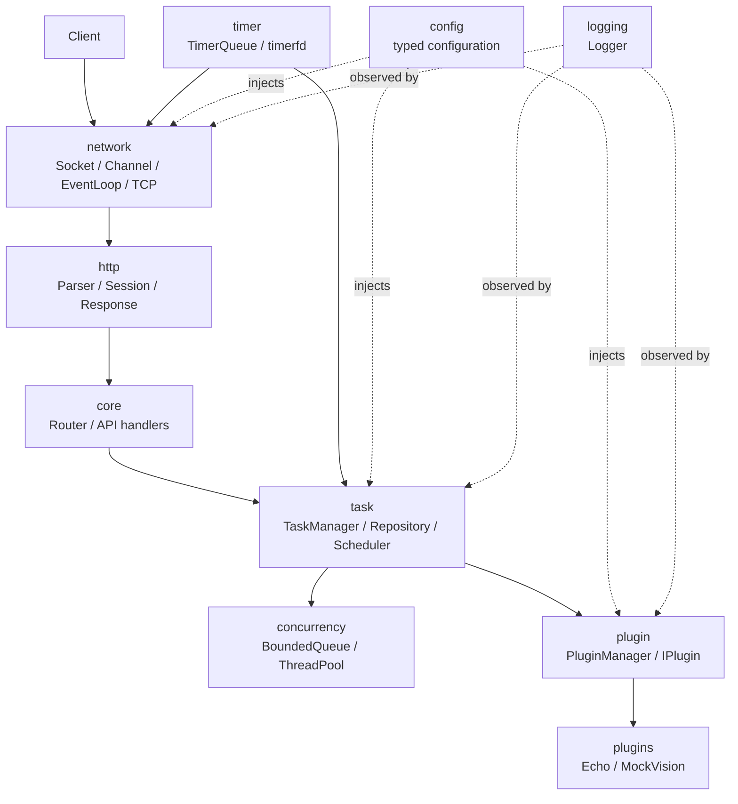
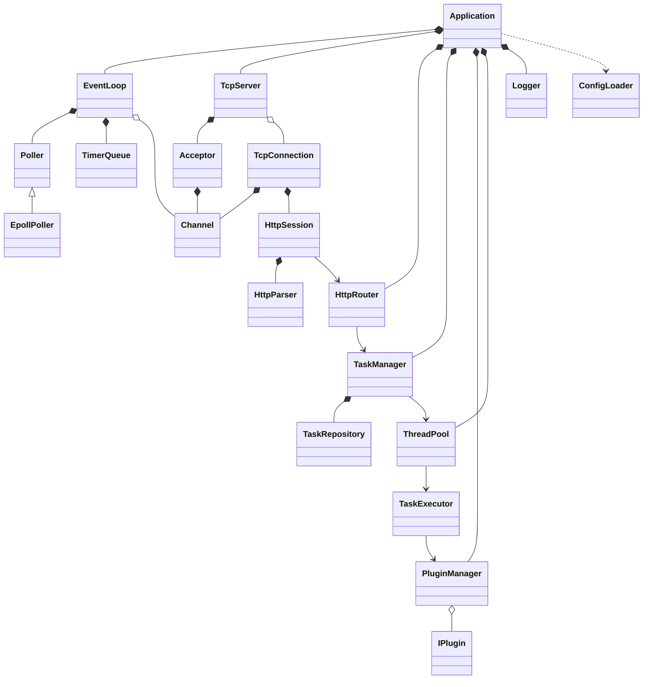
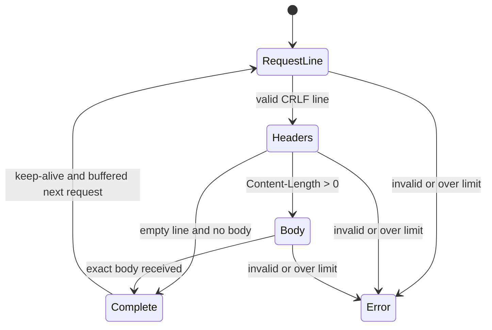
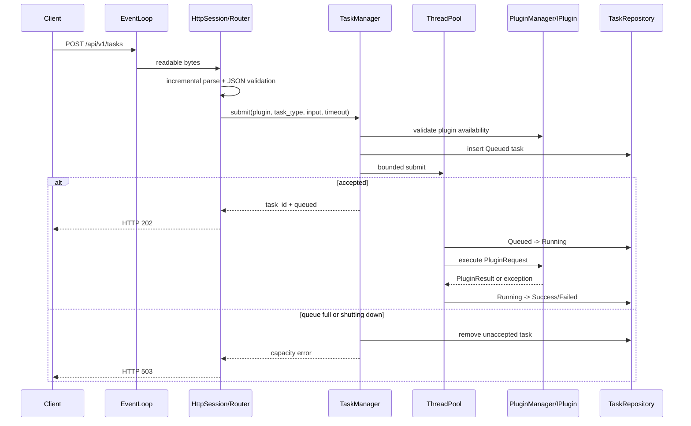
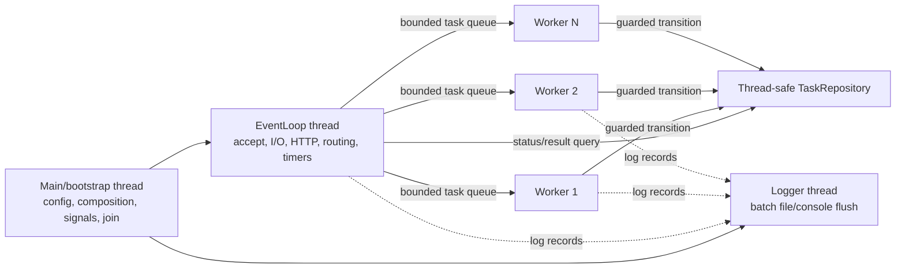
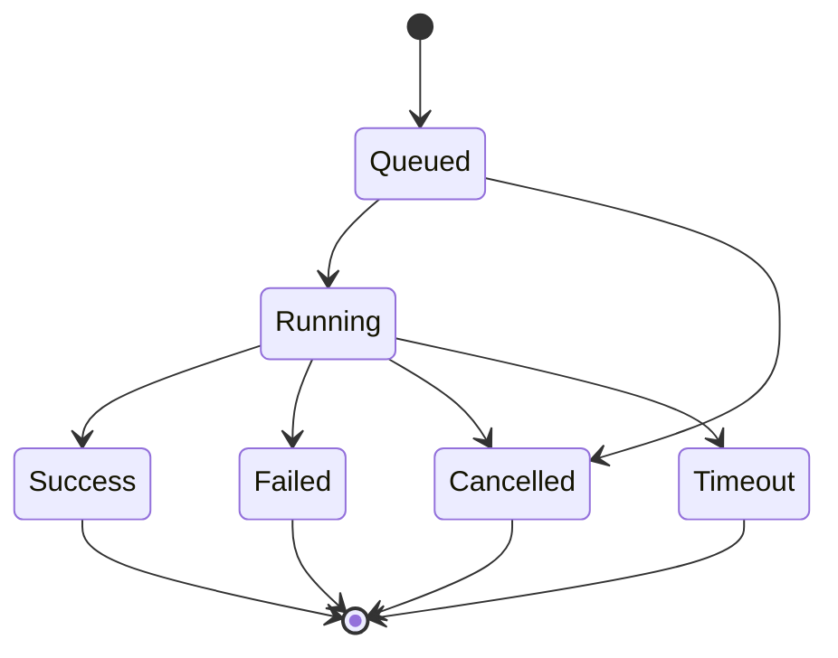

# 架构设计

## 1. 文档状态

- 项目：IndustrialAIServiceFramework
- 阶段：Phase 0
- 日期：2026-07-29
- 状态：架构基线已完成，实现均为 planned
- 目标平台：Linux x86_64，C++17

本文件描述目标边界和实现约束，不代表对应 C++ 类已经存在。

## 2. 调查结果与设计来源

### 2.1 当前工作区

Phase 0 开始时，工作区根目录只有只读参考目录 `TinyWebServer_reference`，没有项目代码、CMake 工程、Git 仓库或用户未提交改动。`PTV2-WeldSeg-Deployment` 和 `weld_agent` 未出现在当前工作区，因此未读取、未修改。

### 2.2 参考工程只读观察

参考目录包含 62 个文件，调查时聚合 SHA-256 为：

```text
83AE7E469DEA30C860DEFD4D26CB313B7B3C87EFCD9387414741E152EE46CF27
```

观察到的主要模块：

- 根级 `WebServer` 负责配置、监听、epoll 循环、连接数组、定时器、日志、线程池和数据库初始化。
- `http_conn` 同时承担 Socket I/O、HTTP 解析、静态文件响应和 MySQL 登录相关逻辑。
- 模板线程池使用 pthread、信号量、裸请求指针和分离线程。
- 定时器采用信号与管道唤醒，容器为有序双向链表。
- 日志采用单例、阻塞队列和后台线程。
- 工程包含 MySQL 连接池、HTML/图片/视频站点资源和 webbench。
- 监听与连接支持 LT/ET 组合，也包含 Reactor/模拟 Proactor 选择。

可借鉴的只是通用思想：非阻塞 Socket、epoll 事件分派、ET 下读到 `EAGAIN`、部分写处理、HTTP 增量状态机、工作队列、空闲连接超时和异步日志。

### 2.3 自主改造原则

不复用参考工程目录、类名、数据结构或实现代码。本项目以工业 AI **任务服务化** 为核心重新划分边界：

- 网络对象不理解 HTTP 路由，更不理解工业业务。
- HTTP 会话不持有数据库、插件或视觉资源。
- 任务调度使用通用闭包和统一 Task 模型，不把连接对象直接扔给工作线程。
- 插件管理器是显式实例，禁止隐式全局注册表。
- 所有 fd 使用 RAII；连接对象按 EventLoop 线程归属管理。
- 使用最小堆与 `timerfd`，不使用 `alarm`/`SIGALRM`。
- 不包含登录、HTML、MySQL、任意文件服务或 CGI。
- 设计从第一天支持自动化单元/集成测试和容量上限。

## 3. 设计目标与非目标

### 3.1 目标

- Linux 上的单 Reactor、epoll ET、非阻塞网络服务。
- HTTP/1.1 JSON API；未来可增加长度前缀 TCP JSON 协议。
- 有界线程池和任务队列，耗时计算与网络 I/O 隔离。
- 统一任务状态、结果、超时和错误模型。
- 静态注册插件，隔离插件异常。
- 可配置、可记录、可测试、可优雅停止。
- 为未来视觉、机器人和编排插件提供边界，而不把它们耦合进核心。

### 3.2 非目标

- HTTPS、HTTP/2、WebSocket、chunked、multipart。
- 多 Reactor、每核 EventLoop、零拷贝。
- 动态 `.so` 加载或稳定二进制 ABI。
- 数据库、用户登录、HTML 静态站点。
- 真实 TensorRT/PCL/PointNet++、机器人控制或 Agent。
- 分布式任务队列、任务持久化、跨进程恢复。

## 4. 分层与依赖规则



依赖规则：

1. `network` 不依赖 `http`、`task` 或 `plugin`。
2. `http` 通过字节流与回调适配 `network`，不执行任务。
3. `core` 负责装配和路由，可以依赖上层服务接口。
4. `task` 依赖抽象插件调用端口和执行器，不依赖具体插件。
5. `plugins/*` 依赖公共插件契约，核心不反向依赖具体插件。
6. `logging`、`config` 提供实例化服务，不使用全局可变单例。
7. 跨层错误使用统一 `Error`，不得静默吞异常。

## 5. 推荐目录

```text
include/iaisf/
  core/          Application, Error, Result, Router, ServiceContext
  network/       UniqueFd, InetAddress, Buffer, Channel, Poller,
                 EpollPoller, EventLoop, Acceptor, TcpServer, TcpConnection
  http/          HttpRequest, HttpResponse, HttpParser, HttpSession, HttpRouter
  concurrency/   BoundedQueue, ThreadPool, CancellationToken
  task/          Task, TaskResult, TaskRepository, TaskManager, TaskExecutor
  plugin/        IPlugin, PluginTypes, PluginManager
  timer/         TimerId, TimerQueue
  logging/       LogRecord, ILogger, Logger
  config/        ServerConfig, ConfigLoader
src/             与公共模块对应的实现；main.cpp 只做组合根和进程退出码
plugins/
  echo/          无状态回显插件
  mock_vision/   显式 mock 工业视觉示例
tests/
  unit/          纯模块测试
  integration/   启动真实服务的端到端测试
examples/        示例客户端和请求脚本
scripts/         构建、启动、smoke、sanitizer 辅助脚本
```

## 6. 核心类清单

| 类/概念 | 职责 | 线程安全与生命周期 |
|---|---|---|
| `UniqueFd` | 独占 fd，移动语义，析构关闭 | 不共享；所有权明确 |
| `InetAddress` | `sockaddr` 值对象和格式转换 | 不可变值对象 |
| `Buffer` | 连续/分段输入输出缓冲，消费游标 | 仅归属 EventLoop |
| `Channel` | fd、关注事件、回调，不拥有 fd | 仅 EventLoop 修改 |
| `Poller` | 事件轮询抽象，便于测试 | 仅 EventLoop 使用 |
| `EpollPoller` | RAII 管理 epoll fd 和 `epoll_ctl/wait` | 仅 EventLoop 使用 |
| `EventLoop` | 轮询、定时器、跨线程待执行函数 | 本体单线程；`post()` 可跨线程 |
| `Acceptor` | 创建监听 fd、accept 循环、连接上限前置检查 | EventLoop 线程 |
| `TcpServer` | 持有连接表、创建和移除连接、停止接收 | EventLoop 线程 |
| `TcpConnection` | 连接状态、读写缓冲、半关闭和回压 | EventLoop 线程；外部只持弱引用/投递操作 |
| `HttpParser` | 增量解析 request line/headers/body | 每连接独占，无共享 |
| `HttpSession` | 把 TCP 字节转换为 HTTP 请求/响应 | EventLoop 线程，不执行耗时业务 |
| `HttpRouter` | 方法 + 路径模板匹配 | 启动后只读 |
| `ThreadPool` | 固定工作线程、有界闭包队列、drain/stop | 公共方法线程安全 |
| `Task` | 任务标识、输入、状态、时间、结果和错误 | 状态由仓储锁保护或通过受控方法修改 |
| `TaskRepository` | 有界内存存储、查询、合法状态转换、终态清理 | 内部互斥，公共方法线程安全 |
| `TaskManager` | 校验提交、创建任务、排队、查询、超时协调 | 公共 API 线程安全 |
| `TaskExecutor` | 工作线程中的插件调用边界、异常隔离和结果提交 | 无共享或依赖线程安全服务 |
| `IPlugin` | 插件生命周期和执行契约 | `execute` 在首版要求并发安全 |
| `PluginManager` | 显式注册、冲突检测、初始化、查找、关闭 | 初始化阶段写；运行期只读查找 |
| `TimerQueue` | `timerfd` + 最小堆、取消/更新、执行过期回调 | EventLoop 归属；跨线程操作通过 `post()` |
| `Logger` | 有界日志队列、控制台/文件 sink、刷新停止 | 公共写接口线程安全 |
| `ConfigLoader` | JSON 加载、默认值、类型和范围校验 | 启动期使用，产出不可变配置 |
| `Application` | 组合根、启动顺序、优雅停止，不承担模块细节 | 主线程创建，EventLoop 运行期间协调生命周期 |

## 7. 主要类关系



所有权重点：

- `Application` 控制顶层服务的启动与销毁顺序。
- `TcpServer` 的连接表拥有 `shared_ptr<TcpConnection>`；Channel 回调避免形成强引用环。
- fd 由 `UniqueFd` 独占，Channel 永不关闭 fd。
- Router handler 只捕获生命周期稳定的服务引用。
- 工作任务不持有连接强引用；POST 提交立即响应，后续通过任务 ID 查询。

## 8. Reactor 与网络 I/O

### 8.1 模式选择

首版对监听和连接 fd 都使用 epoll ET：

- ET 减少事件重复通知，能体现正确的非阻塞 I/O 边界处理。
- 单 Reactor 降低首版生命周期和跨线程连接状态的复杂度。
- 业务计算完全交给工作线程；EventLoop 只做 accept/read/parse/route/serialize/write 和短小状态更新。
- 首版不使用 `EPOLLONESHOT`：只有 EventLoop 线程执行连接 I/O，不存在多个 I/O worker 同时处理同一 fd；事件通常关注 `EPOLLET | EPOLLRDHUP` 加实际读写位。

### 8.2 accept/read/write 规则

- 使用 `socket(..., SOCK_NONBLOCK | SOCK_CLOEXEC, ...)`，必要时以 `fcntl` 回退。
- 监听设置 `SO_REUSEADDR`；`SO_REUSEPORT` 首版不启用。
- `accept4(..., SOCK_NONBLOCK | SOCK_CLOEXEC)` 循环直到 `EAGAIN/EWOULDBLOCK`。
- 连接读取循环调用 `recv`，直到返回 `EAGAIN/EWOULDBLOCK`；`EINTR` 重试；`0` 表示 peer EOF。
- 输出优先使用 `send(..., MSG_NOSIGNAL)`；进程启动时同时忽略 `SIGPIPE` 作为防御。
- 写缓冲未清空时关注 `EPOLLOUT`；每次可写事件循环发送到 `EAGAIN`，清空后取消 `EPOLLOUT`，避免 busy loop。
- `EPOLLERR/EPOLLHUP` 读取 `SO_ERROR` 后关闭。`EPOLLRDHUP` 标记读半关闭：处理已完整接收的请求并刷新响应，然后关闭；不再等待新请求。
- `TcpConnection::close` 必须幂等：先从 epoll 删除，再从连接表移除，最后让 `UniqueFd` 关闭。
- 可选启用 `TCP_NODELAY`，默认对小 JSON 响应启用，且通过配置覆盖。

### 8.3 回压和容量

- 每连接限制 header、body、输入缓冲、输出缓冲和待处理请求数。
- 输出超过高水位时暂停读事件；降到低水位后恢复。
- 超过硬上限时返回可行的错误响应后关闭，或在无法安全响应时直接关闭。
- 达到最大连接数时完成 accept 后立即关闭新 fd，并记录限流事件；不能让监听 fd 在 ET 下停止 drain。

### 8.4 EventLoop 唤醒

`EventLoop::post()` 把短小回调放入有界/受控队列，并写 `eventfd` 唤醒 epoll。工作线程不得直接调用 `epoll_ctl`、修改 Channel 或写 Socket。

进程在启动时屏蔽 SIGINT/SIGTERM，并计划通过 `signalfd` 把停止通知纳入 EventLoop；SIGPIPE 独立忽略。这样信号路径只请求停止，不执行非异步信号安全的清理逻辑。

## 9. HTTP 解析与会话

状态机：



解析器按字节增量工作，不依赖 NUL 结尾，也不在不完整数据上保存悬空指针。限制在解析过程中立即检查：

- 请求行长度、单 header 行、header 总字节数和 header 数量。
- body 最大字节数。
- `Content-Length` 必须是唯一、十进制、非负、无溢出的值。
- 同时出现 `Transfer-Encoding` 和 `Content-Length` 时拒绝。
- chunked、multipart 和未知 transfer coding 首版不支持。
- HTTP/1.1 要求 Host；GET/POST 之外按路由能力返回 405。
- 路径只用于路由，不提供通用文件读取；拒绝 NUL、反斜杠、编码斜杠和 `..` 段。

HTTP keep-alive 遵循 HTTP/1.1 默认持久连接和 `Connection: close`。首版允许顺序处理缓冲中的下一个请求，但不承诺并行 pipeline。

## 10. 请求数据流

### 10.1 提交任务



### 10.2 查询状态/结果

查询只读取 `TaskRepository` 快照，不等待插件完成：

- 状态接口返回当前状态、进度和时间元数据。
- 结果接口对非终态返回 409；成功返回结果；失败/超时返回结构化错误。
- 返回对象是拷贝/不可变快照，序列化期间不持有仓储锁。

### 10.3 健康检查

`GET /health` 只做常数时间状态读取，不进入线程池。后续可区分 liveness 与 readiness，但首版只提供简单健康状态。

## 11. 线程模型



首版可以让主线程直接运行 EventLoop；逻辑上仍区分 bootstrap 阶段和事件循环阶段。并发规则：

- 连接、Channel、Buffer 和 HTTP 会话只在 EventLoop 线程访问。
- `TaskRepository`、`ThreadPool::submit/stop` 和 Logger 写接口内部同步。
- 插件初始化/关闭在工作线程启动前/停止后串行执行。
- 插件 `execute` 可能被多个 worker 并发调用；不满足并发安全的未来插件必须通过专用执行策略或并发闸门限制。
- 停止顺序：停止 accept → 处理/关闭连接 → 拒绝新任务 → 按策略 drain 工作队列 → shutdown 插件 → flush/stop Logger → 退出。

## 12. 任务状态与超时

合法状态转换：



所有转换在 `TaskRepository` 的一个临界区中校验，失败返回 `InvalidTaskTransition`，不覆盖已有终态。完成与超时竞争时，先获得状态转换权的一方生效。

任务若未能进入有界队列，则不被 API 接受并从仓储移除；不会为了排队失败而扩展 `Queued -> Failed`。worker 取到任务后先转换为 Running，后续内部或插件错误才转换为 Failed。

C++17 无法安全强杀执行任意插件代码的线程。Phase 6 的超时语义是：

1. 截止时间到达后把仍为 Running 的任务原子地标记为 Timeout；
2. 触发自定义 `CancellationToken`，要求插件协作退出；
3. 插件若继续运行，晚到结果被丢弃；
4. worker 线程只能在插件返回后复用。

因此，卡死的非协作插件仍会占用 worker。这是已知边界，真实 GPU/机器人插件必须设计可取消调用或进程隔离。

## 13. 定时器

选择 `timerfd + 最小堆`：

- `timerfd` 是普通 fd，可直接加入 epoll，无异步信号处理复杂度。
- 最小堆给出 `O(log n)` 添加/更新和接近 `O(1)` 的下一截止时间读取。
- 使用单调时钟避免系统时间调整影响超时。

`TimerId` 由序号和 generation 组成。取消和更新通过 generation 失效旧堆节点，过期弹出时惰性清理。回调在 EventLoop 执行，只允许关闭连接、状态转换或投递工作等短操作，禁止执行插件。

应用：

- 每次有效网络活动更新连接 idle timer。
- 任务进入 Running 时按执行超时设置 deadline timer；终态时取消。排队时间不计入首版执行超时，停止服务时仍在 Queued 的任务转为 Cancelled。
- 未来心跳仍复用同一 TimerQueue。

## 14. 配置模型

`ConfigLoader` 解析 JSON 到不可变强类型结构。默认值只用于非关键缺失字段；类型错误、范围错误、关键资源错误必须使启动失败并返回非零退出码。

建议配置组：

- `server`：host、port、backlog、epoll_max_events、max_connections、idle_timeout_ms、TCP_NODELAY。
- `http`：request_line/header/body/input/output 上限、header_count、keep_alive_requests。
- `thread_pool`：worker_count、max_queue_size、shutdown_drain_timeout_ms。
- `tasks`：max_records、default_timeout_ms、max_timeout_ms、terminal_retention_ms。
- `logging`：level、console、file、queue_size、batch_size、flush_interval_ms、rotation_size。
- `plugins`：各插件 enabled 与专属配置。

未知顶层键默认报错，插件专属 JSON 由插件验证。日志路径必须是服务端配置，客户端不能控制。

## 15. 日志模型

Phase 1 只提供同步控制台占位，Phase 7 替换为一个有界队列和单后台写线程：

- producer 创建包含时间戳、level、线程 ID、request/task ID、可选源文件/行号的 `LogRecord`，通过 `try_push` 非阻塞入队；
- 后台线程用 condition variable 等待，按 batch 写控制台/文件并按间隔 flush，不使用 busy waiting；
- 队列预留一小段 WARN/ERROR 容量：接近满时先拒绝 TRACE/DEBUG/INFO；完全满时高等级日志也不能无限阻塞，只增加分级 dropped counter；
- 队列恢复后由后台线程输出合成的 dropped 统计，使丢弃可观测；
- 文件轮转只在后台线程按大小执行，首版不做复杂双缓冲；
- stop 后拒绝新记录、drain 队列、flush sink、join 后台线程；
- Logger 是注入实例，不是隐式单例；sink 失败不得递归写日志。

这保证日志容量固定，常规日志路径不在 EventLoop 做文件 I/O。若所有 sink 失效，进程继续还是停止由严重程度和阶段策略明确记录，不能静默忽略。

## 16. 错误处理模型

### 16.1 内部表示

预期失败使用统一值类型：

- `ErrorCode`：稳定的机器可读枚举/字符串。
- `message`：面向调用者的安全说明。
- `context`：内部诊断字段，不直接暴露给客户端。
- `std::error_code`：可选的系统错误，创建时立即捕获 `errno`。
- `request_id` / `task_id`：关联字段。

跨模块预期失败返回 `Result<T>`（C++17 自主实现的轻量 value-or-error 类型）或明确状态，不用异常控制普通流程。构造失败可抛异常，但必须在 `Application` 启动边界处理。

### 16.2 异常边界

- `main/Application`：捕获启动异常，记录后返回非零。
- EventLoop 回调：捕获到未处理异常时记录连接上下文并关闭相关连接；EventLoop 不能退出。
- worker：每个任务外围 `try/catch`，`std::exception` 和未知异常均转换为 Failed；线程继续工作。
- PluginManager/TaskExecutor：插件异常转为 `PluginExecutionFailed`，不泄露异常文本给远端。
- Logger：sink 失败进入可观测降级状态，避免递归记录。

禁止空 catch 和吞错。客户端只获得稳定错误码；详细路径、errno、栈信息只进入服务端日志。

### 16.3 HTTP 映射

| 情况 | HTTP |
|---|---:|
| 非法请求行/header/JSON/字段 | 400 |
| 未认证（未来能力） | 401 |
| 未知路由、任务或插件 | 404 |
| 方法不允许 | 405 |
| 非终态查询结果、非法状态冲突 | 409 |
| body 超限 | 413 |
| 语义校验失败 | 422 |
| 连接/请求限流 | 429 或直接拒绝连接 |
| 队列满、插件未就绪、服务停止中 | 503 |
| 任务已超时 | 504 |
| 未分类内部错误 | 500 |

## 17. 安全与健壮性

- 不实现通用文件读取、下载、静态文件或 shell 执行。
- 核心只把 `input` JSON 作为数据传给已注册插件；不解释为命令。
- MockVision 的路径字段只做格式验证，不实际打开文件。
- 所有容量有上限；任务终态按保留期清理。
- Task ID 和 request ID 由服务端生成，客户端不能覆盖。
- 路由路径严格匹配，拒绝目录穿越形式。
- JSON 错误、插件错误和日志错误不能终止 EventLoop。
- fd 创建即设置 `CLOEXEC`，所有提前返回路径由 RAII 回收。
- 优雅停止有总超时，超时后仍不得强杀线程；应记录并由运维决定进程级处置。

## 18. 可演进点

- 多 Reactor：保留 EventLoop/Channel 的线程归属接口，但在有测量依据前不实现。
- 动态插件：未来使用版本化 C ABI 工厂而非直接假设 C++ ABI 稳定。
- 真实视觉：增加模型生命周期、GPU 上下文池、输入对象存储和独立并发闸门。
- 持久任务：以 `ITaskRepository` 抽象替换内存实现，但首版不引入数据库。
- 可观测性：后续增加 metrics/tracing，不在 Phase 0 宣称已有。
