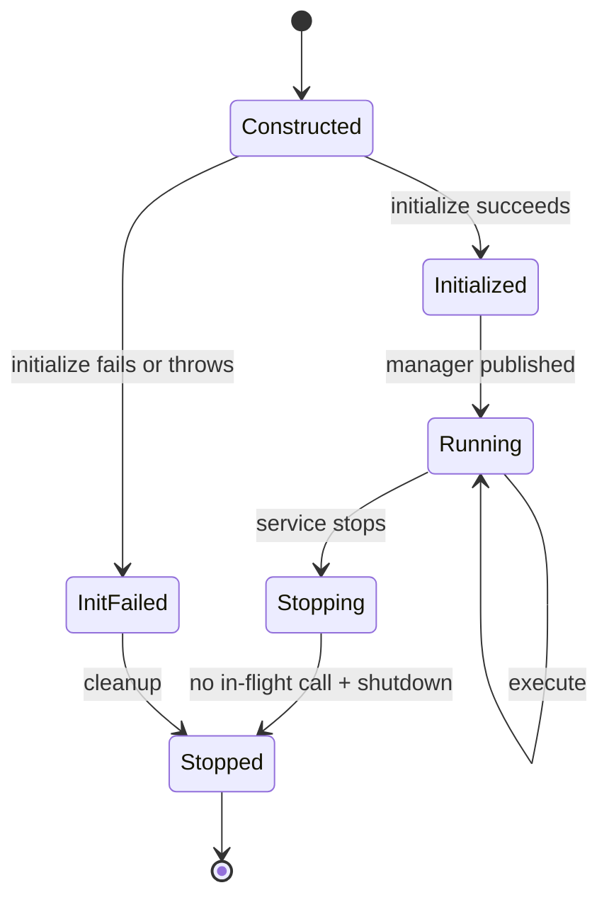

# 插件系统设计

## 1. 目标与状态

插件系统让框架承载不同工业任务，但框架本身不包含焊缝、点云、机器人或 Agent 语义。

Phase 0 只完成接口设计。Phase 5 首次实现静态插件；动态 `.so`、真实视觉、机器人和 Agent 都未实现。

## 2. 边界原则

- 核心只识别 `plugin_name`、`task_type`、JSON `input`、deadline、结果和错误。
- 具体输入校验和领域结果由插件负责。
- 插件不能获得 `TcpConnection`、Socket fd、Router 或 EventLoop。
- 插件不能直接构造 HTTP 响应。
- 插件不能读取客户端指定的任意路径、执行 shell 或创建不受控线程。
- 插件日志通过注入的日志接口，配置只来自服务端配置文件。
- 插件异常必须在 `TaskExecutor` 边界被捕获。

## 3. 公共类型

以下是接口语义，不是已实现代码。

### 3.1 PluginRequest

字段：

| 字段 | 类型语义 | 说明 |
|---|---|---|
| `task_id` | string | 服务端生成，不透明 |
| `task_type` | string | 插件内操作名 |
| `input` | JSON object | 插件专属输入 |
| `deadline` | steady-clock time point | 单调时钟截止时间 |
| `cancellation` | CancellationToken | C++17 自定义协作取消令牌 |
| `request_context` | 只读结构 | request_id 等安全关联信息 |

不得把连接指针、HTTP request 或可变全局配置放入请求。

### 3.2 PluginResult

使用显式成功/失败二选一，而不是通过特殊 JSON 表示失败：

- 成功：JSON object `output`，可选 metrics/metadata。
- 失败：稳定 `ErrorCode`、安全 message、可选安全 details。

插件执行耗时由 TaskExecutor 测量，插件不自行伪造框架时间字段。

### 3.3 PluginMetadata

建议包含：

- 唯一 `name`
- 人类可读 description
- 插件语义版本
- 支持的 `task_type` 列表
- `mock` 标志
- 执行并发策略描述

运行期 API 不必暴露全部 metadata，后续可添加只读插件查询端点。

## 4. IPlugin 生命周期

目标接口职责：

1. `name()` / `metadata()`：注册前可调用，不抛异常。
2. `initialize(config, context)`：串行调用一次，验证专属配置并申请资源。
3. `validate_request(task_type, input)`：提交前执行快速、确定、无 I/O 的 schema 校验。
4. `execute(request)`：在 worker 线程调用零到多次。
5. `shutdown()`：不再有 execute 后串行调用一次，释放资源。

状态：



契约：

- `initialize` 返回明确错误，不得部分成功后把泄漏资源留给管理器。
- `validate_request` 只能做 task type、字段、类型、范围和字符串格式校验；不得读文件、访问网络、睡眠或执行模型。确定性错误在排队前返回 422。
- `execute` 首版可能被多个 worker 并发调用；Echo 和 MockVision 必须无状态或内部同步。
- `shutdown` 应幂等、noexcept 语义；异常只记录，不能中断其他插件关闭。
- 插件析构是最终 RAII 防线，不能依赖进程强制退出。

未来 GPU 插件可能要求 `max_concurrency=1` 或上下文池。该限制应由独立 `PluginExecutorPolicy`/semaphore 实现，而不是让网络层了解 GPU。

## 5. PluginManager

职责：

- 接收 `unique_ptr<IPlugin>` 的显式注册。
- 校验名称格式、空名称和冲突。
- 按配置启用/禁用并初始化。
- 只发布初始化成功的插件。
- 运行期按名称返回受控引用/`shared_ptr`，不暴露内部 map。
- 停止时阻止新执行，等待 TaskExecutor drain 后逆序 shutdown。

非职责：

- 不调度线程、不保存 Task、不解析 HTTP。
- 不解释插件 `input`。
- 不捕获后继续隐瞒初始化失败。
- 不扫描目录或自动 `dlopen`。

### 5.1 注册方式

Phase 5 使用组合根显式注册：

```text
Application composition root
  -> construct EchoPlugin
  -> PluginManager.register(plugin)
  -> construct MockVisionPlugin
  -> PluginManager.register(plugin)
  -> PluginManager.initialize_enabled(config.plugins)
```

不使用静态初始化宏或全局 registry，原因是：

- 启动顺序和失败点可见；
- 单元测试可构造独立 manager；
- 避免全局可变状态；
- 链接器裁剪和静态初始化次序不会悄悄改变注册结果。

### 5.2 名称冲突

- 名称建议匹配 `^[a-z][a-z0-9_-]{0,63}$`。
- 重复名称返回 `PluginAlreadyRegistered`，启动配置中的重复是致命错误。
- 名称比较区分大小写；规范要求插件只用小写。
- disabled 插件不会对外可执行；请求返回 `PluginNotFound` 或 `PluginDisabled`，HTTP 层稳定映射。

### 5.3 初始化失败

- enabled 插件初始化失败默认使服务启动失败，避免健康但不可用的假象。
- 可在未来加入 `required: false` 的降级插件；首版不增加该复杂度。
- 错误日志包含插件名和内部原因，HTTP 不会看到配置或路径详情。

## 6. 任务执行边界

```mermaid
sequenceDiagram
    participant TM as TaskManager
    participant TP as ThreadPool
    participant TE as TaskExecutor
    participant PM as PluginManager
    participant PL as IPlugin
    participant TR as TaskRepository

    TM->>TP: submit bounded closure
    TP->>TE: run task
    TE->>TR: Queued -> Running
    TE->>PM: acquire enabled plugin
    PM-->>TE: plugin handle
    TE->>PL: execute(request)
    alt success before deadline
        PL-->>TE: output
        TE->>TR: Running -> Success
    else explicit plugin failure
        PL-->>TE: Error
        TE->>TR: Running -> Failed
    else exception
        PL--xTE: throws
        TE->>TR: Running -> Failed
    else timeout won race
        PL-->>TE: late output/error
        TE->>TR: transition rejected; discard late result
    end
```

`TaskExecutor` 必须：

- 在任何插件代码前检查任务仍为 Queued/可运行。
- 以受控转换进入 Running。
- 捕获 `std::exception` 和未知异常。
- 不把异常 `what()` 原文直接发给客户端。
- 完成后只尝试一次终态转换。
- 对已 Timeout/Cancelled 的任务丢弃结果并记录 debug/warn。
- 不让单个任务异常退出 worker。

## 7. 配置

建议 Phase 5 配置：

```json
{
  "plugins": {
    "echo": {
      "enabled": true
    },
    "mock_vision": {
      "enabled": true,
      "mock_delay_ms": 200,
      "default_weld_type": "straight"
    }
  }
}
```

规则：

- `enabled` 由核心读取。
- 其余对象原样交给对应插件，但插件必须进行类型、范围和未知字段校验。
- `mock_delay_ms` 设置合理上限，不能用超大数占满 worker。
- 客户端不能覆盖插件配置。
- 配置对象在 initialize 后视为不可变。

## 8. EchoPlugin

目的：验证 Task → ThreadPool → Plugin → Result 全链路。

设计：

- 名称：`echo`
- task type：`echo`
- 无外部依赖、无睡眠、无文件访问
- 输入必须是 JSON object
- 输出把输入置于 `echo` 字段，并加入 `plugin: "echo"`
- 并发安全：无共享可变状态

它是框架测试插件，不是工业能力。

## 9. MockVisionPlugin

目的：展示工业视觉任务的结构化契约，但不执行真实算法。

设计：

- 名称：`mock_vision`
- task type：`weld_detect`
- 输入字段：
  - `point_cloud_path`：必填非空字符串，只作为模拟标识；
  - `weld_type_hint`：可选受限枚举。
- 不打开路径、不检查真实文件、不导入 PCL/TensorRT/CUDA。
- 模拟延迟只来自服务端 `mock_delay_ms`，执行中分段检查 cancellation。
- 输出固定包含：
  - `"mock": true`
  - `"plugin": "mock_vision"`
  - 模拟 `detected/weld_type/start_point/end_point/confidence`

路径校验：

- 限制 UTF-8 字节长度；
- 拒绝 NUL、绝对路径、盘符、反斜杠和 `..` path segment；
- 即使通过也不读取该路径；
- 未来真实插件必须使用服务端对象 ID/受控数据目录，而不能直接信任客户端文件系统路径。

真实性要求：

- `mock` 标志不能通过配置或输入关闭。
- README、日志和 API 示例均称其为模拟结果。
- 不报告精度、GPU 利用率或模型版本。

## 10. 错误分类

| 插件错误 | 含义 | 任务状态 | HTTP 查询结果 |
|---|---|---|---|
| `PluginNotFound` | 未注册/disabled | 不创建任务 | 404 |
| `PluginAlreadyRegistered` | 启动注册冲突 | 启动失败 | 不适用 |
| `PluginInitializationFailed` | enabled 插件初始化失败 | 启动失败 | 不适用 |
| `UnsupportedTaskType` | 插件不支持 task_type | 不创建任务 | 422 |
| `PluginInputInvalid` | 快速 input schema 失败 | 不创建任务 | 422 |
| `PluginExecutionFailed` | 插件显式失败/抛异常 | Failed | 结果接口返回失败 |
| `PluginCancelled` | 协作取消 | Cancelled/Timeout，取决于先发生的状态 | 409/504 |
| `PluginUnavailable` | 停止中或资源暂不可用 | 不创建任务/Failed | 503 |

Phase 5 必须实现轻量 `validate_request(task_type, input)`，使确定性输入错误在排队前返回 422。只有依赖执行期资源才能发现的错误才会在任务被接受后转成 Failed。

## 11. 日志与可观测性

插件日志字段至少包含：

- plugin name/version
- task_id、request_id
- task_type
- lifecycle event（initialize/execute/shutdown）
- duration（由框架测量）
- outcome 和稳定 error code

禁止记录：

- 完整大输入/输出
- 可能敏感的路径或凭据
- 未清洗异常中包含的服务端目录

未来 metrics 可按 plugin/task_type 统计队列、执行时间和错误，但 Phase 8 前不声称已有。

## 12. 动态插件的未来方案

动态加载不属于第一版。若将来启用：

- 使用 `dlopen`/`dlsym` 的版本化 C ABI 工厂，例如 ABI version、create/destroy 函数。
- 不把 nlohmann/json C++ 类型直接跨不受控编译器 ABI 边界；考虑序列化字符串或稳定 C 结构。
- 校验插件 ABI、核心版本、名称和能力后再发布。
- 处理库句柄生命周期：所有插件对象销毁后才能 `dlclose`。
- 不支持服务运行中的热卸载，除非能证明没有 in-flight 调用。
- 需要签名/来源/文件权限策略，不能扫描客户端可写目录。

在这些能力实现并测试前，文档只能写“静态注册”。

## 13. 真实工业插件预留

未来候选：

- PTV2 TensorRT VisionPlugin
- PCL PostProcessPlugin
- RobotControlPlugin
- WeldWorkflowPlugin
- AgentOrchestrationPlugin

它们不得改变核心层依赖方向。尤其：

- 模型和 GPU 上下文属于插件；
- 机器人 SDK/网络协议属于 Robot 插件；
- 工作流/Agent 只能通过 Task API 或插件服务接口组合，不进入 Reactor；
- 高风险物理动作必须增加认证、授权、审计和安全状态机，不能复用当前 mock 安全假设。
