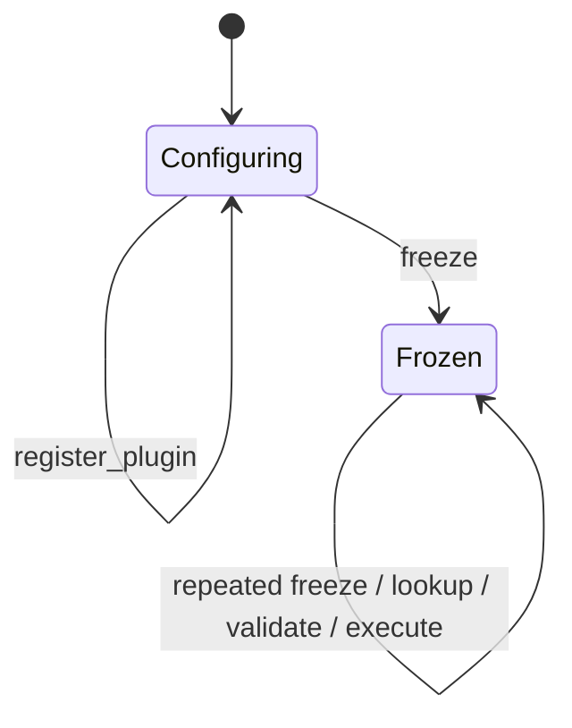

# 静态算法插件设计

## 1. 状态与范围

Phase 6 跨平台静态插件系统已完成；当前动态插件最终本地审计状态：

```text
PHASE_8G_FINAL_DYNAMIC_PLUGIN_HARDENED
```

Windows VS2022 Debug/Release 已各通过 316/316 CTest，其中 Task Runtime 97、
Plugin System 92。功能提交 `66a606bb53bf8ed80b8efd6faf7c6529b5cd22d1` 的首次
[Linux CI run 30602538268](https://github.com/realme-max/IndustrialAIServiceFramework/actions/runs/30602538268)
Debug/Release 均为 428/428，Plugin System 92/92、Task Runtime 97/97，Release smoke
成功；但两个配置各有 3 条项目源码 warning 和 3 条项目测试 warning，因此不是最终
封板证据。warning 修复提交 `853ccccca80cdc042b3d51eae52fe45566aa2b22`
对应最终 [Linux CI run 30604428624](https://github.com/realme-max/IndustrialAIServiceFramework/actions/runs/30604428624)：
Debug/Release 均 428/428，Plugin System 92/92、Task Runtime 97/97，Release smoke
成功，项目源码与测试 warning 均为 0。

“静态”仅表示插件代码编译进进程，并在组合阶段显式注册对象。当前没有动态 `.so`/
DLL、目录扫描、全局注册宏、热加载、卸载、HTTP Task API、自动 timeout、文件读取、
GPU 推理或常驻 Application。

## 2. Target 与依赖

```text
iaisf_plugin / iaisf::plugin (portable STATIC)
  PUBLIC -> iaisf::task
  PUBLIC -> iaisf::core
  PUBLIC -> nlohmann_json::nlohmann_json

iaisf_plugin_tests (portable)
  PRIVATE -> iaisf::plugin
  PRIVATE -> GTest / Threads
```

`iaisf_task` 不反向依赖 plugin，plugin 不依赖 net、tcp、http。网络层和 TaskRepository
不理解 `echo`、`mock_vision.detect` 或任何工业领域字段。

## 3. PluginLimits

`PluginLimits::create` 生成经验证的不可变安全边界：

- `max_plugins`
- `max_operation_bytes`
- `max_name_bytes`
- `max_version_bytes`
- `max_description_bytes`
- `max_error_message_bytes`
- `max_input_bytes`
- `max_output_bytes`
- `max_json_depth`
- `max_json_elements`
- `max_string_bytes`
- `max_capabilities`
- `max_capability_bytes`

所有输入使用有符号整数接收，先拒绝零和负数，再检查公开硬上限和平台 `size_t`
范围；不静默 clamp。字符串大小按 `std::string` 中 UTF-8 bytes 计算；depth 把根
计为 1，elements 计算包括根在内的全部 JSON value 节点，对象键受 string limit
约束。这些默认值是内存与输入安全边界，不是性能指标或容量承诺。

## 4. PluginMetadata

值类型字段：

```text
operation
name
version
description
mock
capabilities
```

规则：

- operation 非空，只接受小写 ASCII `a-z0-9._-`；
- operation 不能以点开头/结尾，不能包含连续点形成空分段；
- name/version/description 非空；
- 所有字段遵守各自 byte limit；
- 文本拒绝 NUL、C0/DEL 控制字符和非法 UTF-8；
- capability 使用与 operation 相同的 canonical lowercase ASCII 规则，允许空列表，
  但每个条目非空、列表内唯一，并受 count/byte 上限约束；
- Manager 注册时只调用一次插件 `metadata()`，保存经过验证的独立副本；
- lookup/list 不返回插件内部字符串引用；
- Echo metadata 的 `mock=false`，MockVision 的 `mock=true`。

operation 是进程内 registry key，不是动态库文件名。

## 5. IAlgorithmPlugin

```cpp
class IAlgorithmPlugin {
public:
    virtual ~IAlgorithmPlugin() = default;
    virtual PluginMetadata metadata() const = 0;
    virtual Result<void> validate_input(const nlohmann::json&) const = 0;
    virtual Result<nlohmann::json> execute(const nlohmann::json&) const = 0;
};
```

契约：

- `validate_input` 必须快速、纯、确定、可重复、可重入且无外部可见副作用，不能做文件/网络 I/O
  或真实推理；同一输入的成功/失败分类不得依赖调用次数；
- 同一实例的 `validate_input` 与 `execute` 可能同时运行，多个 worker 也可能并发
  `execute`；插件必须无共享可变状态或自行同步，`const` 本身不提供线程安全保证；
- Manager 不提供覆盖所有插件的执行锁；
- 接口不包含 Socket、Channel、EventLoop、HTTP、TaskRepository、文件系统、取消、
  进度或 GPU context；
- 本阶段没有 initialize/shutdown、配置注入或动态卸载生命周期。

## 6. 显式静态注册与所有权

组合方式：

```cpp
auto manager = std::make_shared<PluginManager>(limits);
manager->register_plugin(std::make_shared<EchoPlugin>());
manager->register_plugin(std::make_shared<MockVisionPlugin>());
manager->freeze();
```

所有权：

- PluginManager 使用 `shared_ptr`，禁止复制和移动；
- registry 强持有 `shared_ptr<const IAlgorithmPlugin>`；
- lookup 调用插件前在锁内复制 shared handle，释放锁后再调用；
- PluginTaskAdapter 强持有 `shared_ptr<const PluginManager>`；
- validator/handler closure 直接强持有只读 Manager，不持有 Adapter 或 TaskManager；
- TaskManager 保存 validator，TaskExecutor 保存 handler；worker queue 只保存
  TaskExecutor 非 owning 指针、TaskId 和独立 TaskRequest，不另存 handler；
- Manager 强持有 Plugin，整个图没有指向 TaskManager 或 Adapter 的反向强引用；
- TaskManager 销毁前先 drain/join worker，因此 Manager/Plugin 覆盖全部执行期；
  TaskManager 销毁后闭包释放，最后引用可以正常归零。

不存在全局 manager、全局可变 registry、静态初始化次序或自动注册宏。

## 7. Configuring 与 Frozen



| 状态 | register | freeze | list/lookup | validate/execute |
|---|---|---|---|---|
| Configuring | 允许 | 转入 Frozen | InvalidState | InvalidState，不调用插件 |
| Frozen | InvalidState | 幂等成功 | 允许 | 允许，可并发 |

- 只有 Configuring 可注册；register/freeze 在同一 registry mutex 上线性化；
- freeze 幂等且不可逆；
- Frozen 后永久拒绝 register，并在调用插件 metadata 前快速拒绝；不支持
  unfreeze/unregister/replace；
- find/list/validate/execute 在 Configuring 返回 InvalidState；
- Frozen 后 registry 不再修改，查询和插件调用支持多线程并发；
- `list_metadata` 返回按 operation 排序的独立 vector；
- 一个阻塞插件不会持有 registry mutex，也不会阻塞其他 operation 的 metadata lookup。

## 8. 注册事务与异常安全

注册顺序：

1. 拒绝 null，并在短锁内快速检查 Frozen；
2. 在 registry lock 外调用一次 metadata；
3. 捕获 metadata 标准/未知异常并返回安全固定错误；
4. 校验 metadata/capabilities；
5. 加锁后复查 Frozen、duplicate 和 capacity；此处是注册线性化点；
6. 先复制独立 operation key，再移动 metadata/plugin 进入 map；
7. map 插入成功才改变 size。

这条独立 key 规则避免 C++ 函数参数求值顺序使 metadata 先被 move 后再读取 operation。
测试锁定 metadata 只调用一次、copy 独立性、重复/容量/非法 metadata/异常后 size
不变，以及失败后仍能注册合法插件。无法稳定注入真实 allocator `bad_alloc`，该路径
由生产 catch 与容器强异常保证做代码审计，不伪造故障注入 PASS。

## 9. Lookup、校验和执行错误

未知 operation 使用结构化 `ErrorCode::NotFound`，不根据 message 文本判断。

`validate_input` 返回的 InvalidArgument/ResourceExhausted 可保留经过
`max_error_message_bytes` 限制的安全消息；其他错误映射为：

```text
InternalError("plugin validation failed")
```

validation 标准或未知异常也使用同一固定错误，不暴露 `what()`。

`execute` 返回的任意插件 Error 都不能被假定为客户端安全内容，统一映射为：

```text
InternalError("plugin execution failed")
```

execute 标准或未知异常使用相同映射。框架自身的输出容量失败保留结构化
ResourceExhausted；所有 PluginManager 对外错误字符串都受
`max_error_message_bytes` 限制。随后 TaskRepository 的 TaskLimits 再做一次错误消息
限制；异常文本、errno、系统路径、Token 和原始大 JSON 不进入 TaskSnapshot。插件
异常不会退出 worker，下一任务继续。

### 9.1 统一 JSON 容量与失败策略

TaskLimits 与 PluginLimits 共用 `validate_json_value`。它在进入下一层前检查 depth，
用受硬上限约束的节点计数立即停止超宽/超深结构，并检查字符串/对象键、discarded、
non-JSON binary 和非有限浮点数。随后使用 nlohmann/json 的紧凑 serializer 向
counting stream 输出，因此返回值与 `dump().size()` 精确一致：braces、brackets、
comma、colon、键、引号、转义、数字文本和 UTF-8 实际字节全部计入。计数器不保存
第二份完整文本，并通过流异常在首个超限字节中止序列化。Task 与 Plugin 边界仍各自
执行，以保留两套安全策略。

输入超出 bytes/depth/elements/string 返回 ResourceExhausted；discarded、non-JSON
binary、非法 UTF-8 或非有限输入返回 InvalidArgument。插件成功输出必须在 Manager 返回以及 Repository
写入前通过同一检查：容量错误返回 ResourceExhausted，插件产生的 discarded、非法
UTF-8 或非有限输出视为 InternalError。任何失败都不产生半结果。

## 10. TaskValidator

Task Runtime 新增：

```cpp
using TaskValidator =
    std::function<Result<void>(const TaskRequest&)>;
```

旧的 handler-only `TaskManager::create` 保留。新重载接受 validator + handler。

submit 顺序：

```text
admission accepting check + in-flight increment
  -> generic TaskLimits request validation
  -> optional TaskValidator outside Manager/Repository locks
  -> create_queued
  -> non-blocking try_submit
  -> rollback on queue/allocation failure
  -> in-flight decrement on every return path
```

validator failure/exception 不分配 TaskId、不改变 Repository size、不占线程池队列。
shutdown 关闭 admission 后等待正在执行的 validator 完成，再 drain/join。validator
可以被多个 submitter 并发调用，必须线程安全、快速且无 I/O。

## 11. PluginTaskAdapter

Adapter 只从 Frozen Manager 创建，提供：

- `validate_task(TaskRequest)`
- `execute_task(TaskRequest)`
- `make_validator()`
- `make_handler()`

`TaskRequest::operation` 直接作为 registry key。validator 在提交前调用 Manager
validate；handler 在 worker 中对已拥有的 TaskRequest 快照再次执行插件契约校验后
才 execute。若第二次校验失败，说明插件验证依赖可变状态或调用顺序，Adapter 返回
固定 `InternalError("plugin validation changed before execution")`，且不调用 execute。

成功 submit 返回前，Repository 与 worker closure 已各自拥有 operation/input；
调用方随后修改或销毁原 TaskRequest、源 operation 字符串或 JSON 不影响已接收任务。

closures 只捕获 `shared_ptr<const PluginManager>`，不捕获 Adapter、TaskManager、
裸 `this` 或调用方 JSON 引用。释放 Adapter 后 weak_ptr 立即过期；有任务或闭包时
Manager/Plugin 保持存活，TaskManager 析构释放最后闭包后正常销毁。Adapter 不创建
线程，不访问 HTTP、Socket 或 EventLoop。

## 12. EchoPlugin

operation：`echo`，`mock=false`。

严格输入：

```json
{"payload": null}
```

input 必须是 object，必须且只能有 `payload`。payload 可为 null、boolean、有符号/
无符号整数、有限浮点数、string、array 或 object，包括 binary-safe string。成功输出
是 payload 的独立副本，不添加 operation envelope；operation 已由 TaskSnapshot 保存。
例如：

```json
null
```

插件不修改输入；返回后修改调用方 input 不影响结果。non-finite、discarded 和
non-JSON binary 由 Manager 的统一输入校验拒绝。输出仍必须通过统一 output limits。
插件不做 I/O、不访问网络/文件、不生成随机值或时间戳。

## 13. MockVisionPlugin

operation：`mock_vision.detect`，metadata `mock=true`，description 明确“no real
inference”。

输入：

```json
{
  "image_id": "demo-001",
  "width": 640,
  "height": 480,
  "confidence_threshold": 0.5
}
```

规则：

- object only，未知字段拒绝；
- image_id 必填 string，1—128 bytes，无控制字符；
- width/height 必填严格整数，不接受 bool/float/string/null，范围 1—16384；
- threshold 可选，默认 0.5，必须为 finite number 且在 `[0,1]`；
- 不接受 path 字段，不读取 image_id 指向的任何资源；
- 不使用 OpenCV、PCL、TensorRT、CUDA、GPU、相机或模型。

固定 mock confidence 为 0.93；threshold ≤ 0.93 返回一个按 width/height 整数规则生成
的 `weld_seam` bbox，否则 detections 为空。结果无随机数、时间戳或调用顺序依赖：

```json
{
  "mock": true,
  "operation": "mock_vision.detect",
  "image_id": "demo-001",
  "image_size": {"width": 640, "height": 480},
  "detections": []
}
```

`mock: true` 不可关闭。该结果仅验证框架任务流、状态机和适配，不代表准确率、性能、
production readiness 或真实检测，不应直接驱动机器人。

## 14. 并发契约

- Frozen Manager、Adapter、Echo、MockVision 支持并发调用；
- Manager 锁只保护 registry 状态和 handle copy，不覆盖 plugin validate/execute；
- 内置插件无共享可变状态，validate/execute 同时运行仍保持确定性；
- TaskManager 不串行 validator/handler；
- 每个 TaskRequest 和结果独立，不依赖随机数、当前时间、线程局部状态或调用顺序；
- 非协作未来插件仍可能延迟 TaskManager shutdown；本阶段没有强制终止。

## 15. 已验证测试

Plugin System 共 92 项：

- PluginLimits 6
- PluginMetadata 12
- PluginManager 28
- EchoPlugin 12
- MockVisionPlugin 18
- PluginTaskAdapter 16

Task Runtime 从 85 增至 97；除原 9 项 TaskValidator 回归外，新增 3 项通用 JSON
结构边界测试。覆盖成功/错误、NotFound、
标准/未知异常、通用校验顺序、ID/Repository/queue 不变、shutdown 屏障、并发 validator
及锁边界，以及 bytes/depth/elements/string、discarded/non-finite。

Windows Debug/Release 都实际执行：

```text
Foundation       43
HTTP Core        84
Task Runtime     97
Plugin System    92
Total           316
```

并发用例使用 promise/future 屏障和有限 `wait_for`，没有 fixed sleep、detached
thread、网络、文件读取、随机值或测试顺序依赖。Linux Debug/Release 已实际执行全部
92 项 Plugin 测试，包括并发、register/freeze 竞态、输入快照、转义后字节边界、
Echo 任意 JSON 原值和 MockVision mock 契约；功能测试全部通过。Phase 6 后续零
warning CI 已完成，相关历史证据见 stage_status。

## 16. 后续边界

未实现：

- 动态 `.so`/DLL、`dlopen`/`dlsym`/`LoadLibrary`
- ABI 版本、目录发现、签名、热加载/卸载
- CLI 插件组合或通用 Plugin 管理 API
- timerfd、自动 timeout、取消/重试/优先级
- 插件配置、initialize/shutdown
- 真实图片/点云、TensorRT/PCL/GPU/机器人

未来真实或不可信插件可能需要进程隔离、稳定 C ABI、资源配额和安全策略。当前
C++ `try/catch` 只隔离语言异常，不隔离崩溃、死锁、无限循环或内存破坏。

Phase 7 已由 `IndustrialAiService` 组合现有 HttpServer、TaskManager、PluginManager，
静态注册内置插件并增加最小 `/v1/tasks` 提交/查询 API。HTTP owner thread 只调用
快速、纯、确定性且可重入的 validate；execute 始终在 worker。TaskRequest 在 submit
时形成独立快照，Adapter closure 只捕获 Manager，route closure 只捕获 TaskHttpApi
weak token，组件间无强引用环。

同一插件实例仍可能被多个 worker 并发调用；`const` 不等于线程安全。EchoPlugin
仍原样返回 payload；MockVisionPlugin 始终输出 `mock:true`，不读文件、不运行真实
推理。注册仍是进程内静态注册，不支持动态 `.so`。timerfd、自动超时、signalfd、
生产 CLI 常驻、GPU/真实 AI、数据库、异步日志和 benchmark 均不在 Phase 7 范围。

## 17. Phase 7B 插件生命周期边界

- Service 停止开始即关闭 Task API admission；validate 返回后还会再次检查 admission，
  因而插件同步触发 stop 也不会把新任务提交到 runtime。
- 已接受任务仍由 worker 调用同一只读插件实例；HTTP/TCP 全部清理完成后才 drain/join，
  join 完成前 Adapter、PluginManager 和 plugin 都保持存活。
- Router handler 只弱持有 TaskHttpApi；TaskHttpApi 借用 TaskManager/PluginManager；
  TaskManager closure 只强持有 PluginManager，不反向持有 API 或 Service。
- 插件返回错误、标准异常和未知异常最终都成为 Failed task；GET 只公开固定泛化 error，
  不把 plugin error、`what()`、路径、errno 或输入回显到 HTTP。
- 当前仍是静态注册；重复 operation 在 worker/listener 创建前失败并释放注册对象。
  不存在动态 `.so`、initialize/shutdown hook、GPU context 或真实模型生命周期。

## Phase 7E 集成审计记录

Service 只借用静态 PluginManager/TaskManager，不改变 Phase 6 插件契约：插件实例可被多个 worker 并发调用，`const` 不等于线程安全，调用方必须提供线程安全实现。HTTP 请求提交前和 worker 执行前仍执行双重校验，输入通过快照进入 closure，Adapter、Manager、TaskManager 不形成强引用环。

历史 Linux CI run 30779555703 的 Debug/Release CTest 均 `497/497`，但项目测试 `tests/service/test_industrial_ai_service.cpp:1041:51` 尚有 `-Wshadow`；该 warning 已由后续提交修复。当前仍静态注册、不支持动态 `.so`，CLI 尚未启动插件系统，HTTP Task API 尚未成为常驻服务入口；真实模型/GPU 仍未实现。

## Phase 7G 封板同步

最终 push run 30781932731 对应 `a44b1272bf603a17724fa17c66d60ee0e18bb918`，Debug/Release 均 `497/497`，Plugin 92、Task 99 实际执行，项目源码与测试 warning 均为 0。静态注册、并发插件调用、输入快照、双重校验和错误安全规范化契约保持不变；动态 `.so`、真实模型/GPU 和常驻 CLI 仍未实现。Phase 7 状态为 `PHASE_7_SERVICE_INTEGRATION_COMPLETED`，尚未执行 50 次重复稳定性测试。
## Phase 8G-1 PluginRuntime lifecycle

Phase 8G-1 adds an in-process `PluginRuntime` around the existing static
registry. Dynamic `.so`/DLL loading, C ABI, hot reload and process isolation
remain outside this phase.

The runtime state machine is `Configuring -> Frozen -> Draining -> Stopped`;
`Failed` is fail-closed. Registration validates metadata and reserves a
duplicate/capacity-free slot before initializing an optional
`IManagedAlgorithmPlugin`; the registry entry is published only after the
transaction succeeds. A failed initialization or publish rolls back the
current lifecycle object without changing earlier registrations. Managed
plugins shut down in reverse initialization order, and all lifecycle errors
are normalized.

`PluginExecutionLease` keeps the plugin handle alive and increments an active
invocation count. Draining rejects new validation/execution calls and waits
for all leases before invoking plugin shutdown. `IndustrialAiService` closes
HTTP admission and joins `TaskManager` before shutting down `PluginRuntime`;
the runtime does not own or reference TaskManager, HTTP, EventLoop or TCP.

`PluginManager` remains the registry implementation owned by the runtime, and
the old `PluginTaskAdapter`/`TaskHttpApi` overloads remain compatibility entry
points for existing callers. Service composition uses the runtime overloads;
there is no second registry. Dynamic loading and plugin diagnostics export
remain outside this phase.

Implementation status: `PHASE_8G_1_PLUGIN_RUNTIME_LIFECYCLE_IMPLEMENTED`.

## Phase 8G-2A PluginRuntime metrics

`PluginRuntime::create` accepts an optional borrowed `MetricsRegistry*`.
Application owns the registry; the runtime stores no ownership and remains
usable without metrics. Service composition passes the Application-owned
registry through `EventLoop::metrics_registry()`.

The runtime registers a fixed, label-free metric set: registration,
initialization, validation, execution and shutdown counters; registered,
active-execution and numeric-state gauges; and validation/execution duration
histograms. Metric creation is best effort and type/name conflicts disable only
the affected metric handle. Every update is observational and cannot change
plugin registration, validation, execution or shutdown outcomes. No operation
labels or dynamic metric names are created.

`plugin_runtime_active_executions` follows execution lease ownership and
returns to zero when the final lease is released. `plugin_runtime_state` maps
Configuring/Frozen/Draining/Stopped/Failed to stable numeric values. The
registered gauge counts successfully published entries; it is not decremented
by shutdown because registry publication is still the runtime's durable
registration fact. Histogram samples record elapsed seconds for every call,
including failed calls.

The metrics tests use promises/condition variables and verify lifecycle counts,
active-lease transitions, and that registry failures never alter plugin
execution. No HTTP/TCP/Task execution semantics or dynamic loader behavior is
changed.

Implementation status:
`PHASE_8G_2A_PLUGIN_RUNTIME_METRICS_IMPLEMENTED`.

## Phase 8G-2B per-entry lifecycle observation

Each accepted operation has a runtime-owned observation entry with its
operation, metadata copy, managed-lifecycle flag, lifecycle state, active
execution count, and shutdown-failure bit. Entry states are
`Registered -> Initializing -> Ready -> Draining -> Stopped`; initialization
or registration rollback failures become `Failed`. Failed entries remain
observable until a subsequent registration replaces that failed observation,
or until the runtime is destroyed.

`PluginExecutionLease` holds both the copied plugin handle and a shared entry
observation. While the lease is alive, the runtime-wide and entry-local active
counts are incremented; release decrements both under the runtime lifecycle
lock. Plugin code never runs while the registry lock is held. Entry snapshots
are independent copies and can be read concurrently with execution.

Shutdown first marks ready entries `Draining`, rejects new leases, waits for
all runtime leases (including their entry leases), invokes managed shutdown
hooks in reverse initialization order, clears lifecycle ownership, and marks
entries `Stopped`. A returned shutdown error sets that entry's
`shutdown_failed` bit while keeping the runtime terminal and exception text
sanitized. Repeated shutdown remains idempotent.

The public observation API is `entry_snapshot(operation)` and
`entry_snapshots()`. It exposes no plugin object or mutable registry state.
Dynamic loading, C ABI boundaries, and HTTP plugin APIs remain out of scope.

Implementation status:
`PHASE_8G_2B_PLUGIN_ENTRY_LIFECYCLE_IMPLEMENTED`.

## Phase 8G-2C PluginRuntime diagnostics integration

`RuntimeDiagnostics` observes the service-owned `PluginRuntime` through a
`std::weak_ptr<const PluginRuntime>`. A snapshot therefore never extends the
runtime lifetime and contains only copied metadata: runtime state, registration
and active-lease counts, managed-plugin count, shutdown-failure status, and
per-entry operation/version/state/managed/active-execution fields. Plugin
handles, paths, configuration, exception text, and request or result payloads
are intentionally absent.

The diagnostics JSON keeps entries in deterministic operation order. An expired
runtime is represented by `plugins.available=false` with an empty entry list;
the existing `GET /debug/status` route and response-size fail-closed behavior
are unchanged. `POST /debug/status` remains a method mismatch (405), and no
new route or metric is introduced.

Implementation status:
`PHASE_8G_2C_PLUGIN_RUNTIME_DIAGNOSTICS_IMPLEMENTED`.

## Phase 8G-3 stable C ABI contract

The C ABI is an independent compatibility boundary in
`include/iaisf/plugin/abi/plugin_abi.h`. It is pure C11-compatible and uses
only fixed-width integers, `size_t`, pointer/length views, opaque instance
handles, and function pointers. Every public table carries an ABI version and
`struct_size`; older hosts can therefore validate a minimum prefix while
future fields are appended.

Version 1 defines metadata, host services (logging and allocation), and the
plugin callbacks `get_metadata`, `create`, `validate`, `execute`, `shutdown`,
and `destroy`. Execution returns bytes through a host-owned output callback,
so no allocator or C runtime ownership crosses the boundary. Callback status
codes are explicit and no exception or RTTI contract exists at the C edge.

`AbiPluginAdapter` is the host-side bridge to the existing
`IAlgorithmPlugin`/`IManagedAlgorithmPlugin` interfaces. It validates ABI
headers, required callbacks, metadata and configured byte limits, snapshots
metadata, serializes JSON input, collects bounded JSON output, and keeps
execution concurrent while shutdown takes an exclusive lifecycle lock. The
adapter owns the opaque instance only after a successful `create`, invokes
`shutdown` once, and invokes `destroy` during final destruction. It does not
load shared libraries; `dlopen`, `LoadLibrary`, search paths, hot reload and
HTTP plugin APIs remain unimplemented.

Implementation status:
`PHASE_8G_3_STABLE_C_ABI_CONTRACT_IMPLEMENTED`.

## Phase 8G-4A ABI entry hardening

The stable C boundary now exposes the cross-platform `IAISF_PLUGIN_EXPORT`
and `IAISF_PLUGIN_CALL` macros. Linux exports use default visibility and
Windows exports use `__declspec(dllexport)` with `__cdecl`; every ABI callback
uses the same calling-convention macro. The fixed entry symbol is
`iaisf_plugin_get_api_v1`, represented by `iaisf_plugin_get_api_v1_fn`. This
phase still does not load a shared library or resolve a filesystem path.

Entry negotiation is fail-closed. The host clears its output table, passes its
host prefix size and output capacity, and validates the returned status,
version, prefix size, required callbacks, non-null output pointer, and the
reported `struct_size <= output capacity` invariant. Unknown status values are
`InternalError`; version, prefix, capacity and callback contract failures are
`InvalidState`. Validation reads only the common prefix and never guesses the
meaning of an appended field.

The API table is append-only. Version 1 keeps the original required callback
prefix and appends an optional `initialize(instance, compact_config)` hook.
An older table whose `struct_size` ends at `destroy` remains valid and may use
an empty configuration. A non-empty JSON configuration requires the initialize
field; a newer table performs `create -> initialize -> execute -> shutdown ->
destroy`. If initialization fails, the adapter destroys the instance and does
not call shutdown. If initialization succeeds, shutdown and destroy are both
required even when shutdown reports an error. Configuration is serialized to
compact UTF-8 JSON bytes and is bounded by the existing plugin input limit.

Host byte/string views use explicit pointer-plus-length ownership. A null
pointer with a non-zero length is invalid; a zero-length view is valid. The
host retains ownership for the duration of the callback, and plugin output is
copied through the bounded output callback. No STL type, exception, RTTI,
allocator ownership, or C++ virtual interface crosses the ABI.

The C and C++ include tests compile the entry symbol, export/calling
convention declarations, status negotiation, short and oversized structures,
missing callbacks, unknown statuses, prefix compatibility, and initialize
success/failure lifecycle. No dynamic library is built in this phase.

Implementation status:
`PHASE_8G_4A_ABI_ENTRY_HARDENING_IMPLEMENTED`.

## Phase 8G-4B dynamic module and safe-path foundation

`detail::DynamicModule` is a move-only RAII wrapper around a native module
handle.  It owns the handle returned by the platform loader, releases it in a
`noexcept` destructor, and exposes only symbol resolution; it does not create
an ABI instance or register an operation with `PluginRuntime`.

On Linux, opening uses `dlopen` with `RTLD_NOW | RTLD_LOCAL`.  `dlerror()` is
cleared before opening and the error text is copied immediately after a
failed `dlopen` or `dlsym`; `RTLD_GLOBAL` is never used.  On Windows, the
loader converts the path to UTF-16 and uses `LoadLibraryExW` with
`LOAD_LIBRARY_SEARCH_DLL_LOAD_DIR | LOAD_LIBRARY_SEARCH_DEFAULT_DIRS`, then
resolves symbols with `GetProcAddress`.  The Windows implementation does not
use `LoadLibraryA` or mutate the process DLL search path.  Platform details
are mapped to the stable framework errors (`SystemError` for module-open
failure and `NotFound` for a missing symbol).

`SafePathResolver` accepts only a safe relative UTF-8 library name below a
canonical plugin root.  It rejects absolute, drive-letter, UNC, `..`, `.`,
empty-segment, backslash, control-character, and invalid-UTF-8 inputs.  The
root, every existing path component, and the library itself must not be a
symlink or reparse point; the canonical candidate must be a regular file and
remain lexically inside the canonical root.  This is containment and
filesystem-object validation only: signing, hashing, permissions, directory
scanning, and remote-plugin policy are intentionally outside this phase.

`DynamicPluginLoader` composes the resolver and module wrapper.  Its options
contain a canonical `plugin_root`; each `DynamicPluginModuleSpec` has an
identifier and a relative `.so` (Linux) or `.dll` (Windows) path.  Canonical
paths are tracked in a deterministic set, so loading the same normalized
library twice is rejected.  The loader returns a module handle only: ABI entry
negotiation, instance creation, validation/execution, runtime registration,
configuration, hot reload, and service/HTTP integration remain unimplemented
and are reserved for Phase 8G-4C or later.

The test fixture is a CMake `MODULE` library that exports only
`iaisf_test_symbol`; it does not implement or invoke the production ABI.  The
dynamic-loader suite covers invalid and valid loads, symbol success/failure,
move ownership, duplicate normalized paths, and safe-path rejection.  Tests
use known temporary paths and no sleeps or directory scans.  Symlink/reparse
tests run where the platform permits creation; the Windows validation
environment skips those two cases when the process lacks symlink privilege.

Implementation status:
`PHASE_8G_4B_DYNAMIC_LOADER_IMPLEMENTED`.

## Phase 8G-4C dynamic adapter and registration transaction

`DynamicPluginAdapter` retains a shared `detail::DynamicModule` together with
the negotiated C ABI table and opaque instance.  The adapter is move-disabled
and exposes the existing `IAlgorithmPlugin` and `IManagedAlgorithmPlugin`
interfaces.  Its lifecycle is `Prepared -> Created -> Initialized ->
Draining -> Stopped`; creation, initialization, execution, shutdown, and
destroy failures transition to a terminal `Failed`/`Stopped` result without
letting exception text cross the ABI boundary.  The module member is declared
before the instance/lifecycle state so destruction runs as
`shutdown -> destroy -> adapter fields -> DynamicModule`.

All ABI callbacks are wrapped in `try/catch`.  Validation and execution copy
input bytes into host-owned storage; execution output is collected through a
bounded callback, parsed as JSON, checked for UTF-8/JSON limits, and never
retains a plugin-owned pointer.  A non-empty configuration requires the
append-only `initialize` callback; an old prefix with an empty configuration
remains compatible.  Initialization failure destroys the instance and does
not call ABI shutdown.  Successful initialization always attempts shutdown
and destroy, while destroy remains exactly-once even when shutdown fails.

`DynamicPluginLoader::load_plugin` now performs the complete preparation path:
safe-path resolution, module load, fixed entry-symbol lookup, ABI negotiation,
metadata validation/copy, and adapter creation.  It still does not publish to
the runtime.  The loader does not implement configuration discovery, hot
reload, remote modules, HTTP exposure, or process isolation.

`PluginRuntime::register_dynamic` is the only publication entry point.  It
requires a bounded module identifier and executes a transaction under the
existing Configuring state: validate metadata, check operation and capacity,
initialize the adapter, publish the registry entry, then mark it Ready.  Any
failure shuts down/destroys the adapter as appropriate and erases the dynamic
entry, so no failed operation or diagnostics record remains.  Static
registration keeps its existing failed-entry observation behavior.  Dynamic
entries expose only `origin: "dynamic"` and the caller-supplied `module_id` in
diagnostics; library paths, configuration, and exception text are never
returned.  The adapter/module remains alive through `PluginExecutionLease`.

The runtime adds the label-free counters
`plugin_dynamic_plugin_creations_total` and
`plugin_dynamic_plugin_creation_failures_total`; metric updates are best
effort and cannot change load or registration outcomes.  No dynamic operation
labels are created.

The CMake fixture `iaisf_dynamic_fixture_plugin` exports a real
`iaisf_plugin_get_api_v1` table and exercises create, initialize, validate,
execute, shutdown, and destroy through the host adapter.  The dynamic adapter
test suite covers successful loading, invalid JSON and oversized output,
initialization/shutdown failure cleanup, missing initialize compatibility,
ABI exception isolation, transactional duplicate/capacity/initialization
rollback, origin/module diagnostics, and module lifetime during an execution
lease.  Tests use deterministic futures/ownership scopes and no sleeps.

Implementation status:
`PHASE_8G_4C_DYNAMIC_PLUGIN_ADAPTER_IMPLEMENTED`.

## Phase 8G-4D startup configuration and service integration

Dynamic modules are startup-only configuration.  `plugins.runtime` accepts
`dynamic_loading_enabled`, a relative `root`, a bounded `max_modules`, and an
array of `{id, enabled, library, config}` entries.  Module identifiers use
`[A-Za-z0-9][A-Za-z0-9._-]{0,63}`.  Library values are either one safe relative
name or an explicit `linux`/`windows` object; there is no extension guessing,
directory scan, PATH search, reload, or remote download.  Configuration rejects
unknown fields, duplicate keys, unsafe paths, missing current-platform names,
and JSON values over the configured plugin depth/node/string/serialized-byte
limits.  Legacy static `echo` and `mock_vision` configuration remains valid.

`RuntimeOptions` resolves the platform-specific library name and carries an
owned `DynamicPluginOptions` value.  `IndustrialAiService::create` performs
the startup transaction after static registration and before `PluginRuntime::freeze`:
create loader, load every enabled module, register every adapter, then freeze.
Any failure returns an error before a service is published; local runtime and
adapter ownership rolls back module instances and releases module handles.
The HTTP server is created only after this transaction succeeds.  Shutdown
continues to drain HTTP/TCP and tasks before `PluginRuntime::shutdown`, which
invokes dynamic shutdown/destroy and releases modules.

Two label-free metrics are best effort: `plugin_dynamic_modules_loaded` is a
gauge and `plugin_dynamic_load_failures_total` is a counter.  Diagnostics add
only `dynamic_loading_enabled` and `dynamic_module_count`; root, library,
configuration, paths, and exception text remain private.  Dynamic plugin
loading is not exposed through HTTP and does not support runtime management.

Configuration, RuntimeOptions, service rollback, platform selection, and real
fixture startup tests cover disabled compatibility, valid loading, invalid
IDs/paths/schema, missing platform libraries, JSON limits, startup failure,
duplicate/capacity rejection, and fixture-backed task admission.

Implementation status:
`PHASE_8G_4D_DYNAMIC_PLUGIN_CONFIGURATION_IMPLEMENTED`.

## Phase 8G-4E final hardening audit

The final audit keeps the complete path explicit: Config -> Loader -> Adapter
-> PluginRuntime -> Task adapter -> TaskManager/HTTP. Dynamic adapters retain a
shared `DynamicModule`; `PluginRuntime` waits for every execution lease before
calling lifecycle shutdown and releasing the module. Startup failures are
transactional and leave no published Service or registry entry.

The fixed dynamic observability set now also includes
`plugin_dynamic_unload_failures_total`. Native unload clears the handle even if
`dlclose`/`FreeLibrary` reports failure; the failure is counted and converted
to a bounded shutdown error. Missing or wrong-type metrics are treated as
unavailable and never change plugin behavior.

Lifecycle tests cover create, initialize, execute, shutdown and destroy
failures, including exceptions. Diagnostics tests verify that the dynamic
section exposes only bounded state/count/origin/module-id fields and does not
leak paths, root, config, native handles or exception text. Safe-path tests
cover drive/UNC forms, symlinks/reparse points and an explicit permission
restriction skip where the host cannot enforce mode bits.

Final status is local hardening only until the resulting commit has a fresh
Linux Debug/Release workflow run; no hot reload, remote plugin, sandbox or
process isolation is included.

## Phase 8G-4E final hardening and release audit

The final audit covers Config -> RuntimeOptions -> DynamicPluginLoader ->
DynamicModule -> stable C ABI -> DynamicPluginAdapter -> PluginRuntime ->
Task adapter -> TaskManager -> HTTP. PluginRuntime is the publication boundary:
it validates metadata and initializes an adapter before exposing the operation.
Execution leases keep the adapter and module alive; shutdown waits for all
leases, calls shutdown/destroy, then releases the native handle. Failed startup
paths roll back before a Service is published.

The fixed dynamic metrics are `plugin_dynamic_modules_loaded` (gauge),
`plugin_dynamic_load_failures_total` (counter), and
`plugin_dynamic_unload_failures_total` (counter). They are label-free and best
effort. Native unload clears the handle even when `dlclose`/`FreeLibrary`
reports failure. Diagnostics exposes only copied operation/version/origin,
module-id, state and count fields; paths, root, configuration, handles,
payloads and exception text remain private.

The real platform MODULE fixture and in-process fake ABI tests cover valid
create/initialize/execute/shutdown/destroy, create/initialize/execute/shutdown/
destroy failures and exceptions, transaction rollback, lease lifetime, metric
unavailability/type failure, diagnostics privacy, and safe-path drive/UNC,
symlink/reparse and permission handling. Permission enforcement uses an
explicit skip when the host cannot provide it.

Local final evidence is WSL Ubuntu 24.04 Debug `761/761` and Release `761/761`
(one explicit permission skip in each), and Windows VS2022 Debug and Release
(533 registered, 528 passed, five explicit environment skips, zero failures).
Project source and test compiler warnings are zero. No new GitHub Actions run
exists for this uncommitted worktree; the existing workflow already builds the
dynamic targets and fixture. ASan/UBSan were not run because the current local
build has no sanitizer configuration. Hot reload, remote plugins, process
isolation and sandboxing remain out of scope.
