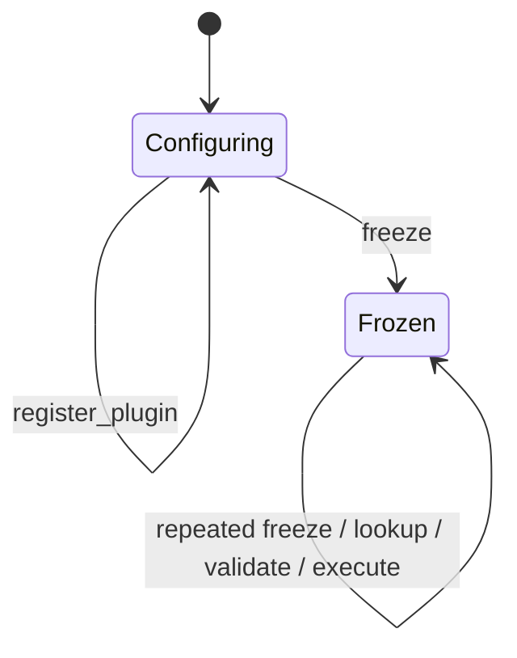

# 静态算法插件设计

## 1. 状态与范围

Phase 6 跨平台静态插件系统已完成，当前状态：

```text
PHASE_6_PLUGIN_SYSTEM_COMPLETED
```

Windows VS2022 Debug/Release 已各通过 316/316 CTest，其中 Task Runtime 97、
Plugin System 92。功能提交 `66a606bb53bf8ed80b8efd6faf7c6529b5cd22d1` 的首次
[Linux CI run 30602538268](https://github.com/realme-max/IndustrialAIServiceFramework/actions/runs/30602538268)
Debug/Release 均为 428/428，Plugin System 92/92、Task Runtime 97/97，Release smoke
成功；但两个配置各有 3 条项目源码 warning 和 3 条项目测试 warning，因此不是最终
封板证据。warning 修复提交 `853ccccca80cdc042b3d51eae52fe45566aa2b22`
对应最终 [Linux CI run 30604428624](https://github.com/realme-max/IndustrialAIServiceFramework/actions/runs/30604428624)：
Debug/Release 均 428/428，Plugin System 92/92、Task Runtime 97/97，Release smoke
成功，项目源码与测试 warning 均为 0。

“静态”仅表示插件代码编译进进程，并在组合阶段显式注册对象。当前没有动态 `.so`/
DLL、目录扫描、全局注册宏、热加载、卸载、HTTP Task API、自动 timeout、文件读取、
GPU 推理或常驻 Application。

## 2. Target 与依赖

```text
iaisf_plugin / iaisf::plugin (portable STATIC)
  PUBLIC -> iaisf::task
  PUBLIC -> iaisf::core
  PUBLIC -> nlohmann_json::nlohmann_json

iaisf_plugin_tests (portable)
  PRIVATE -> iaisf::plugin
  PRIVATE -> GTest / Threads
```

`iaisf_task` 不反向依赖 plugin，plugin 不依赖 net、tcp、http。网络层和 TaskRepository
不理解 `echo`、`mock_vision.detect` 或任何工业领域字段。

## 3. PluginLimits

`PluginLimits::create` 生成经验证的不可变安全边界：

- `max_plugins`
- `max_operation_bytes`
- `max_name_bytes`
- `max_version_bytes`
- `max_description_bytes`
- `max_error_message_bytes`
- `max_input_bytes`
- `max_output_bytes`
- `max_json_depth`
- `max_json_elements`
- `max_string_bytes`
- `max_capabilities`
- `max_capability_bytes`

所有输入使用有符号整数接收，先拒绝零和负数，再检查公开硬上限和平台 `size_t`
范围；不静默 clamp。字符串大小按 `std::string` 中 UTF-8 bytes 计算；depth 把根
计为 1，elements 计算包括根在内的全部 JSON value 节点，对象键受 string limit
约束。这些默认值是内存与输入安全边界，不是性能指标或容量承诺。

## 4. PluginMetadata

值类型字段：

```text
operation
name
version
description
mock
capabilities
```

规则：

- operation 非空，只接受小写 ASCII `a-z0-9._-`；
- operation 不能以点开头/结尾，不能包含连续点形成空分段；
- name/version/description 非空；
- 所有字段遵守各自 byte limit；
- 文本拒绝 NUL、C0/DEL 控制字符和非法 UTF-8；
- capability 使用与 operation 相同的 canonical lowercase ASCII 规则，允许空列表，
  但每个条目非空、列表内唯一，并受 count/byte 上限约束；
- Manager 注册时只调用一次插件 `metadata()`，保存经过验证的独立副本；
- lookup/list 不返回插件内部字符串引用；
- Echo metadata 的 `mock=false`，MockVision 的 `mock=true`。

operation 是进程内 registry key，不是动态库文件名。

## 5. IAlgorithmPlugin

```cpp
class IAlgorithmPlugin {
public:
    virtual ~IAlgorithmPlugin() = default;
    virtual PluginMetadata metadata() const = 0;
    virtual Result<void> validate_input(const nlohmann::json&) const = 0;
    virtual Result<nlohmann::json> execute(const nlohmann::json&) const = 0;
};
```

契约：

- `validate_input` 必须快速、纯、确定、可重复、可重入且无外部可见副作用，不能做文件/网络 I/O
  或真实推理；同一输入的成功/失败分类不得依赖调用次数；
- 同一实例的 `validate_input` 与 `execute` 可能同时运行，多个 worker 也可能并发
  `execute`；插件必须无共享可变状态或自行同步，`const` 本身不提供线程安全保证；
- Manager 不提供覆盖所有插件的执行锁；
- 接口不包含 Socket、Channel、EventLoop、HTTP、TaskRepository、文件系统、取消、
  进度或 GPU context；
- 本阶段没有 initialize/shutdown、配置注入或动态卸载生命周期。

## 6. 显式静态注册与所有权

组合方式：

```cpp
auto manager = std::make_shared<PluginManager>(limits);
manager->register_plugin(std::make_shared<EchoPlugin>());
manager->register_plugin(std::make_shared<MockVisionPlugin>());
manager->freeze();
```

所有权：

- PluginManager 使用 `shared_ptr`，禁止复制和移动；
- registry 强持有 `shared_ptr<const IAlgorithmPlugin>`；
- lookup 调用插件前在锁内复制 shared handle，释放锁后再调用；
- PluginTaskAdapter 强持有 `shared_ptr<const PluginManager>`；
- validator/handler closure 直接强持有只读 Manager，不持有 Adapter 或 TaskManager；
- TaskManager 保存 validator，TaskExecutor 保存 handler；worker queue 只保存
  TaskExecutor 非 owning 指针、TaskId 和独立 TaskRequest，不另存 handler；
- Manager 强持有 Plugin，整个图没有指向 TaskManager 或 Adapter 的反向强引用；
- TaskManager 销毁前先 drain/join worker，因此 Manager/Plugin 覆盖全部执行期；
  TaskManager 销毁后闭包释放，最后引用可以正常归零。

不存在全局 manager、全局可变 registry、静态初始化次序或自动注册宏。

## 7. Configuring 与 Frozen



| 状态 | register | freeze | list/lookup | validate/execute |
|---|---|---|---|---|
| Configuring | 允许 | 转入 Frozen | InvalidState | InvalidState，不调用插件 |
| Frozen | InvalidState | 幂等成功 | 允许 | 允许，可并发 |

- 只有 Configuring 可注册；register/freeze 在同一 registry mutex 上线性化；
- freeze 幂等且不可逆；
- Frozen 后永久拒绝 register，并在调用插件 metadata 前快速拒绝；不支持
  unfreeze/unregister/replace；
- find/list/validate/execute 在 Configuring 返回 InvalidState；
- Frozen 后 registry 不再修改，查询和插件调用支持多线程并发；
- `list_metadata` 返回按 operation 排序的独立 vector；
- 一个阻塞插件不会持有 registry mutex，也不会阻塞其他 operation 的 metadata lookup。

## 8. 注册事务与异常安全

注册顺序：

1. 拒绝 null，并在短锁内快速检查 Frozen；
2. 在 registry lock 外调用一次 metadata；
3. 捕获 metadata 标准/未知异常并返回安全固定错误；
4. 校验 metadata/capabilities；
5. 加锁后复查 Frozen、duplicate 和 capacity；此处是注册线性化点；
6. 先复制独立 operation key，再移动 metadata/plugin 进入 map；
7. map 插入成功才改变 size。

这条独立 key 规则避免 C++ 函数参数求值顺序使 metadata 先被 move 后再读取 operation。
测试锁定 metadata 只调用一次、copy 独立性、重复/容量/非法 metadata/异常后 size
不变，以及失败后仍能注册合法插件。无法稳定注入真实 allocator `bad_alloc`，该路径
由生产 catch 与容器强异常保证做代码审计，不伪造故障注入 PASS。

## 9. Lookup、校验和执行错误

未知 operation 使用结构化 `ErrorCode::NotFound`，不根据 message 文本判断。

`validate_input` 返回的 InvalidArgument/ResourceExhausted 可保留经过
`max_error_message_bytes` 限制的安全消息；其他错误映射为：

```text
InternalError("plugin validation failed")
```

validation 标准或未知异常也使用同一固定错误，不暴露 `what()`。

`execute` 返回的任意插件 Error 都不能被假定为客户端安全内容，统一映射为：

```text
InternalError("plugin execution failed")
```

execute 标准或未知异常使用相同映射。框架自身的输出容量失败保留结构化
ResourceExhausted；所有 PluginManager 对外错误字符串都受
`max_error_message_bytes` 限制。随后 TaskRepository 的 TaskLimits 再做一次错误消息
限制；异常文本、errno、系统路径、Token 和原始大 JSON 不进入 TaskSnapshot。插件
异常不会退出 worker，下一任务继续。

### 9.1 统一 JSON 容量与失败策略

TaskLimits 与 PluginLimits 共用 `validate_json_value`。它在进入下一层前检查 depth，
用受硬上限约束的节点计数立即停止超宽/超深结构，并检查字符串/对象键、discarded、
non-JSON binary 和非有限浮点数。随后使用 nlohmann/json 的紧凑 serializer 向
counting stream 输出，因此返回值与 `dump().size()` 精确一致：braces、brackets、
comma、colon、键、引号、转义、数字文本和 UTF-8 实际字节全部计入。计数器不保存
第二份完整文本，并通过流异常在首个超限字节中止序列化。Task 与 Plugin 边界仍各自
执行，以保留两套安全策略。

输入超出 bytes/depth/elements/string 返回 ResourceExhausted；discarded、non-JSON
binary、非法 UTF-8 或非有限输入返回 InvalidArgument。插件成功输出必须在 Manager 返回以及 Repository
写入前通过同一检查：容量错误返回 ResourceExhausted，插件产生的 discarded、非法
UTF-8 或非有限输出视为 InternalError。任何失败都不产生半结果。

## 10. TaskValidator

Task Runtime 新增：

```cpp
using TaskValidator =
    std::function<Result<void>(const TaskRequest&)>;
```

旧的 handler-only `TaskManager::create` 保留。新重载接受 validator + handler。

submit 顺序：

```text
admission accepting check + in-flight increment
  -> generic TaskLimits request validation
  -> optional TaskValidator outside Manager/Repository locks
  -> create_queued
  -> non-blocking try_submit
  -> rollback on queue/allocation failure
  -> in-flight decrement on every return path
```

validator failure/exception 不分配 TaskId、不改变 Repository size、不占线程池队列。
shutdown 关闭 admission 后等待正在执行的 validator 完成，再 drain/join。validator
可以被多个 submitter 并发调用，必须线程安全、快速且无 I/O。

## 11. PluginTaskAdapter

Adapter 只从 Frozen Manager 创建，提供：

- `validate_task(TaskRequest)`
- `execute_task(TaskRequest)`
- `make_validator()`
- `make_handler()`

`TaskRequest::operation` 直接作为 registry key。validator 在提交前调用 Manager
validate；handler 在 worker 中对已拥有的 TaskRequest 快照再次执行插件契约校验后
才 execute。若第二次校验失败，说明插件验证依赖可变状态或调用顺序，Adapter 返回
固定 `InternalError("plugin validation changed before execution")`，且不调用 execute。

成功 submit 返回前，Repository 与 worker closure 已各自拥有 operation/input；
调用方随后修改或销毁原 TaskRequest、源 operation 字符串或 JSON 不影响已接收任务。

closures 只捕获 `shared_ptr<const PluginManager>`，不捕获 Adapter、TaskManager、
裸 `this` 或调用方 JSON 引用。释放 Adapter 后 weak_ptr 立即过期；有任务或闭包时
Manager/Plugin 保持存活，TaskManager 析构释放最后闭包后正常销毁。Adapter 不创建
线程，不访问 HTTP、Socket 或 EventLoop。

## 12. EchoPlugin

operation：`echo`，`mock=false`。

严格输入：

```json
{"payload": null}
```

input 必须是 object，必须且只能有 `payload`。payload 可为 null、boolean、有符号/
无符号整数、有限浮点数、string、array 或 object，包括 binary-safe string。成功输出
是 payload 的独立副本，不添加 operation envelope；operation 已由 TaskSnapshot 保存。
例如：

```json
null
```

插件不修改输入；返回后修改调用方 input 不影响结果。non-finite、discarded 和
non-JSON binary 由 Manager 的统一输入校验拒绝。输出仍必须通过统一 output limits。
插件不做 I/O、不访问网络/文件、不生成随机值或时间戳。

## 13. MockVisionPlugin

operation：`mock_vision.detect`，metadata `mock=true`，description 明确“no real
inference”。

输入：

```json
{
  "image_id": "demo-001",
  "width": 640,
  "height": 480,
  "confidence_threshold": 0.5
}
```

规则：

- object only，未知字段拒绝；
- image_id 必填 string，1—128 bytes，无控制字符；
- width/height 必填严格整数，不接受 bool/float/string/null，范围 1—16384；
- threshold 可选，默认 0.5，必须为 finite number 且在 `[0,1]`；
- 不接受 path 字段，不读取 image_id 指向的任何资源；
- 不使用 OpenCV、PCL、TensorRT、CUDA、GPU、相机或模型。

固定 mock confidence 为 0.93；threshold ≤ 0.93 返回一个按 width/height 整数规则生成
的 `weld_seam` bbox，否则 detections 为空。结果无随机数、时间戳或调用顺序依赖：

```json
{
  "mock": true,
  "operation": "mock_vision.detect",
  "image_id": "demo-001",
  "image_size": {"width": 640, "height": 480},
  "detections": []
}
```

`mock: true` 不可关闭。该结果仅验证框架任务流、状态机和适配，不代表准确率、性能、
production readiness 或真实检测，不应直接驱动机器人。

## 14. 并发契约

- Frozen Manager、Adapter、Echo、MockVision 支持并发调用；
- Manager 锁只保护 registry 状态和 handle copy，不覆盖 plugin validate/execute；
- 内置插件无共享可变状态，validate/execute 同时运行仍保持确定性；
- TaskManager 不串行 validator/handler；
- 每个 TaskRequest 和结果独立，不依赖随机数、当前时间、线程局部状态或调用顺序；
- 非协作未来插件仍可能延迟 TaskManager shutdown；本阶段没有强制终止。

## 15. 已验证测试

Plugin System 共 92 项：

- PluginLimits 6
- PluginMetadata 12
- PluginManager 28
- EchoPlugin 12
- MockVisionPlugin 18
- PluginTaskAdapter 16

Task Runtime 从 85 增至 97；除原 9 项 TaskValidator 回归外，新增 3 项通用 JSON
结构边界测试。覆盖成功/错误、NotFound、
标准/未知异常、通用校验顺序、ID/Repository/queue 不变、shutdown 屏障、并发 validator
及锁边界，以及 bytes/depth/elements/string、discarded/non-finite。

Windows Debug/Release 都实际执行：

```text
Foundation       43
HTTP Core        84
Task Runtime     97
Plugin System    92
Total           316
```

并发用例使用 promise/future 屏障和有限 `wait_for`，没有 fixed sleep、detached
thread、网络、文件读取、随机值或测试顺序依赖。Linux Debug/Release 已实际执行全部
92 项 Plugin 测试，包括并发、register/freeze 竞态、输入快照、转义后字节边界、
Echo 任意 JSON 原值和 MockVision mock 契约；功能测试全部通过。当前唯一 Phase 6
封板阻塞是项目 warning 不为 0，必须修复后重新运行完整 Linux CI。

## 16. 后续边界

未实现：

- 动态 `.so`/DLL、`dlopen`/`dlsym`/`LoadLibrary`
- ABI 版本、目录发现、签名、热加载/卸载
- HTTP Task/Plugin API 或 CLI 插件组合
- timerfd、自动 timeout、取消/重试/优先级
- 插件配置、initialize/shutdown
- 真实图片/点云、TensorRT/PCL/GPU/机器人

未来真实或不可信插件可能需要进程隔离、稳定 C ABI、资源配额和安全策略。当前
C++ `try/catch` 只隔离语言异常，不隔离崩溃、死锁、无限循环或内存破坏。

Phase 7 只建议组合现有 HttpServer、TaskManager、PluginManager，静态注册内置插件并
增加最小 `/v1/tasks` 提交/查询 API；timerfd、自动超时、signalfd、生产 CLI 常驻、
动态插件、GPU/真实 AI、数据库、异步日志和 benchmark 均不在该建议范围。
