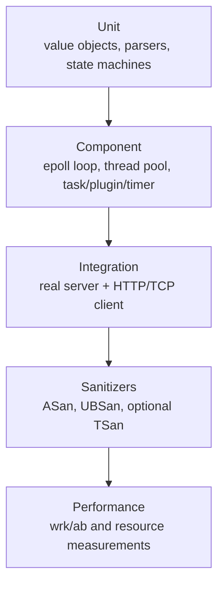

# 测试计划

## 1. 状态与原则

Phase 1 已实现基础单元测试和 CLI smoke，并在 Phase 1B 加强 Error 边界、Result 引用类别、配置数值类型和 UTF-8 字节限制覆盖。Linux CI workflow 已创建但尚未 push 或运行，因此没有“Linux PASS”声明。

测试原则：

- 自动运行，不依赖手工点击。
- 不依赖 GPU、真实点云、机器人或外部数据库。
- 单元测试优先使用确定性输入、可注入时钟和本地 socket。
- 集成测试启动真实服务进程，动态选择空闲端口并可靠回收。
- 性能数字只在 Phase 8 实际测量后记录。
- 测试失败必须保留原始命令和足够诊断，不以重试掩盖竞态。

## 2. 测试层次



Phase 1—7 的 CI 门禁以前三层和适用 sanitizer 为主；性能测试不作为不稳定的每次提交单元门禁。

## 3. 工具与组织

计划：

- GoogleTest/GoogleMock：单元和组件测试。
- CTest：统一发现、标签、超时和退出码。
- shell/Python 标准库可用于集成测试驱动，但核心服务端必须是 C++；优先使用项目内 C++ client 或 `curl`。
- ASan：内存越界、use-after-free、泄漏。
- UBSan：未定义行为。
- TSan：可用 Linux/Clang 环境下检查仓储、线程池和 logger；与 ASan 分开运行。
- Valgrind：可选慢速补充，不替代 sanitizer。
- wrk 或 ab：Phase 8 HTTP 压测。

推荐测试命名：

```text
tests/unit/<module>_<subject>_test.cpp
tests/integration/<scenario>_test.cpp
```

CTest labels：`unit`、`integration`、`linux`、`sanitizer`、`slow`。

## 4. Phase 1 测试

| 测试 | 目标 |
|---|---|
| `VersionTest` | 版本常量格式和值一致 |
| `ErrorTest` / `ResultTest` | 稳定错误码、空消息边界、value/error 引用类别、void、move-only 和 API 误用 |
| `AppConfigTest` | 默认值、真实示例、类型/范围、负数、float/string/null/bool、UTF-8 bytes、未知字段和错误分类 |
| `LogLevelTest` / `ConsoleLoggerTest` | 级别解析、阈值、格式、换行和字段清洗 |
| `ApplicationTest` | help/version/config/无参数/非法参数/错误不抛出 |
| `iaisf_server_version` | CTest 固定 CLI 版本输出 |
| `iaisf_server_example_config` | CTest 使用源码树真实示例配置的 CLI smoke |
| Out-of-source check | 源码目录无生成物 |

正式 Linux 命令：

```bash
cmake -S . -B build/linux-debug \
  -DCMAKE_BUILD_TYPE=Debug \
  -DIAISF_BUILD_TESTS=ON \
  -DIAISF_USE_SYSTEM_DEPS=OFF
cmake --build build/linux-debug --parallel
ctest --test-dir build/linux-debug --output-on-failure

cmake -S . -B build/linux-release \
  -DCMAKE_BUILD_TYPE=Release \
  -DIAISF_BUILD_TESTS=ON \
  -DIAISF_USE_SYSTEM_DEPS=OFF
cmake --build build/linux-release --parallel
ctest --test-dir build/linux-release --output-on-failure
./scripts/smoke_linux.sh
```

当前结果：

| 环境 | Configure | Build | CTest | Smoke |
|---|---|---|---|---|
| Linux Debug | not run | not run | not run | 不适用 |
| Linux Release | not run | not run | not run | not run |
| Windows VS2022 Debug | pass（补充） | pass（补充） | 43/43 pass（补充） | CTest 内 2 项 pass |
| Windows VS2022 Release | pass（补充） | pass（补充） | 43/43 pass（补充） | version/config 手工执行退出码 0 |
| GitHub Actions Ubuntu 24.04 | workflow created | not run | not run | not run |

Windows 结果不满足 Linux 阶段验收门槛。

Phase 1B 的临时配置 fixture 使用原子创建的唯一系统临时目录，不仅依赖进程内序号；因此多个 CTest 进程并行执行时不会共享配置路径，析构时通过 RAII 清理整个测试目录。

## 5. Network/Reactor 测试

### 5.1 Unit/component

- `UniqueFd` 默认无效、析构关闭、release/reset、移动构造、移动赋值；禁止拷贝。
- fd 为 0 时仍能正确管理，避免以 `> 0` 判断有效性。
- EpollPoller add/mod/del 正常；重复注册、无效 fd 和删除后事件有明确错误。
- Channel 关注事件变更只在 owner loop。
- EventLoop `post()` 从其他线程唤醒，不丢回调，不 busy wait。
- Buffer 跨边界 append/consume 和高水位。
- Acceptor 在 ET 下连续 accept 到 `EAGAIN`。

### 5.2 I/O 边界

- 单次发送完整消息。
- 每字节/随机分段发送。
- 多消息一次到达。
- 人工缩小 socket send buffer，验证部分写和 `EPOLLOUT` 重新关注。
- 客户端 `shutdown(SHUT_WR)`，服务读取剩余数据并写完响应。
- 客户端 reset、HUP、ERR。
- 连接上限和 accept drain。
- 服务关闭时所有连接回调/Channel/fd 的销毁顺序。

### 5.3 fd 泄漏

Linux 集成测试前后读取 `/proc/<pid>/fd` 数量；重复连接/断开后应回到稳定区间。ASan leak detection 作为补充。

## 6. HTTP Parser 测试

必须覆盖：

- 完整 GET。
- 完整 POST + JSON body。
- request line、每个 header、CRLF 分界和 body 的所有关键分段点。
- 一字节一字节输入。
- body 后紧跟下一请求，解析器保留剩余字节。
- 非完整请求返回 NeedMore，不产生 400。
- 非法 method/version/target。
- 裸 LF、错误 CRLF、header 缺冒号、非法 header name。
- 缺 Host。
- Content-Length 缺失（POST 规则）、非数字、负数、溢出、冲突重复。
- Transfer-Encoding、TE + CL、chunked。
- 请求行/header 数/header 总量/body 超限。
- 空 JSON、畸形 JSON、合法但顶层非 object。
- keep-alive 和 `Connection: close`。
- 路由 404、方法 405、路径参数提取。
- `..`、编码斜杠、NUL/反斜杠路径拒绝。

解析测试不需要真实 Socket；向 parser 多次 feed 字节片段即可。

## 7. ThreadPool 与队列测试

- 固定 worker 数启动。
- 多任务恰好执行一次。
- 有界队列满时 `submit` 返回 false。
- `submit` 与 worker 并发无数据竞争。
- condition variable 在空队列阻塞，无 busy waiting。
- stop 后拒绝新任务。
- drain stop 等待已接受任务。
- 多次 stop 幂等。
- 析构 join 所有线程，无 detached worker。
- 任务抛 `std::exception`/未知异常后 worker 继续处理后续任务。
- worker_count、queue_size 为 0 等非法构造失败。

避免依赖固定 sleep 判断并发；使用 latch/barrier 的 C++17 自定义测试辅助和 condition variable。

## 8. Task 测试

### 8.1 状态转换

允许：

- Queued → Running/Cancelled
- Running → Succeeded/Failed/Cancelled/Timeout

拒绝：

- Succeeded → Running
- Failed → Queued
- Timeout → Succeeded
- 任意终态 → 其他状态
- 重复完成（除非明确作为幂等 no-op，首版建议返回 false）
- Queued → Failed（排队失败不创建任务；执行错误必须先进入 Running）

### 8.2 并发与容量

- success 与 timeout 同时竞争，只有一个成功转换。
- cancel 与 worker start 竞争。
- 查询得到自洽快照，时间字段满足 create ≤ start ≤ finish。
- progress 范围校验。
- 队列满不留下 task。
- repository 满拒绝新任务。
- 终态清理后查询 404。
- 插件晚到结果不覆盖 Timeout。
- Succeeded、Failed 与 Timeout 同时到达时，第一个被 TaskRepository 接受的终态获胜。

## 9. Plugin 测试

- 注册 Echo，按名称获取。
- 空名/非法名拒绝。
- 重复名称拒绝且原插件不被覆盖。
- 未知/disabled 插件。
- initialize 成功、失败、抛异常。
- shutdown 顺序和幂等行为。
- Echo 原样封装输入且无共享状态。
- MockVision：
  - 有效输入产生 `mock: true`；
  - 标志不可关闭；
  - 缺路径、绝对路径、`..`、NUL、非法 hint 被拒绝；
  - 不要求文件真实存在；
  - 延迟配置边界；
  - cancellation 能在模拟延迟中尽快返回。
- execute 显式失败/抛异常被 TaskExecutor 转成 Failed，worker 存活。

核心测试不链接 PCL、TensorRT、CUDA 或机器人 SDK。

## 10. Timer 测试

TimerQueue 通过可注入单调时钟或纯堆核心测试，避免真实等待：

- add 后按 expire 顺序执行。
- 同截止时间全部执行。
- cancel 后不执行。
- cancel 不存在/已执行 timer 返回明确结果。
- update 提前/延后，只执行新 generation。
- 回调中 add/cancel 的重入策略。
- timer_id wrap/generation 边界（可模拟）。
- 空堆时 timerfd disarm。
- 到期批量执行后正确设置下一个 timerfd。
- idle connection 活动续期。
- task completion 取消 timeout。

真实 timerfd 只做少量 Linux 集成测试，并给出宽松但有限的时间窗口。

## 11. Config 测试

- 完整合法配置。
- 缺失可选字段使用文档默认。
- 缺失关键字段的既定行为。
- 错误 JSON、错误类型、负数、零、端口溢出、过大容量。
- queue/record/timeout 之间的跨字段约束。
- 未知顶层字段。
- disabled/enabled 插件配置。
- enabled 插件初始化失败导致启动失败。
- 日志目录不可创建/文件不可写。
- 配置错误输出不泄露秘密。

测试使用临时目录，不能修改真实 `config/iaisf.example.json`。

## 12. Logger 测试

- 每个级别过滤正确。
- 时间、线程 ID、level、message 行完整。
- 多 producer 无行交错。
- 有界队列溢出策略和 dropped counter。
- 批量写和定期 flush。
- stop 前 drain/flush。
- 多次 stop。
- 文件打开失败策略。
- 基础按大小轮转，文件数量/命名稳定。
- sink 写失败不递归记录或死锁。

## 13. 集成场景

必须自动化：

1. `/health` 返回 200 JSON。
2. 提交 Echo 任务，轮询到 success，结果与输入一致。
3. 提交 MockVision，结果包含 `mock: true` 和结构化模拟字段。
4. 查询 queued/running/terminal 状态。
5. 非终态结果查询返回 409。
6. 未知插件返回 404。
7. 错误 JSON 返回 400。
8. 请求 body 超限返回 413。
9. 队列满返回 503。
10. 任务超时返回 timeout/504，晚到结果不覆盖。
11. idle connection 关闭，活动连接保持。
12. keep-alive 上连续请求。
13. 多客户端并发提交和查询。
14. SIGTERM 后停止 accept、按策略 drain、刷新日志并以 0 退出。

队列满不能映射为插件错误；429 只用于未来单独的用户级限流。worker 完成路径测试必须确认它只写完成队列并通过 eventfd 唤醒 EventLoop，不直接操作 Socket、Channel 或 epoll。

测试 harness 要求：

- 动态获取端口，避免固定 8080 冲突。
- 启动后轮询 readiness，不能固定长 sleep。
- 失败时捕获 server stdout/stderr/log。
- 设置总 timeout。
- 无论成功失败都终止并 wait 服务进程。

## 14. 安全回归

- 超大 Content-Length 不导致预分配。
- 慢速分段请求受 idle/header deadline 限制（Phase 6 后）。
- 多个 Content-Length 请求走固定拒绝路径，防请求走私。
- `../`、绝对路径、反斜杠、百分号编码绕过。
- 客户端 JSON 中的 `"command"` 只被视为普通/未知字段，绝不执行。
- 日志换行和控制字符被转义，防日志注入。
- 错误响应不含本地绝对路径、errno 文本或异常原文。
- 连接/队列/日志/任务仓储容量均可触发并恢复。

## 15. Sanitizer 与静态检查

计划命令形态：

```bash
cmake -S . -B build-asan \
  -DCMAKE_BUILD_TYPE=Debug \
  -DIAISF_ENABLE_ASAN=ON \
  -DIAISF_BUILD_TESTS=ON
cmake --build build-asan --parallel
ctest --test-dir build-asan --output-on-failure
```

UBSan/TSan 分开 build 目录。每次记录编译器、sanitizer 选项和被排除测试。不能只写“ASan 通过”而没有命令和日期。

## 16. Phase 8 性能与稳定性

### 16.1 工作负载

- `GET /health`：测网络/HTTP 基线。
- Echo submit + status/result：测任务框架。
- MockVision 固定 mock delay：测 worker/队列行为，不代表视觉推理性能。
- 长 keep-alive、多短连接分别测试。

### 16.2 记录模板

```text
Date:
Commit:
OS / kernel:
CPU / logical cores:
Memory:
Compiler / version:
Build type / flags:
Server config:
Workload:
Client tool / version:
Raw command:
Duration:
Concurrency:
Observed throughput:
Latency distribution:
Server CPU:
Server RSS:
Errors/timeouts:
Raw output path:
Interpretation and limitations:
```

### 16.3 禁止项

- 不沿用 TinyWebServer README 的性能数字。
- 不用 mock 延迟结果宣称真实模型吞吐。
- 不只报告平均延迟，至少保留工具给出的分位数。
- 不在 Debug/ASan 结果上包装生产性能。
- 不删除失败请求后只展示成功数字。

## 17. Phase 0 历史调查验证

Phase 0 的非运行验证项：

- 根目录和参考目录均不是 Git 仓库。
- 参考工程 62 个文件、总大小 59,240,225 bytes。
- 调查时参考聚合 SHA-256：
  `83AE7E469DEA30C860DEFD4D26CB313B7B3C87EFCD9387414741E152EE46CF27`。
- 当前宿主无可用 Linux/epoll 构建环境，因此没有伪造编译结果。
- Phase 0 结束时复算哈希应一致。
