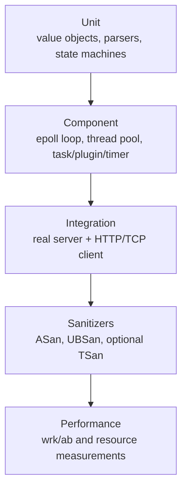

# 测试计划

## 1. 状态与原则

Phase 1 已实现基础单元测试和 CLI smoke，并在 Phase 1B 加强 Error 边界、Result 引用类别、配置数值类型和 UTF-8 字节限制覆盖。Phase 2 Reactor 最终 [GitHub Actions Linux CI run 30516007475](https://github.com/realme-max/IndustrialAIServiceFramework/actions/runs/30516007475) 已完成 Debug、Release、87/87 CTest 和 Release smoke 零 warning 验证。Phase 3 最终 [Linux CI run 30524686201](https://github.com/realme-max/IndustrialAIServiceFramework/actions/runs/30524686201) 已完成 Debug/Release 138/138 CTest，其中 Foundation 43、Reactor 45、TCP 50。当前 Phase 4 状态为 `PHASE_4_HTTP_PROTOCOL_IMPLEMENTED_LINUX_VALIDATION_BLOCKED`：Windows Debug/Release 126/126 已通过，Linux HTTP 尚未执行。

测试原则：

- 自动运行，不依赖手工点击。
- 不依赖 GPU、真实点云、机器人或外部数据库。
- 单元测试优先使用确定性输入、可注入时钟和本地 socket。
- 集成测试启动真实服务进程，动态选择空闲端口并可靠回收。
- 性能数字只在 Phase 9 实际测量后记录。
- 测试失败必须保留原始命令和足够诊断，不以重试掩盖竞态。

## 2. 测试层次



Phase 1—8 的 CI 门禁以前三层和适用 sanitizer 为主；性能测试不作为不稳定的每次提交单元门禁。

## 3. 工具与组织

计划：

- GoogleTest/GoogleMock：单元和组件测试。
- CTest：统一发现、标签、超时和退出码。
- shell/Python 标准库可用于集成测试驱动，但核心服务端必须是 C++；优先使用项目内 C++ client 或 `curl`。
- ASan：内存越界、use-after-free、泄漏。
- UBSan：未定义行为。
- TSan：可用 Linux/Clang 环境下检查仓储、线程池和 logger；与 ASan 分开运行。
- Valgrind：可选慢速补充，不替代 sanitizer。
- wrk 或 ab：Phase 9 HTTP 压测。

推荐测试命名：

```text
tests/unit/<module>_<subject>_test.cpp
tests/integration/<scenario>_test.cpp
```

CTest labels：`unit`、`integration`、`linux`、`sanitizer`、`slow`。

## 4. Phase 1 测试

| 测试 | 目标 |
|---|---|
| `VersionTest` | 版本常量格式和值一致 |
| `ErrorTest` / `ResultTest` | 稳定错误码、空消息边界、value/error 引用类别、void、move-only 和 API 误用 |
| `AppConfigTest` | 默认值、真实示例、类型/范围、负数、float/string/null/bool、UTF-8 bytes、未知字段和错误分类 |
| `LogLevelTest` / `ConsoleLoggerTest` | 级别解析、阈值、格式、换行和字段清洗 |
| `ApplicationTest` | help/version/config/无参数/非法参数/错误不抛出 |
| `iaisf_server_version` | CTest 固定 CLI 版本输出 |
| `iaisf_server_example_config` | CTest 使用源码树真实示例配置的 CLI smoke |
| Out-of-source check | 源码目录无生成物 |

正式 Linux 命令：

```bash
cmake -S . -B build/linux-debug \
  -DCMAKE_BUILD_TYPE=Debug \
  -DIAISF_BUILD_TESTS=ON \
  -DIAISF_USE_SYSTEM_DEPS=OFF
cmake --build build/linux-debug --parallel
ctest --test-dir build/linux-debug --output-on-failure

cmake -S . -B build/linux-release \
  -DCMAKE_BUILD_TYPE=Release \
  -DIAISF_BUILD_TESTS=ON \
  -DIAISF_USE_SYSTEM_DEPS=OFF
cmake --build build/linux-release --parallel
ctest --test-dir build/linux-release --output-on-failure
./scripts/smoke_linux.sh
```

GitHub Actions 证据：

| 项目 | 实际记录 |
|---|---|
| workflow | `Linux CI` |
| run | [30508113122](https://github.com/realme-max/IndustrialAIServiceFramework/actions/runs/30508113122) |
| event / attempt | `push` / `1` |
| commit | `63b30cffcbe3e621af33664721b3675a647bd1a1` |
| branch | `phase/1-foundation` |
| final status / conclusion | `completed` / `success` |
| runner | 两个 job 均为 GitHub-hosted `ubuntu-24.04` |
| OS | Debug 环境记录为 Ubuntu 24.04.4 LTS |
| compiler | Debug 与 Release configure 均识别 GNU 13.3.0 |
| CMake | Debug 环境记录为 3.31.6；Release job 未单独重复打印版本 |

真实测试矩阵：

| 环境/job | Configure | Build | CTest 总数/通过/失败 | Smoke | 项目编译 warning |
|---|---|---|---|---|---:|
| GitHub Actions Linux Debug | pass | pass | 43 / 43 / 0 | 不适用 | 0 |
| GitHub Actions Linux Release | pass | pass | 43 / 43 / 0 | pass | 0 |
| Windows VS2022 Debug（补充） | pass | pass | 43 / 43 / 0 | CTest 内 2 项 pass | 0 |
| Windows VS2022 Release（补充） | pass | pass | 43 / 43 / 0 | version/config 手工执行 exit 0 | 0 |

Release smoke 原始输出摘要：

```text
IndustrialAIServiceFramework 0.1.0
2026-07-30T02:19:47.674Z [INFO] [Application] configuration validated for service IndustrialAIServiceFramework
```

`Smoke Release` 步骤、两个 build 步骤和两个 CTest 步骤均为 `success`；完整 workflow conclusion 为 `success`，没有用 cancelled、skipped、neutral 或单步重跑代替完整成功运行。Linux 编译日志没有匹配到项目 warning。

Phase 1B 的临时配置 fixture 使用原子创建的唯一系统临时目录，不仅依赖进程内序号；因此多个 CTest 进程并行执行时不会共享配置路径，析构时通过 RAII 清理整个测试目录。

## 5. Phase 2 Network/Reactor 基础测试

状态：completed。Phase 2 只验证 fd RAII、Linux Socket 基础封装和事件循环原语。

### 5.1 Unit/component

| 测试文件 | 定义数 | 覆盖 |
|---|---:|---|
| `tests/net/test_unique_fd.cpp` | 8 | 默认/显式有效性、fd 0、析构、release/reset、move construct/assign、swap、禁止复制 |
| `tests/net/test_socket.cpp` | 5 | 创建 IPv4 TCP、`O_NONBLOCK`、`FD_CLOEXEC`、`SO_REUSEADDR`、所有权转移与 write-half shutdown |
| `tests/net/test_channel.cpp` | 7 | mask；RDHUP read；HUP-only close；HUP+IN read；ERR→read 与 read→write 顺序；非 owning |
| `tests/net/test_epoll_poller.cpp` | 7 | add/mod/del、重复/未注册操作、eventfd ET、容量/timeout、fd 删除后复用映射 |
| `tests/net/test_event_loop.cpp` | 17 | owner/state、stop-before-run、Stopping 拒绝、跨线程容量竞争、失败回调不执行、唤醒失败回滚、嵌套 queue、active 批次延迟移除、异常边界、eventfd drain/EAGAIN |

合计 44 个 Phase 2 Reactor `TEST`。Linux Debug 和 Release 均实际发现并执行全部 44 项；加上 Phase 1 的 43 项，每个配置实际执行 87 项。

正式 Linux 验证矩阵：

| 环境/job | Configure | Build | CTest 总数/通过/失败 | Reactor 通过 | Smoke | warning |
|---|---|---|---|---|---|---:|
| Ubuntu 24.04 GCC Debug | pass | pass | 87 / 87 / 0 | 44 / 44 | CTest 内 2 项 pass | 0 |
| Ubuntu 24.04 GCC Release | pass | pass | 87 / 87 / 0 | 44 / 44 | 独立 version/config pass | 0 |
| Windows VS2022 Debug（网络 OFF） | pass | pass | 43 / 43 / 0 | 不适用 | CTest 内 2 项 pass | 0 |
| Windows VS2022 Release（网络 OFF） | pass | pass | 43 / 43 / 0 | 不适用 | version/config exit 0 | 0 |

首次功能 CI：

- [run 30514521602](https://github.com/realme-max/IndustrialAIServiceFramework/actions/runs/30514521602) 对应 Reactor 实现提交 `f76993e09767a2d6b6e1cbd2bcb22cfa1df6f74f`。
- Debug/Release configure、build、87/87 CTest 和 smoke 均通过。
- Release 测试构建存在 2 条 `-Wunused-result`，来自 `tests/net/test_event_loop.cpp:721` 和 `:746` 忽略 `read()` 返回值；该 run 不是最终零 warning 证据。

最终零 warning CI 证据：

| 项目 | 实际记录 |
|---|---|
| workflow / run | `Linux CI` / `30516007475` |
| URL | [https://github.com/realme-max/IndustrialAIServiceFramework/actions/runs/30516007475](https://github.com/realme-max/IndustrialAIServiceFramework/actions/runs/30516007475) |
| event / attempt | `push` / `1` |
| branch / head SHA | `phase/2-reactor-core` / `4db8708a5121f8477d835addd0b16170a3e2054f` |
| checkout SHA | `4db8708a5121f8477d835addd0b16170a3e2054f`，Debug/Release 一致 |
| status / conclusion | `completed` / `success` |
| runner / OS | GitHub-hosted `ubuntu-24.04` / Ubuntu 24.04.4 LTS |
| GCC / CMake | 13.3.0 / 3.31.6 |
| jobs | `Linux Debug`、`Linux Release` 均为 `success` |
| CTest | Debug 87/87、Release 87/87，均为 0 failed |
| Reactor | Debug 44/44、Release 44/44 |
| targets | `iaisf_net`、`iaisf_net_tests` 在 Debug/Release 均实际构建 |
| warning | 项目源码 0；项目测试 0 |
| 非成功步骤 | 0；没有 skipped、cancelled、neutral |
| `continue-on-error` | 对应 workflow revision 未配置；日志无被掩盖的非零退出 |

Release smoke 原始输出：

```text
IndustrialAIServiceFramework 0.1.0
2026-07-30T05:14:04.588Z [INFO] [Application] configuration validated for service IndustrialAIServiceFramework
```

最终编译日志核验：Debug/Release 项目源码 warning 为 0，项目测试 warning 为 0，
两处 `-Wunused-result` 已消失。checkout 日志中的 `git init` 默认分支提示含有单词
“warning”，但不是项目或第三方编译 warning。

Linux 原始命令：

```bash
cmake -S . -B build/linux-debug \
  -DCMAKE_BUILD_TYPE=Debug \
  -DIAISF_BUILD_TESTS=ON \
  -DIAISF_USE_SYSTEM_DEPS=OFF \
  -DIAISF_BUILD_LINUX_NETWORK=ON
cmake --build build/linux-debug --parallel
ctest --test-dir build/linux-debug --output-on-failure

cmake -S . -B build/linux-release \
  -DCMAKE_BUILD_TYPE=Release \
  -DIAISF_BUILD_TESTS=ON \
  -DIAISF_USE_SYSTEM_DEPS=OFF \
  -DIAISF_BUILD_LINUX_NETWORK=ON
cmake --build build/linux-release --parallel
ctest --test-dir build/linux-release --output-on-failure
./scripts/smoke_linux.sh
```

补充检查：

- 非 Linux 平台默认不构建 `iaisf_net`；显式 `-DIAISF_BUILD_LINUX_NETWORK=ON` 必须在 configure 阶段失败。
- Reactor 测试只使用 `eventfd` 和 `socketpair`，不监听端口、不访问外部网络。
- 等待使用 condition variable/future 的有限超时；`iaisf_net_tests` CTest timeout 为 10 秒。
- 并发容量测试用 condition variable 同步 32 个生产者，不用固定 sleep；成功数不超过容量，每个成功回调最多执行一次，失败回调执行次数为 0。
- active 批次测试验证直接 remove 被拒绝、通过 `queue_in_loop` 延迟后成功，并保证同批其他 Channel 仍被处理。
- Channel 异常测试固定策略：当前 Channel 剩余回调停止，后续 active Channel 继续；pending callback 同时覆盖标准和未知异常。
- 当前未启用 sanitizer；ASan/UBSan 仍是后续可选验证，不能写成已通过。

### 5.2 Phase 2 暂不执行

- HTTP parser/request/response/router。
- Buffer、完整 `TcpConnection` 协议处理、Acceptor/TcpServer 和 TCP echo 集成。
- ThreadPool、TaskRepository、TaskManager 和 PluginManager。
- timerfd 任务超时、signalfd 优雅停止。
- 异步日志或 AI 插件。

### 5.3 Phase 2 封板时的 Phase 3 测试边界

Phase 2 封板时计划的 Buffer、Acceptor/TcpConnection/TcpServer、ET I/O、
动态 `EPOLLOUT`、high-water、半关闭和 Echo 覆盖已在 Phase 3 源码中定义；
实际 Phase 3 矩阵见第 6 节。没有引入 HTTP parser、HttpRouter、ThreadPool、
TaskRepository、TaskManager、PluginManager、timerfd、signalfd、异步日志、
AI 推理或 benchmark。

### 5.4 fd 泄漏

Phase 2 单元测试重复创建和释放受管 fd，并检查所有权转移后只关闭一次。Phase 3
测试增加监听 Socket/Channel 顺序、连接延迟 remove、连接表清理、重复 close 和
RAII 客户端 fd 覆盖；`/proc/<pid>/fd` 数量稳定性仍需真实 Linux 运行后记录。

## 6. Phase 3 TCP Transport 测试

当前 `iaisf_tcp_tests` 源码定义分布：

| 测试文件 | 定义数 | 覆盖 |
|---|---:|---|
| `test_buffer.cpp` | 13 | 空/二进制、游标、显式 compact、前部复用、增长/上限、失败不变式、溢出、move/moved-from |
| `test_ipv4_endpoint.cpp` | 4 | loopback/any、端口 0/65535、非法 numeric IPv4、sockaddr round-trip |
| `test_acceptor.cpp` | 7 | port 0、NONBLOCK/CLOEXEC、重复 start、幂等/active-callback stop、异常后继续、突发 accept drain、EAGAIN |
| `test_tcp_connection.cpp` | 6 | 参数/状态、close once、non-owner/state send、all-or-failure、graceful shutdown、确定性 EPOLLOUT/high-water 重武装与异常 |
| `test_tcp_server.cpp` | 20 | binary/分片/大流 Echo、多连接、容量、半关闭/输入消费、RST、回调异常、满队列清理、延迟移除/最后强引用释放、stop/table/destructor lifecycle |

合计 **50 个 `TEST`**。Phase 3B 另在 `test_event_loop.cpp` 增加 1 项内部
clean-up lane 测试，使 Reactor 为 45 项。Linux CI 的 Debug/Release CTest 日志均
实际发现并执行 Foundation 43、Reactor 45、TCP 50，合计 138 项，并全部通过。

关键测试策略：

- 只连接 `127.0.0.1`，监听一律使用 port 0，不访问外部网络；
- ET Acceptor 突发接受到 EAGAIN；accepted fd 检查 `O_NONBLOCK/FD_CLOEXEC`；
- Buffer 使用 `size_t::max` 验证减法形式的溢出保护；`bad_alloc` 没有稳定故障注入，
  只验证实现边界转换代码；
- 二进制 NUL、三次分片、超过 initial capacity 的 128 KiB payload 和 8 客户端；
- input/output hard maximum 走 fail-closed；output 超限前先做整包容量预检，断言
  failure 时对端无本次前缀、原有 output 可读字节不变；最大连接数拒绝由 RAII 回收；
- direct socketpair 把 server send buffer 设为 4096，通过真实 drain 后二次跨越
  high-water，验证动态 `EPOLLOUT` 与重武装，不使用固定 sleep；
- peer write-half shutdown 后仍完整 Echo；RST 输出路径使用 `MSG_NOSIGNAL`，随后
  健康连接继续；message callback 异常也只关闭故障连接；
- 普通 pending queue 满时连接关闭和 stop 仍通过 intrusive internal cleanup lane
  完成；覆盖多连接、幂等登记、一次 disconnect、表清空和最后强引用释放；
- Acceptor callback 抛异常后 accepted Socket 自动关闭并继续 accept；在 read callback
  内 stop 时 Channel 在 active batch 后移除；
- peer EOF 最后一段先交付；分别覆盖部分消费和完全不消费，message/close 不重复，
  output 排空后关闭；
- connection/message/high-water/new-connection 回调异常路径均不抛出 EventLoop 边界，
  Logger 失败不参与清理正确性；
- started server 直接析构由 death test 证明为契约错误；正常 stop 后可安全析构；
- test-only Acceptor/Connection/Server cleanup guard 保证非致命断言或提前返回仍尝试
  remove/stop；所有已启动线程在断言前 join，fd 使用 RAII，future/condition variable 有
  5—10 秒有限等待，
  每项 CTest timeout 为 20 秒。

本地实际结果：

| 环境 | Configure | Build | CTest | Smoke | 解释 |
|---|---|---|---|---|---|
| Windows VS2022 Debug，network OFF | pass | pass | 43/43 | CTest 内 2 项 pass | 只验证 Phase 1 回归 |
| Windows VS2022 Release，network OFF | pass | pass | 43/43 | version/config exit 0 | 不编译 TCP |
| 本机 Linux/WSL | unavailable | 未执行 | 未执行 | 未执行 | 不能替代 CI |
| Phase 3 GitHub Actions Debug | pass | pass | 138/138 | CTest 内 2 项 pass | TCP 50/50 |
| Phase 3 GitHub Actions Release | pass | pass | 138/138 | version/config pass | TCP 50/50 |

最终证据为 [Linux CI run 30524686201](https://github.com/realme-max/IndustrialAIServiceFramework/actions/runs/30524686201)，
对应提交 `0a45658d0e450dd9dfde052808a27ae92ad08881`、push event、attempt 1。两个 job
均实际构建 `iaisf_tcp` 和 `iaisf_tcp_tests`，再运行完整 CTest。Debug 与 Release
均为 138/138、0 failed；按实际 CTest 顺序核对为 Foundation 43/43、Reactor 45/45、
TCP 50/50。Release smoke 输出版本 `IndustrialAIServiceFramework 0.1.0`，示例配置
输出包含 `configuration validated for service IndustrialAIServiceFramework`。
项目源码 warning 0、项目测试 warning 0；没有失败、取消、跳过、中性结论或
`continue-on-error`。

2026-07-30 的本轮 Windows clean build 未出现项目 C++ warning。Visual Studio 本机
vcpkg applocal 在 executable 后打印缺少 `pwsh.exe` 的非致命辅助诊断；两个 build
仍 exit 0，Debug/Release CTest 均 43/43，Release 两项 smoke 均 exit 0。该诊断不是
Linux/TCP 测试结果。

## 7. Phase 4 HTTP 测试

状态：implementation complete，Linux validation blocked。

### 7.1 可移植 HTTP Core

`iaisf_http_core_tests` 当前有 **83 个 TEST 定义**：

| 文件 | 定义数 | 重点 |
|---|---:|---|
| `test_http_limits.cpp` | 8 | 默认/有符号 factory、零/负数/硬上限、CRLF 与跨字段关系 |
| `test_http_parser.cpp` | 40 | incremental CRLF/line/header/body、pipeline、重复 header、Connection token、歧义与全部限制 |
| `test_http_request_response.cpp` | 20 | owning request、binary body、framing、响应 count/line/total 精确边界、稳定顺序与失败不变性 |
| `test_http_router.cpp` | 15 | exact/freeze/capacity/404/405/Allow、handler response 限制、异常、built-ins |

实际 Windows 矩阵：

| 配置 | Configure | Clean build | Foundation | HTTP Core | CTest 总计 | smoke | 项目 warning |
|---|---|---|---:|---:|---:|---|---:|
| VS2022 Debug | pass | pass | 43/43 | 83/83 | 126/126 | CTest 内 2 项 | 0 |
| VS2022 Release | 同一 multi-config tree | pass | 43/43 | 83/83 | 126/126 | version/config exit 0 | 0 |

最终规定的 Debug/Release clean build 均成功。没有项目源码/测试编译错误或 warning。
现有 VS/vcpkg applocal 仍可能打印缺失 `pwsh.exe` 的非致命诊断，应与项目 warning 分开。

Core 覆盖：

- 最小 GET、query、CL=0、binary body、逐字节/多段输入、CRLF 跨片、pipeline
  consumed count、take/reset 和 Error 终态；
- method/target/request line、header line/total/count、body 和 response body 上限；
  line/total 的 exact-limit 与 limit+1 均包含 CRLF；
- 缺失/空/重复 Host，任意普通/特殊/大小写变体重复 header，CL OWS、加号/负号/
  逗号/小数/溢出，CL+TE、chunked、Expect、Upgrade，以及组合错误的稳定优先级；
- `Connection` 完整 token 的大小写不敏感匹配、相似子串、空 token 与非法 token；
- bare CR/LF、obs-fold、colon 前空白、NUL/control、fragment、absolute/authority/
  asterisk target、HTTP/1.0 和 HTTP/2 preface；
- Response Content-Length/Connection、binary body、Content-Type/Allow、自定义 header
  稳定顺序、header name/value 注入、保留 framing header；header count/line/head
  total 的 exact-limit 与 limit+1 均计入自动 framing，preflight 失败不返回部分结果；
- Router 大小写敏感 path、query 忽略、404/405 + sorted Allow、duplicate/freeze、
  handler Error、标准/未知异常后的 500 与后续健康 dispatch；
- built-in health/version 的稳定 JSON。

bad_alloc/length_error 由生产边界转换为 `ResourceExhausted`/500；当前没有稳定 allocator
故障注入，因此只做代码边界审计并明确记录，未伪造故障注入结果。

### 7.2 Linux-only HTTP integration

`iaisf_http_tests` 当前有 **16 个 TEST 定义**，覆盖：

- loopback `127.0.0.1` + port 0 的 health、version、404、405/Allow；
- 顺序 keep-alive、同 Buffer pipeline、顺序保持和 `max_requests_per_dispatch=1`
  continuation；continuation pending 期间追加的新数据不会产生重复 dispatch，
  三个请求各响应一次且顺序稳定；
- request line/header/body 分片、test-only POST echo 和 binary NUL；
- `Connection: close` 大响应在小 socket buffer 下仍完整写出后主动 EOF，客户端不先
  `shutdown`；malformed 只发一个错误、missing Host、duplicate CL、TE、
  body/header 超限；
- handler Error/异常、response body 超限、peer RST 后健康客户端；
- 6 个并发客户端、continuation queue 满载关闭、重复连接的 Session/fd 回收；
- continuation queue 满载关闭后 Session 表为空；首个 handler 内 stop 时已排队的第二
  请求不再路由；stop、禁止 restart、stop 后拒绝新连接和 Session 表最终为空。

测试无固定端口、外网、fixed sleep 或 detached thread；客户端 fd 是 RAII，socket
读写有 10 秒 timeout，CTest 单项 timeout 20 秒，线程全部 join。`/proc/self/fd`
测试在单独 gtest filter 进程中比较完整创建/销毁前后数量。

这些 integration 只在 Linux target 存在时注册。本机无 Linux/WSL，**尚未执行**；
当前源码定义数为 Foundation 43 + Reactor 45 + TCP 51 + HTTP Core 83 +
HTTP integration 16 = 238，但必须以未来 CI 的 CTest 输出为准，不能写成 238 PASS。
Phase 3 历史 CI 的 TCP 50/50 与总计 138/138 保持不变；新增 TCP 测试只验证
`close_after_write()` 的 Phase 4 传输契约，尚未取得 Linux PASS。

## 8. ThreadPool 与队列测试

- 固定 worker 数启动。
- 多任务恰好执行一次。
- 有界队列满时 `submit` 返回 false。
- `submit` 与 worker 并发无数据竞争。
- condition variable 在空队列阻塞，无 busy waiting。
- stop 后拒绝新任务。
- drain stop 等待已接受任务。
- 多次 stop 幂等。
- 析构 join 所有线程，无 detached worker。
- 任务抛 `std::exception`/未知异常后 worker 继续处理后续任务。
- worker_count、queue_size 为 0 等非法构造失败。

避免依赖固定 sleep 判断并发；使用 latch/barrier 的 C++17 自定义测试辅助和 condition variable。

## 9. Task 测试

### 9.1 状态转换

允许：

- Queued → Running/Cancelled
- Running → Succeeded/Failed/Cancelled/Timeout

拒绝：

- Succeeded → Running
- Failed → Queued
- Timeout → Succeeded
- 任意终态 → 其他状态
- 重复完成（除非明确作为幂等 no-op，首版建议返回 false）
- Queued → Failed（排队失败不创建任务；执行错误必须先进入 Running）

### 9.2 并发与容量

- success 与 timeout 同时竞争，只有一个成功转换。
- cancel 与 worker start 竞争。
- 查询得到自洽快照，时间字段满足 create ≤ start ≤ finish。
- progress 范围校验。
- 队列满不留下 task。
- repository 满拒绝新任务。
- 终态清理后查询 404。
- 插件晚到结果不覆盖 Timeout。
- Succeeded、Failed 与 Timeout 同时到达时，第一个被 TaskRepository 接受的终态获胜。

## 10. Plugin 测试

- 注册 Echo，按名称获取。
- 空名/非法名拒绝。
- 重复名称拒绝且原插件不被覆盖。
- 未知/disabled 插件。
- initialize 成功、失败、抛异常。
- shutdown 顺序和幂等行为。
- Echo 原样封装输入且无共享状态。
- MockVision：
  - 有效输入产生 `mock: true`；
  - 标志不可关闭；
  - 缺路径、绝对路径、`..`、NUL、非法 hint 被拒绝；
  - 不要求文件真实存在；
  - 延迟配置边界；
  - cancellation 能在模拟延迟中尽快返回。
- execute 显式失败/抛异常被 TaskExecutor 转成 Failed，worker 存活。

核心测试不链接 PCL、TensorRT、CUDA 或机器人 SDK。

## 11. Timer 测试

TimerQueue 通过可注入单调时钟或纯堆核心测试，避免真实等待：

- add 后按 expire 顺序执行。
- 同截止时间全部执行。
- cancel 后不执行。
- cancel 不存在/已执行 timer 返回明确结果。
- update 提前/延后，只执行新 generation。
- 回调中 add/cancel 的重入策略。
- timer_id wrap/generation 边界（可模拟）。
- 空堆时 timerfd disarm。
- 到期批量执行后正确设置下一个 timerfd。
- idle connection 活动续期。
- task completion 取消 timeout。

真实 timerfd 只做少量 Linux 集成测试，并给出宽松但有限的时间窗口。

## 12. Config 测试

- 完整合法配置。
- 缺失可选字段使用文档默认。
- 缺失关键字段的既定行为。
- 错误 JSON、错误类型、负数、零、端口溢出、过大容量。
- queue/record/timeout 之间的跨字段约束。
- 未知顶层字段。
- disabled/enabled 插件配置。
- enabled 插件初始化失败导致启动失败。
- 日志目录不可创建/文件不可写。
- 配置错误输出不泄露秘密。

测试使用临时目录，不能修改真实 `config/iaisf.example.json`。

## 13. Logger 测试

- 每个级别过滤正确。
- 时间、线程 ID、level、message 行完整。
- 多 producer 无行交错。
- 有界队列溢出策略和 dropped counter。
- 批量写和定期 flush。
- stop 前 drain/flush。
- 多次 stop。
- 文件打开失败策略。
- 基础按大小轮转，文件数量/命名稳定。
- sink 写失败不递归记录或死锁。

## 14. 集成场景

必须自动化：

1. `/health` 返回 200 JSON。
2. 提交 Echo 任务，轮询到 success，结果与输入一致。
3. 提交 MockVision，结果包含 `mock: true` 和结构化模拟字段。
4. 查询 queued/running/terminal 状态。
5. 非终态结果查询返回 409。
6. 未知插件返回 404。
7. 错误 JSON 返回 400。
8. 请求 body 超限返回 413。
9. 队列满返回 503。
10. 任务超时返回 timeout/504，晚到结果不覆盖。
11. idle connection 关闭，活动连接保持。
12. keep-alive 上连续请求。
13. 多客户端并发提交和查询。
14. SIGTERM 后停止 accept、按策略 drain、刷新日志并以 0 退出。

队列满不能映射为插件错误；429 只用于未来单独的用户级限流。worker 完成路径测试必须确认它只写完成队列并通过 eventfd 唤醒 EventLoop，不直接操作 Socket、Channel 或 epoll。

测试 harness 要求：

- 动态获取端口，避免固定 8080 冲突。
- 启动后轮询 readiness，不能固定长 sleep。
- 失败时捕获 server stdout/stderr/log。
- 设置总 timeout。
- 无论成功失败都终止并 wait 服务进程。

## 15. 安全回归

- 超大 Content-Length 不导致预分配。
- 慢速分段请求受 idle/header deadline 限制（Phase 7 后）。
- 多个 Content-Length 请求走固定拒绝路径，防请求走私。
- `../`、绝对路径、反斜杠、百分号编码绕过。
- 客户端 JSON 中的 `"command"` 只被视为普通/未知字段，绝不执行。
- 日志换行和控制字符被转义，防日志注入。
- 错误响应不含本地绝对路径、errno 文本或异常原文。
- 连接/队列/日志/任务仓储容量均可触发并恢复。

## 16. Sanitizer 与静态检查

计划命令形态：

```bash
cmake -S . -B build-asan \
  -DCMAKE_BUILD_TYPE=Debug \
  -DIAISF_ENABLE_ASAN=ON \
  -DIAISF_BUILD_TESTS=ON
cmake --build build-asan --parallel
ctest --test-dir build-asan --output-on-failure
```

UBSan/TSan 分开 build 目录。每次记录编译器、sanitizer 选项和被排除测试。不能只写“ASan 通过”而没有命令和日期。

## 17. Phase 9 性能与稳定性

### 17.1 工作负载

- `GET /health`：测网络/HTTP 基线。
- Echo submit + status/result：测任务框架。
- MockVision 固定 mock delay：测 worker/队列行为，不代表视觉推理性能。
- 长 keep-alive、多短连接分别测试。

### 17.2 记录模板

```text
Date:
Commit:
OS / kernel:
CPU / logical cores:
Memory:
Compiler / version:
Build type / flags:
Server config:
Workload:
Client tool / version:
Raw command:
Duration:
Concurrency:
Observed throughput:
Latency distribution:
Server CPU:
Server RSS:
Errors/timeouts:
Raw output path:
Interpretation and limitations:
```

### 17.3 禁止项

- 不沿用 TinyWebServer README 的性能数字。
- 不用 mock 延迟结果宣称真实模型吞吐。
- 不只报告平均延迟，至少保留工具给出的分位数。
- 不在 Debug/ASan 结果上包装生产性能。
- 不删除失败请求后只展示成功数字。

## 18. Phase 0 历史调查验证

Phase 0 的非运行验证项：

- 根目录和参考目录均不是 Git 仓库。
- 参考工程 62 个文件、总大小 59,240,225 bytes。
- 调查时参考聚合 SHA-256：
  `83AE7E469DEA30C860DEFD4D26CB313B7B3C87EFCD9387414741E152EE46CF27`。
- 当前宿主无可用 Linux/epoll 构建环境，因此没有伪造编译结果。
- Phase 0 结束时复算哈希应一致。
